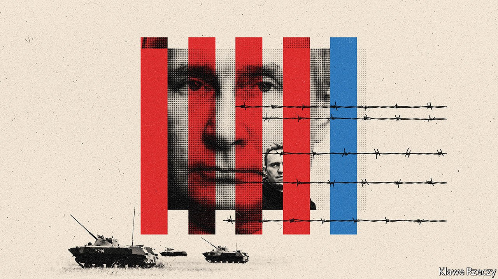

###### Putin’s next move

# Russia’s president menaces his people and neighbours 

##### The West should raise the cost of his malign behaviour 

 

> Apr 24th 2021 

ONE MAN commands a police state. The other is locked up and close to death. Nonetheless, Vladimir Putin fears his prisoner. Alexei Navalny may be physically weak: after most of a month on hunger strike, he was moved to a prison hospital on April 19th, perhaps for force-feeding. Yet he is still Russia’s most effective opposition leader. His jocular, matter-of-fact videos resonate with voters. One, a guided tour of a gaudy palace that Mr Putin denies owning, has been viewed more than 116m times. Mr Navalny has built a movement by mocking the Kremlin’s lies, and challenges Mr Putin’s party at elections. That is why he was poisoned last year, and then jailed on bogus charges. It is why his organisation has been branded “extremist” and is being ruthlessly shut down. It may also explain why Mr Putin, eager to change the subject and fire up patriotic Russian supporters, is once again .

 


 Mr Putin promised handouts for the masses and pain for his enemies. He repeated a conspiracy theory about the West trying to assassinate Alexander Lukashenko, the despot of next-door Belarus. He vowed that those who threaten Russia’s security “will regret their actions more than anything they’ve regretted in a long time”. As he spoke, his goons rounded up dissidents.

Mr Putin is weaker than he looks, but that makes him dangerous. His previous Ukrainian adventures came when the Russian economy was in trouble and his polls needed a boost. Today, his personal polls are sliding and barely a quarter of Russians support his party. Protests against Mr Navalny’s arrest in January were the largest in a decade. And events in Belarus worry Mr Putin: Mr Lukashenko has been so weakened by protests that he now depends on Russian support to stay in power. If something similar were to happen to Mr Putin, he has no one to turn to. Facing protests at home, he may lash out abroad, in Ukraine, Belarus or elsewhere.

All this poses a challenge for President Joe Biden and his allies. When deciding how to deter Mr Putin, the West should be realistic. No one wants war with a nuclear power, and  are often ineffective. They rarely work if they are unilateral, or their aim is too ambitious. Even the strictest  have failed to dislodge lesser tyrants in Cuba and Venezuela. Russia has fashioned a siege economy, inward-looking and stagnant but hard for outsiders to throttle. Talk of an embargo on Russian oil and gas exports, meanwhile, is naive. The world must one day find alternatives to fossil fuels, but suddenly shutting off a supplier as big as Saudi Arabia would cause global economic tremors—so it won’t happen.

The aim of sanctions should be modest: not regime change, but to raise the cost to Mr Putin of aggression abroad and oppression at home. Mr Biden has made a good start, imposing a raft of  for hacking and election-meddling, which can be tightened if Mr Putin transgresses more. Harsher curbs on Western financial institutions dealing with Kremlin-linked firms would add to the pain. Mr Biden is also trying to cajole allies to present a united front, as they have so far failed to do. Germany should kill Nord Stream 2, a gas pipeline intended to bypass and squeeze Ukraine. Britain should crack down more on money-laundering. Individuals implicated in abuses should have their assets frozen and be barred from entering the West.

NATO should step up. It must strike a balance: reassuring Russia’s neighbours without feeding the Kremlin’s paranoia. Some Russians imagine that NATO might invade to help Ukraine recapture its lost turf. Mr Biden should make clear that it won’t. But NATO should beef up its presence in the Black Sea, and its members should continue to supply Ukraine with defensive weapons.

Russia is far less important than China, either to the world economy or to climate talks. But it still matters a great deal. It is the single most prolific stoker of instability on Europe’s borders, and arguably the most energetic troublemaker in rich democracies, funding extremist parties, spreading disinformation and discord. How the West deals with it also sets a precedent. China’s leaders are certainly watching. If Mr Biden lets Russia roll over Ukraine, they may assume that Taiwan is fair game, too.

Unlike his predecessor, Mr Biden sees Mr Putin clearly. Rather than embracing him, he has called him a killer. But he also keeps communications open. He has suggested a summit. That would be a mistake if it merely boosts Mr Putin’s prestige, but not if it de-escalates military tensions and signals resolve. The diplomatic spadework that precedes it will be crucial. Fortunately, Mr Biden has hired plenty of Russia experts, and actually listens to them.

In the end it will not be outsiders who decide Russia’s future. The long, hard task of creating an alternative to Mr Putin’s misrule can be performed only by Russians themselves. Meanwhile, democracies should lend Russian democrats their moral support, just as they did in the Soviet era. Mr Biden should press hard for Mr Navalny to be released, immediately and unharmed. The world needs dissidents like him to hold the Kremlin to account. Without such checks, Russia will remain a thuggish kleptocracy, and its neighbours will never be safe. ■

This leader was updated shortly after publication on April 22nd to note Russia's announced troop pull-back.

Dig deeper

 (Apr 2021)

 (Apr 2021)

 (Apr 2021)

