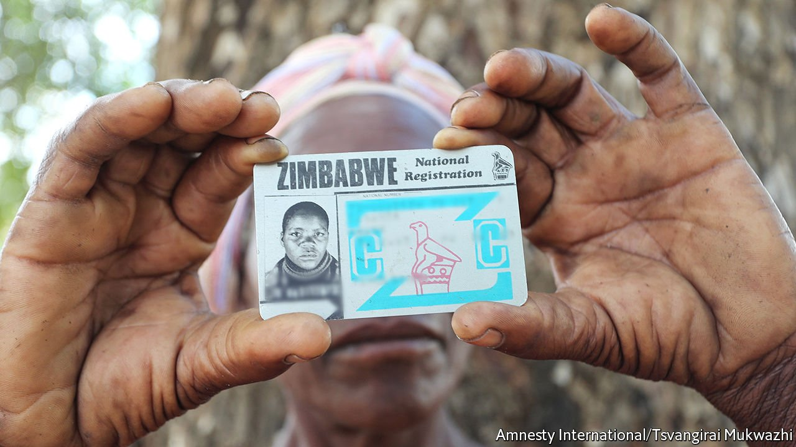

###### Papers, please

# Old laws and red tape leave thousands stateless in Zimbabwe 

##### Those denied documents cannot study or get good jobs 

 

> Apr 24th 2021 

BOTSHIWE DUBE gave birth to all seven of her children at her home. This was not because she wanted to. Nor was it because there was no hospital in Tsholotsho, her home town in Zimbabwe. It was because she is stateless. Without papers proving she is Zimbabwean, she cannot gain admission to a hospital.

Ms Dube lost her identification documents in 1983. At the time, the army was carrying out massacres of her ethnic group, the Ndebele, some of whom were deemed to have rebelled against the regime of Robert Mugabe, Zimbabwe’s late despot. Perhaps 20,000 Ndebele were murdered. Many lost their papers when soldiers burned their houses down.


Under international law everyone is entitled to a nationality. Of Zimbabwe’s 15m people, perhaps 300,000 are at risk of statelessness, according to the UN’s refugee agency. Stateless people there are “trapped in a vicious cycle of poverty and marginalisation”, reports Amnesty International, a watchdog. Without papers “most can only secure precarious and low-paid work” on farms or in mines.

The ruling party has long sought to disenfranchise groups it suspects of not supporting it. In 1984 it passed a citizenship law that made it harder for people to prove citizenship. It was widely used to render Ndebele stateless—and therefore unable to vote. When Ms Dube has tried to replace her lost documents, registration officers have repeatedly told her that they cannot find her name in the system.

Excessive bureaucracy can make people stateless, too. Zimbabwean hospitals have to record all new births, but the process is not simple. They must include details that can only be verified with the mother’s birth certificate. Rather than break this rule, they often turn away pregnant women who do not have such a document. This forces those women to undergo risky births at home, which then go unrecorded. Partly as a result of this, fewer than half of births are registered. Not one of Ms Dube’s children or grandchildren has an identity document. Children without papers can be enrolled in school, but without an ID card they cannot officially complete it, go to university or get a well-paid job. “Even cattle are better, because they are recorded in a book,”Ms Dube told Amnesty.

The consequences of statelessness are far-reaching. Vimbai Munondinzweyi’s family has been in Zimbabwe for three generations—her grandmother migrated from Zambia. But she has no papers because her mother and grandmother had none. Her dreams of becoming a lawyer were cut short after she had to drop out of school and get married at 16. Her new husband has papers but unless she has her own, too, the children she wishes to have will one day face a similar fate to hers.

At independence in 1980, Mugabe’s government promised that anyone born in Zimbabwe would automatically be a citizen. But it quickly tightened the rules to exclude those whose parents came from elsewhere. That affected a lot of people. During the colonial period 20-30% of farm workers were migrants from nearby countries such as Malawi, Mozambique and Zambia. Their descendants, some of whom were stripped of Zimbabwean citizenship under Mugabe, had often lost ties to the countries their families had migrated from, and became stateless.

A constitutional amendment in 2001 empowered the state to revoke the Zimbabwean citizenship of people who had merely a potential claim to citizenship of another country. This was partly aimed at white farmers, some of whom were bankrolling a new opposition party. But it affected descendants of migrants from just about anywhere.

The amendment was revoked in 2013, and dual citizenship is now allowed. But people without documents still find it hard to prove who they are. The government has tried to use mobile registration centres to help people get identity cards. But without the data needed to retrieve lost documents, workers at the centres don’t have the power to confer citizenship, so entire families have given up. They register businesses under their friends’ names, they travel illegally if they must, and their deaths go unrecorded, as if they never existed. ■

