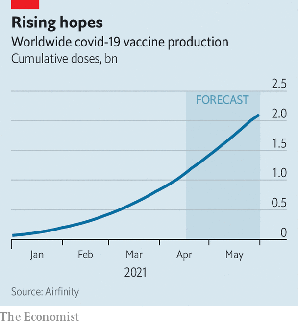

###### A vaxxing problem

# American export controls threaten to hinder global vaccine production 

##### The world’s biggest vaccine-maker says it will feel the pinch in a month 

 

> Apr 22nd 2021 

LAST WEEK, the billionth dose of covid-19 vaccine was made. It is a sign of how greatly capacity has expanded over the past six months that the next billion could be produced by May 27th, according to Airfinity, an analytics firm (see chart). Yet this ambition is at risk from American export controls on raw materials and equipment. Production lines in India, turning out at least 160m doses of covid vaccine a month, will soon grind to a halt unless America supplies 37 critical items.

On April 16th Adar Poonawalla, head of the world’s biggest vaccine-maker, the Serum Institute of India (SII), begged President Joe Biden, in a tweet, to “lift the embargo of raw material exports out of the US...Your administration has the details”. Suresh Jadhav, SII’s executive director, says that in the next four to six weeks manufacturing of two vaccines will be affected: AstraZeneca’s, of which SII makes 100m doses a month, and Novavax’s, of which it expects to make 60m-70m doses a month. SII says it first alerted the American government about this two months ago.


That was shortly after the Biden administration announced, on February 5th, plans to use the Defence Production Act (DPA)—a law dating from the 1950s that grants the president broad industrial-mobilisation powers—to bolster vaccine-making. This legislation, previously invoked for similar reasons by Donald Trump when he was president, has helped American pharmaceutical companies to secure a variety of special materials and equipment, including plastic tubing, raw goods, filters and even paper, that are needed for vaccine production. But firms which export such products point out that the DPA hinders their ability to sell them abroad. They must seek permission before exporting these goods. That requires time and paperwork. And if the government decides it needs the goods in question to remain in the country, the firms concerned may be barred from exporting them at all. Some people are also worried about pharma companies outside America stockpiling goods because of concerns about delays caused by American export controls. Together, export controls and stockpiling risk gumming up the global supply chain.

 


To be used in vaccine manufacturing, products have to be approved by regulators. So finding substitutes quickly can be impossible. SII is not alone in its concern. On March 24th Micheal Martin, Ireland’s prime minister, warned that export bans (and not just from America) would harm global vaccine production. He noted that the Pfizer vaccine involves 280 components from 86 suppliers in 19 countries. Indeed, American export controls particularly harm European vaccine companies, which need special bags from America in which to make their products. At a vaccine supply-chain meeting in March, one such firm complained of 66-week delivery times for the supply of these bags.

American pharma firms are inconvenienced too, though. For example, Johnson &amp; Johnson, one of the country’s biggest, had intended to do the filling and finishing of its vaccine domestically. But the invocation of the DPA has forced it to change its plans. Scarce management time has then had to be spent securing deals for this business in Spain, Germany, France and Italy, as well as transferring technology to local firms in South Africa and India.

Sai Prasad, head of the Developing Countries Vaccine Manufacturers Network, says the DPA and any other export restrictions will be a serious impediment to the ability of the industry to make and supply vaccines. He observes that making a batch of vaccine can take between 60 and 180 days. Disruptions in raw materials, packing materials and single-use consumables will thus lead to disproportionately longer delays. In short, vaccine production lines cannot come to a halt and then start up again quickly. The consequence of a missing item could be a disruption in supply which is felt for months.

Trading places

Thomas Cueni, head of the International Federation of Pharmaceutical Manufacturers, says he is extremely concerned about current constraints on supply chains around the world. These concerns are widely shared, and were echoed recently by Richard Hatchett, head of the Coalition for Epidemic Preparedness Innovations (CEPI), an international partnership to develop vaccines that is working with industry on the problem. CEPI has appealed to the World Trade Organisation for support. And on April 14th that organisation’s boss, Ngozi Okonjo-Iweala, held a meeting with representatives of various governments, businesses and lobby groups to discuss ways that the strengthening of supply chains could happen.

If all goes swimmingly, the world could produce as many as 14bn doses of vaccine this year. But if raw materials do not arrive where and when they are needed, production will fall far below that estimate. Shortfalls in India will hinder its own vaccination programme, which is ramping up amid an alarming . And since India has banned the export of finished vaccines while it serves domestic needs, it will not be able to fulfil its commitments to outsiders, including many in the world’s poorest countries. The consequences of America’s actions could thus be terrible indeed. ■

Dig deeper

All our stories relating to the pandemic and the vaccines can be found on our . You can also listen to , our new podcast on the race between injections and infections, and find trackers showing ,  and the virus’s spread across  and .

A version of this article was published online on April 17th, 2021.

