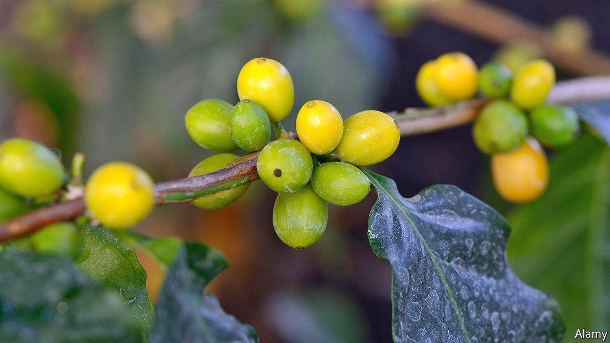

###### Tropical agriculture

# How to save coffee from global warming 

##### Look at research done two centuries ago 

 

> Apr 22nd 2021 

COFFEE IS A multi-billion dollar industry that supports the economies of several tropical countries. Roughly 100m farmers depend on it for their livelihoods. Unfortunately for them, and for the many other people around the world for whom coffee is a near-essential adjunct to life, coffee bushes grow best in a rather narrow range of temperatures, so their cultivation is threatened by a changing climate. But a chance discovery by Aaron Davis of the Royal Botanic Gardens, Kew, in Britain, published in Nature Plants, may offer a way out. Dr Davis and his colleagues report that they have tracked down a type of wild coffee which is both pleasant to taste and tolerant of higher temperatures.

The existing coffee market is dominated by Coffea arabica and Coffea canephora. Arabica hails from the highlands of Ethiopia and South Sudan. It prefers temperatures of 18-22°C. Coffea canephora, commonly called robusta, originated at lower elevations in west and central Africa. It was once thought capable of coping with temperatures of 30°C, but recent work suggests that it does not flourish above 24°C.


Lots of other coffee species are known (122 at the last count). And many do, indeed, grow in places warmer than those preferred by canephora and arabica. But all were thought to have poorer flavours, smaller beans and lower yields. Dr Davis, however, came across a paper written in 1834 by George Don, a Scottish botanist, which described a species from the lowland hills of Sierra Leone. Don dubbed it Coffea stenophylla, and wrote that it had a flavour superior to arabica’s.

This piqued Dr Davis’s interest, for stenophylla still grows, he discovered, in parts of Guinea, Sierra Leone and Ivory Coast that have temperature ranges between 24 and 26°C. He and his colleagues also learned that stenophylla was farmed up until the 1920s, after which canephora, which had higher yields, took over. Stenophylla was then gradually forgotten.

That history of previous cultivation did, however, suggest stenophylla was worth looking into. The crucial question was, was Don’s panegyric to its flavour justified? To find out, Dr Davis enlisted the assistance of Delphine Mieulet of CIRAD, an agronomy-research centre in Montpellier, France. Together, they arranged a competition involving 18 professional coffee tasters who assessed, in a blind comparison, a set of samples that included stenophylla, two types of arabica and one of canephora.

Stenophylla performed well. It was rated as having higher fruitlike qualities than a Brazilian arabica and an Indonesian canephora, and also a more favourable acidity and more complex flavour profile, though slightly less of these desiderata than an Ethiopian arabica. It had nearly the same body as the others, and lacked an unpleasant, earthy bitterness found in the Brazilian arabica and the Indonesian canephora. When asked if what they were tasting was arabica, the judges said “yes” 81% of the time for samples of stenophylla, compared with 98% for the arabica from Ethiopia. They identified the Brazilian arabica as such only 44% of the time, and (showing no one is perfect) misidentified the canephora as arabica on 7% of occasions.

All told, these results suggest that Don’s report from 1834 is correct. Stenophylla does taste like arabica. And, crucially, it tolerates higher temperatures than either arabica or canephora. That opens two possible courses of action. One is to cultivate it directly, though this might run into the yield problem which led to its abandonment in the first place. The other is to crossbreed it with existing cultivars, to endow those high-yielding varieties with its heat tolerance. Whichever path is pursued, though (and they are not mutually exclusive), the rediscovery of stenophylla’s qualities offers hope not only to coffee growers who might otherwise have had their businesses harmed by rising temperatures, but also to the world’s caffeine addicts, who need now worry less about the future supply of their drug of choice. ■

For more coverage of climate change, register for The Climate Issue, our fortnightly , or visit our 


