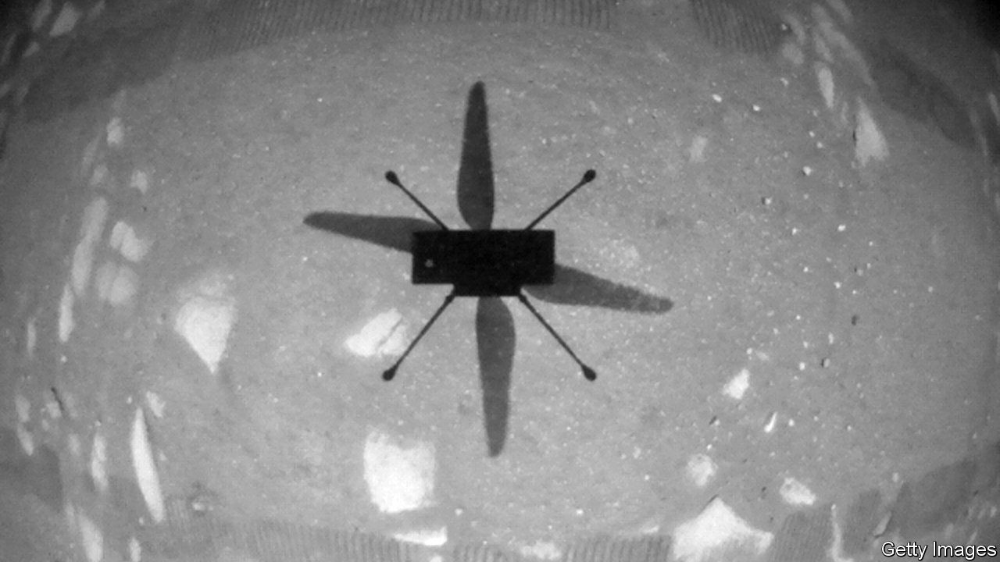

###### Aeronautics on Mars

# NASA’s Martian helicopter, Ingenuity, takes off 

##### Extraterrestrial aviation begins with a 39-second flight 

 

> Apr 22nd 2021 

IN DECEMBER 1903 Orville and Wilbur Wright’s Flyer lifted off the ground for the first time, near Kitty Hawk, North Carolina, and proved that powered, controlled flight was possible on Earth. On April 19th, at 7.34am Universal Time, a small American helicopter called Ingenuity proved it works on another world, too. Following an intricately planned flight sequence six years in the making, the 1.8kg craft spun its contra-rotating twin rotor-blades at 2,400rpm, to ascend from the surface of Mars. It climbed to an altitude of three metres, hovered for 30 seconds, took a photograph of its own shadow (pictured) and touched back down on the ground.

Flying conditions on Mars are rather different from those on Earth. Though it has only a third of Earth’s gravity at its surface, which sounds as if it might make the task of flying there easier, Mars’s atmosphere has a mere hundredth of the density of Earth’s. This means there is little air to push against when attempting to fly. To compensate, Ingenuity’s blades spin five times faster than those of a typical helicopter on Earth.


To keep its flight stable with such fast-moving blades requires hundreds of adjustments a second, based on a stream of information from sensors aboard the aircraft. This complexity explains why the test flight, which was supposed to happen a week ago, was delayed. The project’s engineers identified software problems during a high-speed spin-test of the rotors, and these had to be fixed.

Ingenuity’s flight brings space scientists closer to a new way of exploring other worlds. Over several decades, rovers designed by NASA, America’s space agency, have become ever-more sophisticated mobile laboratories. But they still move slowly and cautiously, and can operate only over reasonably flat ground. Future flying machines could carry payloads around quickly, or survey wide areas of terrain, regardless of its roughness. They could also fly close up to cliff faces that have interesting-looking rock formations, or deep into cave systems.

Despite the daunting engineering challenges required, NASA already has plans to use such machines in future exploration. In 2026 a mission called Dragonfly will, if all goes well, be launched towards Titan, a moon of Saturn. Using eight rotors, this aircraft will carry its suite of scientific instruments to dozens of places, to examine the habitability of the local environment and perhaps look for signs of life.

Ingenuity does not carry any instruments, since it is just a technology demonstrator, though it will send back pictures of its travels. Despite its diminutive size and capabilities, however, the aircraft has now been given the official designation “IGY” by the International Civil Aviation Organisation—the United Nations agency responsible for such matters. In homage to the builders of Flyer, it also carries a small piece of cloth from one of Flyer’s wings, and its Martian aerodrome will henceforth be known as Wright Brothers Field.

A version of this article was published online on April 19th, 2021.

