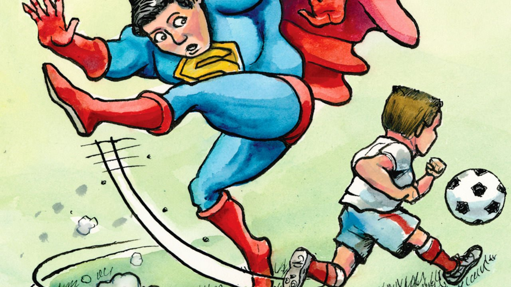

###### Lexington

# Why the European Super League failed 

##### Europe says no thanks to America’s franchise system 

 

> Apr 24th 2021 

IT HAS BEEN a bad month for imperial hubris. First Joe Biden admitted the failure of America’s effort to export liberal democracy to Afghanistan. Now European football fans have rejected another attempted American export, in the form of the reviled European Super League, even more crushingly.

Most Afghans were ambivalent about America’s democratising. By contrast, the response of European players, coaches and fans to the effort to export the American sporting model was unanimous and furious. A former captain of Manchester United (owned by the Glazer family, who also own the Tampa Bay Buccaneers), described the League as a “criminal act” against the fans.


The captain and manager of Liverpool football club, which is mostly owned by the American investor John Henry, owner of the Boston Red Sox, also condemned it. Supporters of some of the 14 leading English football clubs which were to be excluded from the scheme burned Liverpool shirts. After joining a panicked retreat from the league this week, 48 hours after it had been announced, Mr Henry issued a grovelling apology to his team’s fans: “I’m sorry and I alone am responsible”. That was more mollification than Red Sox fans got, after he offloaded their best player, Mookie Betts. And Mr Henry was right to offer it. English football clubs are even more reliant on gate revenues than Major League Baseball (MLB). And their fans are even more zealous and less forgiving than the Red Sox Nation—let alone the usual peripatetic American sports fan.

As in Afghanistan, the American investors were wilfully ignorant of an alien culture. Local allies, in the form of Real Madrid’s president, Florentino Perez, and Juventus’s chairman, Andrea Agnelli, proved unreliable guides to the natives. (Disclosure: Exor, which is a big shareholder in Juventus, also owns a stake in The Economist’s parent company.) The League was pitched as a mid-week addition to its members’ current fixtures, to provide more games among Europe’s best. It would have eaten into their domestic commitments, however, offending local fans. Such stresses are routine in America’s franchise system, which the league resembled; they were anathema to Europe’s sporting culture.

The American system is a century-old marketplace of rival sports leagues, often founded by entrepreneurs, which vie to attract investors to their city-based franchises. MLB, a merger between the National and American leagues, is the result of one such rivalry. The churn of leagues and franchises inherent in this system explains the fluidity of American fandom. The Washington Nationals, a franchise of the National League, began as the Montreal Expos and is the capital’s fourth major baseball team; the other three folded or moved on. By contrast, the basic unit of European sport is not the league but the club, an institution that tends to be much older and more locally rooted than any franchise, and far more fervently followed.

Most leading English and many Spanish and Italian clubs are over a century old and ripple with local associations and mythologies. Liverpool’s main rival is not Manchester but Everton, whose stadium is a mile from its own. Barcelona’s team is synonymous with the cause of Catalan nationalism. The hierarchy of governing bodies the clubs submit to is essentially a means to manage their pre-existing rivalries. The Super League promised to obliterate much of this. It would have undermined the hierarchy and scrambled the rivalries while delivering sport devoid of meaning—association football without the all-important associations.

At the 125-year-old heart of pan-European competition is an understanding that qualifying for it is a reward for success in the domestic contests that local fans care about most. Not even supporters of the dozen Super clubs want to bypass that. “We want our cold nights in Stoke” read a banner carried by a Chelsea fan, protesting against his team’s part in the league. Even more offensive to such fans was a reasonable assumption that the contest had not been designed with them in mind, but for millions of foreign fans, in Asia and America, who care less about such details. In America’s rapacious sports market, where a new fan is as valuable as an old one, this would be normal; in European football, it was heresy.

The other big reason for the scheme’s fate was also evident in America’s failed state-building: it did not even reflect the strengths of the American system it was channelling. America was doomed in Afghanistan from the moment it pushed a rigidly centralised governing system, which fostered regional anger and corruption; Americans, let alone Afghans, would have gone to war with it. Similarly, the proposed league would have replicated the investor-friendly closed structure of America’s leagues without most of the compensatory measures, such as cross-subsidies and rookie drafts, built into them to foster competition.

The putative league would have been an exhibition of elite football, not a true contest, as was further underlined by the fact that the participating clubs were not even the best in Europe, but merely the richest. One of them, Arsenal, owned by the American real-estate tycoon Stan Kroenke, is barely one of the best in England. This would have represented another bastardising of the American system. Shorn of true competition, the league would have resembled baseball’s interminable, money-spinning post-season without the long slog of the regular season that makes sense of it. English football fans are not alone in needing their cold nights in Stoke; baseball fans spend them in Pittsburgh.

A strategic review would be wise

America long ignored the signs it was losing in Afghanistan. America’s football investors were also forewarned to tread carefully. The mob that welcomed the reviled Glazers to Manchester chanting “Die, Glazers, die!” was a definite hint. If they are wise, they will now take a less interventionist role. They are unlikely to withdraw, having mostly enjoyed decent returns. Indeed their hubris was mainly greed.■

