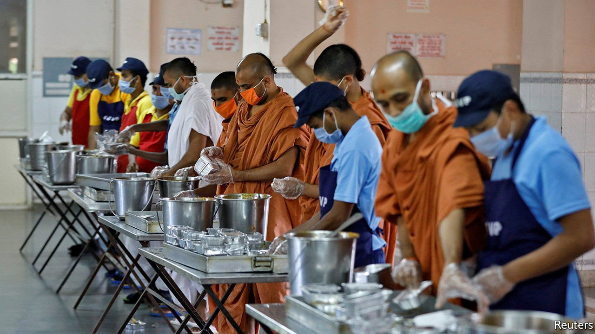

###### Heartening heroics

# Volunteers are filling the gaps in India’s fight against covid-19 

##### The government may have fallen short, but civil society has stepped up 

 

> May 1st 2021 

MANY INDIANS are up in arms about the government’s handling of their country’s all-engulfing second wave of covid-19. Hospitals, testing facilities, even crematoria are overwhelmed. Vaccines are in short supply. The government squandered a lull in infections over the winter, a common criticism runs, and is now flailing in the face of the inevitable resurgence. But while there is no shortage of hapless officials, there is also an impressive supply of ordinary citizens, charities, private companies and even the odd public servant taking their own initiatives to mitigate the crisis.

Devendra, a 38-year-old teacher in the rural state of Jharkhand, became a tabloid hero when, after receiving a distress call from a friend in Delhi, 1,400km away, he scoured his state to find an oxygen cylinder and then drove for 24 hours straight to deliver the life-saving gift. On social-media services such as Twitter and WhatsApp, untold thousands of people respond to even greater numbers of pleas for help to find a hospital bed or oxygen or simply money to pay medical bills. Numerous volunteers have aggregated such requests and offers, allowing browsers to match needs with whatever help is available by subject and location.


Sometimes the efforts are very local. After seeing how hard it was to get his own 80-year-old father admitted to hospital, Vishal Singh, who owns a chain of private schools, set up a free, fully equipped covid-19 care centre for other residents of his own posh gated community. Pascal and Rozy Saldanha, a middle-class couple in Mumbai, sold their jewellery to buy oxygen cylinders to give to needy neighbours. Residents of south Delhi speak of a mystery Food Man who roams the streets, stopping hungry-looking people and feeding them.

Other initiatives are more organised. Khaana Chahiye was formed last year to help migrant workers who were forced to flee Mumbai when a national lockdown cost them their jobs. The group started by setting up soup kitchens on roads, to offer a square meal to those who were so destitute that they were trying to walk to their home villages, hundreds or even thousands of kilometres away. Over the past year it has served some 4.6m meals, thanks to a team of more than 200 volunteers, and expanded to slums in the city.

Older charities have also redirected efforts to the struggle against covid-19. Nearly every Sikh temple, from smallest to grandest, operates a regular langar or soup kitchen. Numerous charities that had been supplying a huge sit-in on the borders of Delhi by farmers, many of them Sikhs, have now refocused on covid-19. One of these, Hemkunt Foundation, now operates a 24-hour drive-in centre outside Delhi that provides free oxygen to those in desperate need.

Indian tycoons have also stepped into the act. Azim Premji, a tech mogul and India’s biggest philanthropist, gave an estimated $1bn to charity last year, either directly or through his companies, $150m of it for covid research and relief. Other entrepreneurs raised some $10m almost overnight for Mission Oxygen, which aims to buy as many oxygen concentrators as possible abroad and ship them to Indian hospitals. Within a single week the group was able to import the first machines, and has placed orders for 1,300 more.

There have been moments of heartening bureaucratic efficiency, too. Whereas in Delhi desperate patients have been forced to wander from hospital to overspilling hospital to plead for admission, authorities in Mumbai run an efficient, centralised triage system to allocate beds to patients. In Nandurbar, a tribal district of northern Maharashtra, one of India’s hardest-hit states, the top local bureaucrat took note of what was happening elsewhere in the world, and poured all his meagre resources into preparing for a second wave. His team focused particularly on fitting local hospitals with small plants to supply their own oxygen, as well as on training medical staff. Had such efforts been replicated across India, they would have saved tens of thousands of lives. ■

Dig deeper

All our stories relating to the pandemic and the vaccines can be found on our . You can also listen to , our new podcast on the race between injections and infections, and find trackers showing ,  and the virus’s spread across  and .

