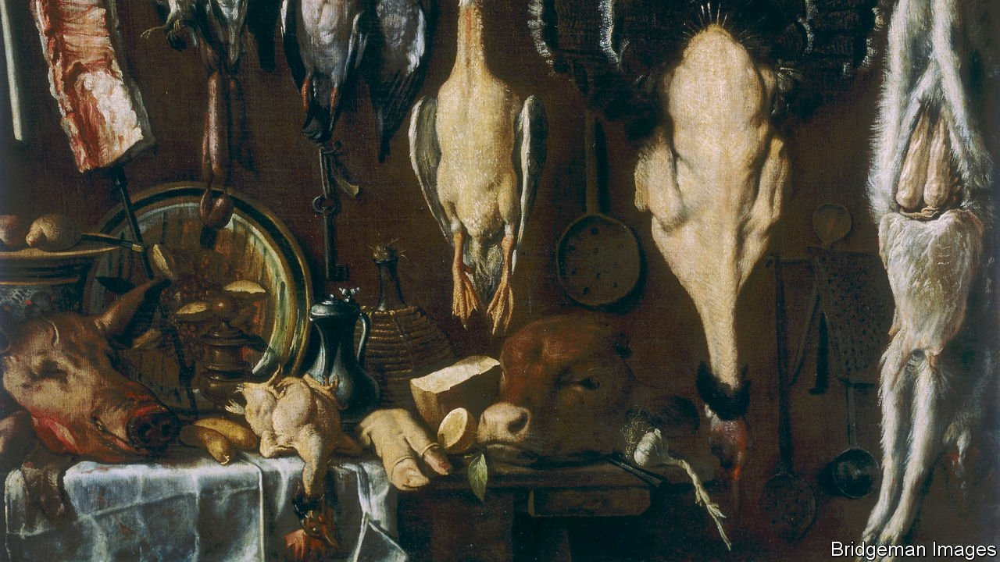

###### Making a meal of it

# Food is an old theme of art. Now the reverse is true too 

##### Museums are using dishes and tipples to attract new audiences 

 

> May 1st 2021 

“TRA ARTE e cucina”—“Between art and cuisine”—is how the Uffizi Galleries describe their recently launched cooking show, “Uffizi da mangiare” (“Uffizi on a plate”).In the videos, Italian chefs share recipes based on pieces in the collection in Florence, discussing both the artworks and the dishes. Dario Cecchini created costata alla fiorentina from a game-filled pantry depicted by Jacopo Chimenti; Marco Stabile turned Giorgio de Chirico’s “Still Life with Peppers and Grapes” into a risotto that aims to capture the painting’s ingredients and sensations on a plate.

Food has always been a subject of art. But increasingly the roles are being reversed, as paintings are interpreted in edible ways and shared online in new, bite-size formats. As part of their bid to attract digital audiences to replace in-person ones, enterprising museums are melding the worlds of art and cuisine.


Last year the Los Angeles County Museum of Art began a quarterly series, “Cooking with LACMA”, which features chefs, culinary historians and recipes based on works in the museum. In the first video Maite Gomez-Rejón of ArtBites, which aims to combine culinary and art history, made a mezcal margarita that was inspired by the output of Rufino Tamayo, a Mexican artist. An instalment this month will involve a Japanese dish drawn from the work of Nara Yoshitomo, a painter. Vivian Lin of LACMA hopes viewers will be moved to “share recipesand new insights about art with one another”.

Cocktails have been an especially popular form of crossover during the pandemic, notes Ms Gomez-Rejón, who collaborated with the Huntington, a museum in California, on a video series reimagining works in its collections as tipples and other offerings. For its part, the Museum of Fine Arts, Houston translated a moody yellow self-portrait by Frantisek Kupka, a Czech artist, into a tropical drink. In the Frick Collection’s weekly “Cocktails with a Curator” films, experts at the museum in New York match a liquid concoction to the theme or region of an artwork under discussion.

The art world’s food fad began before covid-19. Released last year, for instance, the documentary “Ottolenghi and the Cakes of Versailles” focused on a reinterpretation of 18th-century French cuisineat a pricey banquet at the Metropolitan Museum of Art. But recent online programming makes the art-food mash-up digestible for broader audiences. And the trend is set to outlast the lockdown. At a time when broadening access is an imperative, food can help museums entice first-time visitors and co-operate with new partners.It “can be a really nice entry point for people who are less comfortable with art”, says Elee Wood of the Huntington.

Most important, as Ms Gomez-Rejón says, “Cooking itself is an art.” Like the visual kind, it illuminates the culture that produced it—an understanding enriched by juxtaposing the two forms of creativity. At their best, both food and painting are transporting experiences, introducing new worlds and possibilities, whether on a wall, a plate or in the imagination.

Take the use of blancmange by Debora Massari, a pastry chef, in the Uffizi’s series (pictured). Through a dish that has roots in Arab cuisine, which appeared on the tables of the Medicis, she pays homage to Raphael’s marriage portraits of Agnolo and Maddalena Doni. A ring of pastry and blancmange covered in dark chocolate (representing Agnolo) is entwined with a ring of white chocolate and lemon (Maddalena). The recipe draws on art and history to make something deliciously new. ■

