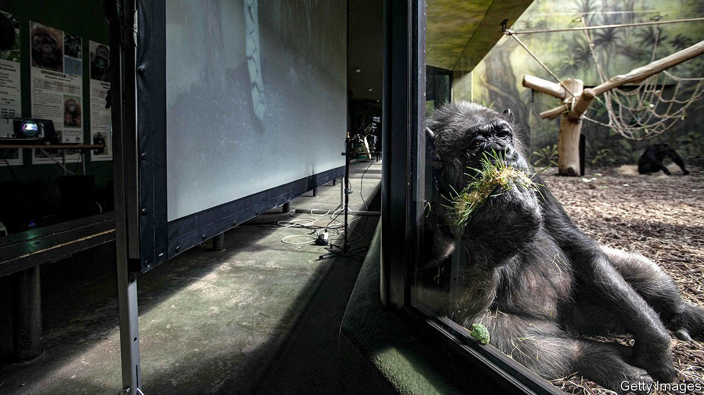

###### Creature discomforts

# In an age of animal-lovers, many creatures are suffering 

##### Henry Mance wants humans to reassess their relationships with other species 

 

> Apr 29th 2021 

How to Love Animals. By Henry Mance. Jonathan Cape; 400 pages; £20. To be published in America by Viking in July; $27

CAT VIDEOS are the definition of clickbait, dogs are prized for their companionable qualities, and the most popular cartoons feature bears, rabbits, ducks and pigs. But in an age when so many people profess to beanimal-lovers, a remarkable number behave in ways that suggest the opposite—eating meat of dubious provenance or fish that suffocated on the decks of trawlers, controlling pets with chastening strictness and gawping at wretchedly constrained elephants in zoos.


As HenryMance, a British journalist, observes, “animalshave worse prospects in the very time that we have supposedly been looking out for them.” His lively first book argues for a profound reassessment of humans’ relationships with other species. It is a polemic framed as a personal quest. He takes a job at a slaughterhouse and graphically reports his efforts to rip the wool off freshly killed sheep. He learns to fish, goes on a fruitless deer hunt and visits a lab where drugs are tested on mice and frogs. He observes at close quarters the effects of both deforestation and re-wilding; he attends a Californian dog-fanciers’ convention where corgis are dressed as sharks while their owners dress as corgis.

Some of MrMance’s conclusions are unsurprising. Covid-19 has been a sharp education in the cost of disrupting ecosystems.Animalswidely regarded as expendable, such as wolves, turn out to play vital roles in keeping other species in check. Though as a child the author adored zoos, marvelling at the tigers and pandas, he now has misgivings about these “soulless, motionless” places, which strike him as “the conservation equivalent of a police line-up”. He is an advocate of veganism, but worries that it may be a “niche pursuit” and “a sign of society fragmenting, rather thananimalinterests winning”.

Yet elsewhere the arguments in“How to LoveAnimals”are arresting. After pondering which sea creatures feel pain, MrMancerules that mussels, clams and oysters can be eaten in good conscience. He argues that cows raised for beef have better lives overall than those on dairy farms. It is usual to condemn trophy-hunters who cross continents to shoot lions, but “if anyone wants to stop wasteful killing for pleasure, they should focus on farming.”

As MrMancetravels from the fishing ports of northern Spain to a Polish hunting lodge, he encounters plenty of strange ideas. Some activists believe seats in parliament should be reserved for people representing the interests of domesticated animals. Others recommend editing wild species’ genes so that they no longer harm other creatures with which they share habitats. There is apparently a case for letting captive elephants communicate with their counterparts in other zoos, through a device nicknamed the “Elephone”.

No shortage of evangelists insist that technology will improve the lives ofanimals. MrManceis sceptical, concluding that restraint will achieve more than ingenuity. Even if his best line is borrowed from Martin Luther King—“The arc of the moral universe is long, but it bends toward justice”—he is a skilful writer who never shies away from painful stories, and leavens even the grimmest episodes with humour. He also has a rare ability to couch strenuous ethical arguments in terms that are warmly familiar. ■

