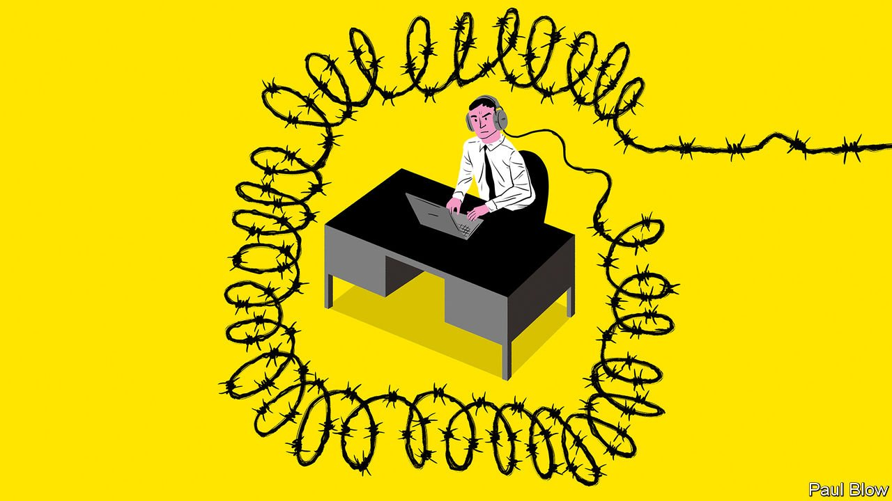

###### Bartleby

# Abolishing executive offices 

##### The costs of office-less executives outweigh the benefits 

 

> May 1st 2021 

IT IS A tradition of corporate architecture. A company’s top executives get offices on the top floor, often dubbed the C-suite after the “chiefs” who occupy it. The CEO resides in the “corner office”, with the biggest windows and best views. Junior staff suffer a few moments of trepidation when summoned upstairs.

Some heterodox bosses shun this tradition. Reed Hastings of Netflix has no office, corner or otherwise, and huddles at random desks, for example. Now more staid firms are following suit. Executives in the London offices of HSBC, a banking giant, will no longer be based on the 42nd floor of the group’s Canary Wharf tower. Instead the floor will be converted into meeting rooms. Senior executives will “hot-desk” with everyone else.


A plausible argument for such a shift can be made. Staff morale would suffer if the rank-and-file are crammed in open-plan offices while the executives cling to cushy digs with panoramic vistas. When the top brass sit alongside their teams, they will be more in touch with how projects are going, and how staff are feeling. In theory, if the executives are visible, employees are more likely to approach them with problems.

But lingering bosses may equally hurt morale. One of the joys of office life is the freedom to enjoy a bit of banter with colleagues. This may include the odd crack about the management. In the presence of their boss staff will be constrained in what they talk about and the tone of their comments. They may feel the need to sound serious at all times, lest the quality of their commitment to their work come into doubt—after all, the manager may be right behind them.

You also have to wonder whether executives will really spend every morning searching for a place to sit. Some hot desks will be a lot hotter than others. Once the chief financial officer has picked a desk on day one, deferential underlings will steer clear of that particular spot on subsequent days. In contrast, anyone who works closely with a particular executive will be tempted to pick a desk close by. The risk is of a “beach towels on sunbeds” syndrome where employees compete to get the desks nearest to (or farthest from) particular managers.

Of course, the executive may be absent from the open floor for extended periods. Any meeting that involves confidential information, such as a future business plan or a career review, will have to be held in private. So the meeting rooms that HSBC is creating on the executive floor may end up being block-booked by the managers for much of the day.

Even so, the lingering boss presents other problems. Anyone who has worked in an open-plan office will acknowledge that the babble of others talking can make it hard to concentrate at times. Managers may find themselves constantly being approached by team members with questions or problems for them to solve. Many people resort to headphones to shut out the background noise (and to signal their unavailability). But if managers do that, they run the risk of seeming shut off from their colleagues.

Studies of open-plan offices have shown that they do not create the hoped-for collaborative effects. One study found that at firms that switched to open-plan design face-to-face interactions fell by 70%. Like an animal caught on open ground without cover, many people do not like being constantly observed. In the absence of a physical barrier, they create a “fourth wall”, indicating their desire for solitude by facial expressions or curt replies to questions.

Where people do need to communicate, it is usually with members of their own team. So using a hot-desking system to mix up different teams, in the hope of creating collaboration, is unlikely to work either. People will avoid contact with their immediate neighbours and will message their other team members electronically.

In practice, the main benefit for companies of adopting an open-plan design is to save money by cramming more employees in the same space. This explains the willingness of some companies to allow working from home. Recently, HSBC revealed that more than 1,200 staff, mainly in call centres, would be doing so permanently. Indeed, the HSBC executive-office shift is part of a plan that aims to save 40% of head-office costs. As Noel Quinn, the bank’s chief executive, told the Financial Times, the executive offices were empty half the time because the managers were travelling. As reporters are often told, the best way to understand what is really going on is to “follow the money”.

