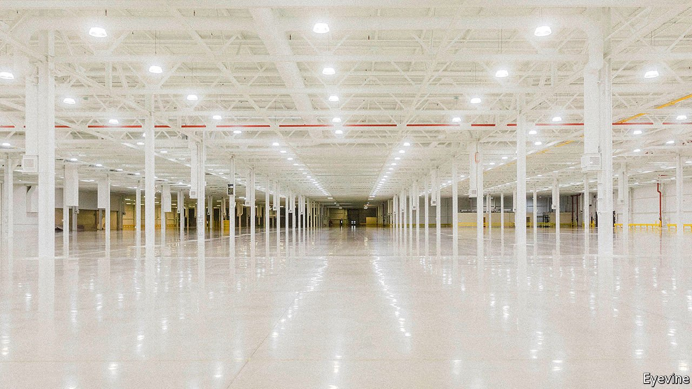
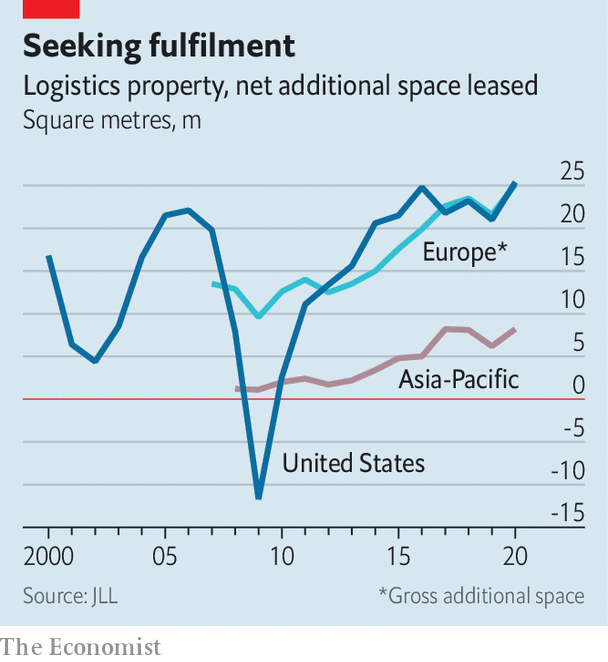

###### Safe as warehouses

# Developers struggle to meet demand for e-commerce storage space 

##### Online shopping requires more warehouses. There is ever less room for them 

 

> May 1st 2021 

WANDER THROUGH central and east London, and you find traces of the East India Company. In its 274-year history, the rapacious colonial-era trader tore down poor houses, replacing them with sprawling depots to store tea, silk, spices and other exotic wares. Today those same sites are occupied by offices, restaurants and flats. Soon, they could once again be stacked with merchandise. A large plot near the historic East India Docks, which once processed goods from India and China, is being converted to a mix of flats and warehouse space dubbed Orchard Wharf.

The pandemic e-commerce boom has fuelled demand for warehouses. In 2020 firms in Europe leased 16% more new logistics space than the year before, according to JLL, a property consultancy. In America and Asia the rise was 21% and 32%, respectively (see chart). Some firms, like supermarkets or medical-supplies makers, needed more storage to meet offline demand. But one in four new leases signed last year in Western countries was linked to online shopping, reckons JLL, up from 12% in 2019. In China it was one in three.


CBRE, a real-estate firm, estimates that a 5% increase in retailers’ inventories in America requires up to 46m square metres of additional warehouse space—enough to cover roughly three-quarters of Manhattan. And those inventories are growing fast as retailers go digital. Online retail typically needs three times as much space as the physical sort, because internet shoppers expect a wider variety of goods. Vacancy rates have therefore plummeted, from 10% across America and Europe a decade ago to just 5% now. In some places, like Toronto and Tokyo, they are below 2%.

 


The value of existing assets is ballooning as a result. The gross assets of Prologis, a leading warehouse developer, are worth $10bn more than six months ago. This in turn is luring more investment. JLL calculates that purchases of logistics assets went from a tenth of global property investments in 2015 to a fifth last year. In 2020 Amazon increased square footage across its fulfilment and logistics network by an unprecedented 50%.

This building frenzy is now starting to run up against obstacles. The first is scarcity of space, especially in densely populated cities. Half of San Francisco’s industrial land was converted to residential and office space between 1990 and 2008. Between 2006 and 2015 London lost 11% of its industrial land. The problem has grown so acute in parts of Germany that delivery lorries operate from sites across the border in Poland and France. High costs, restrictive zoning rules and current tenants make it difficult to convert existing properties, such as struggling shopping malls, into distribution centres. Prologis forecasts that retail conversions will make up just 0.75% of the overall logistics stock over the next decade.

Public hostility to new sites is also growing. Large warehouses are noisy and operate around the clock. Suburban homeowners across America and Europe worry about pollution from lorries. Even where developers pledge thousands of jobs, politicians grumble that these will be low-skilled, or soon replaced by robots. Five Conservative MPs have called on Britain’s government, run by their own party, to stop a huge warehouse from being built in south-east England.

Warehouse owners are getting more creative. SEGRO, a big British one, is redeveloping unused space beneath a Parisian railway station. Amazon is flipping former golf courses in America into distribution centres. The online giant is also converting an empty car park in central London into a delivery hub. Hybrid developments like Orchard Wharf are proliferating.

Less creatively, developers are raising rents. Prologis expects them to go up by 6% globally this year. That may dismay e-merchants. Not investors, though: the share prices of Prologis and SEGRO have nearly doubled since the start of 2019. ■

