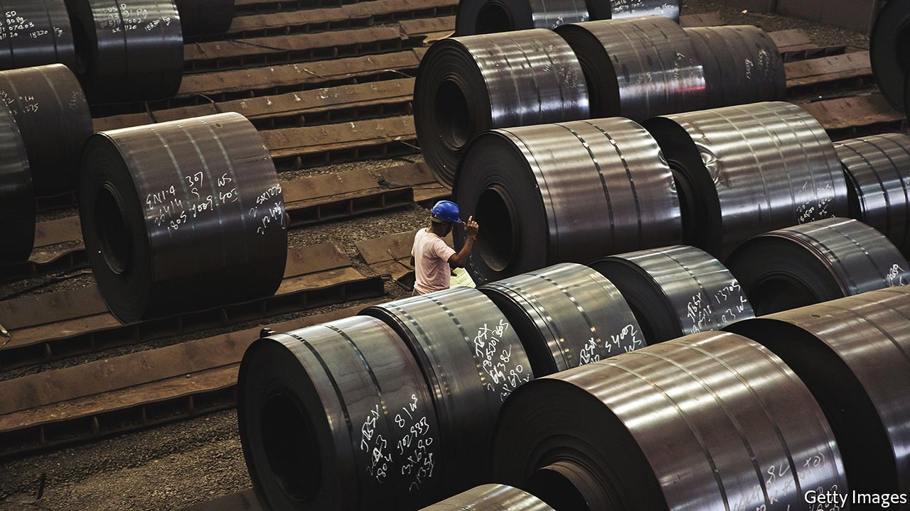
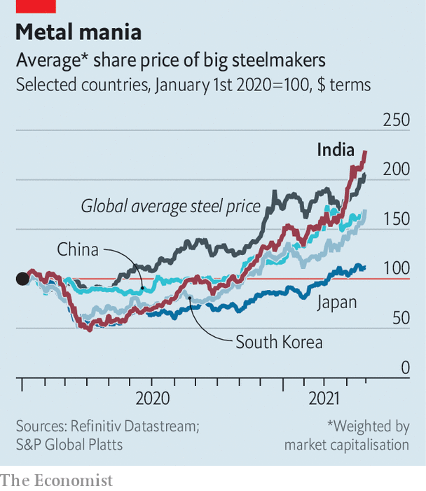

###### White hot

# India’s steelmakers are the covid-ravaged economy’s rare bright spot 

##### The likes of JSW and Tata Steel have been quicker to restart production than foreign rivals 

 

> May 1st 2021 

STEELMAKERS HAVE for decades embodied India’s failed plans for prosperity. Post-independence socialism produced many mills but little steel. A partial privatisation in the 1990s created capacity, but also large firms fed by feckless state-backed lending. Many were subsequently exposed as bankrupt. Even well-run private producers stumbled, as Tata Steel did with its disastrous acquisition in 2007 of Corus, a troubled European rival. Demand subsequently declined at home and aggressive Chinese rivals expanded abroad.

Then came covid-19. In March 2020 India imposed the strictest lockdown of any large economy. For an industry reliant on mills not designed to sit idle, and on the physical shipment of bulky slabs and coils, this spelled disaster. JSW, a rare success, filled its blast furnaces with coking coal to preserve heat, but not with ore; 14,000 workers completing an expansion of its mill in Maharashtra state dispersed to their villages. “There was no market,” recalls Sajjan Jindal, JSW’s chairman.


The market has since come back with a vengeance. In the past year steel prices have nearly doubled in India, doubled in Europe and China, and more than trebled in America. Surveys by Edelweiss, a Mumbai-based broker, show them heading up. Even Tata’s European business is now profitable. With efficient plants running at near-full capacity, the share prices of big Indian steelmakers have outperformed those of rivals elsewhere (see chart).

 


To understand how they pulled it off, look at JSW. Despite the uncertainty of the early pandemic, Mr Jindal took a gamble and immediately began planning for a reopening: “I was eager to restart, so we did.” The firm lengthened shifts to reduce the flow of people in and out, and transformed schools and clinics it runs into dormitories and covid-19 treatment centres. The firm tapped out its credit lines, increasing debt from $6bn to $7bn. But after a three-week lull, JSW was up and running again.

Its Indian rivals followed a similar script. Those in Japan, South Korea and Russia were slower to get back in business. Tight supply propped up prices, even as pockets of high demand persisted in places spared the worst of covid-19, such as China, Vietnam and parts of Africa. By July domestic demand in India had begun to recover, as good harvests prompted farmers to buy new tractors. Construction, which uses steel and heavy machinery made from it, took off after the first viral wave subsided. Enough of JSW’s workers returned to complete the expansion in Maharashtra.

Things may be about to get harder. Foreign competitors are back in operation. India is in the throes of a new, deadlier wave of covid-19 that may prompt another nationwide lockdown. In the long term, many countries are getting more serious about climate change, threatening tariffs on carbon-intensive goods such as steel.

Yet prices of both steel and Indian steelmakers’ shares remain stubbornly high. China seems keen to close its most environmentally toxic plants, which could crimp Chinese production. Jefferies, an investment bank, expects China to import more steel than it exports in 2022—some of it doubtless from India. America’s government, and others, are planning big infrastructure splurges. With tensions between China and the West mounting, the world’s industrial giants may seek alternative suppliers in friendlier places. For those Indian steelmakers that withstand covid-19’s resurgence, the future has not looked this bright for years. ■

