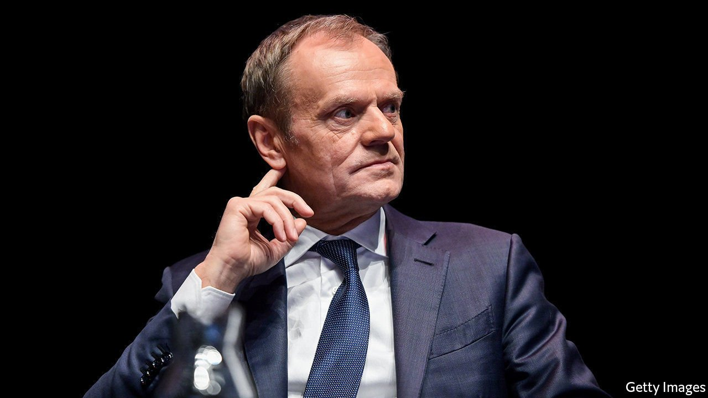

###### The rule of Law and Justice

# Poland’s fragmented opposition lets the governing party run wild 

##### Handouts and social conservatism keep the government popular 

 

> May 1st 2021 

TWENTY YEARS ago, in January 2001, Donald Tusk co-founded the centrist Civic Platform party. It governed Poland reasonably well for eight years from 2007, with Mr Tusk as prime minister for seven of them. Its winning streak ended in 2015 with the victory of the populist Law and Justice party, which was also founded in 2001. Since coming to power, Law and Justice has tightened its hold on Poland’s institutions. It now controls the presidency and the lower chamber of parliament (the opposition has a slim lead in the upper chamber) and has taken over the public media and key courts, provoking a conflict with the European Commission over the rule of law.

It has also imposed a socially conservative agenda. In October the constitutional tribunal dominated by Law and Justice ruled that women could no longer cite severe fetal defects as a reason for an abortion. Massive protests erupted. Yet, to liberals’ dismay, the opposition keeps losing.


Mr Tusk appealed to Poles by offering what he called the policy of “warm water in the tap”, a focus on gradually raising living standards with the help of EU funds, of which Poland has been the largest net beneficiary, rather than on grand ideological projects. Yet its appeal wore thin. Law and Justice won the parliamentary elections in 2015 by courting voters, especially those outside cities, who felt left behind by the social and economic changes since the collapse of communism in 1989.

Since Mr Tusk left Poland in 2014, initially to head the European Council in Brussels, his party has failed to find a leader capable of delivering similar victories. Eyes have been on Warsaw’s liberal mayor, Rafal Trzaskowski, one of Civic Platform’s deputy leaders, who narrowly lost last year’s presidential election to Andrzej Duda, the incumbent. Liberal mayors of cities across Poland have rallied around an emerging movement headed by Mr Trzaskowski called Shared Poland.

Yet Civic Platform faces a new rival for centrist votes: Szymon Holownia, a former television-show host who came third in last year’s presidential election with 14% of the vote. A Roman Catholic, Mr Holownia is courting Poles frustrated with the church’s ties to politics. His movement, Poland 2050, proposes to separate the church from the state. In April it was formally registered as a party. Recent polls suggest it has overtaken Civic Platform.

Partly, this may be because Civic Platform is split. The recent focus on abortion has exposed deep divisions. Some of its politicians want to return to the previous ban on abortion that was slightly less draconian; others want to loosen the rules much more.

Still, Law and Justice faces challenges of its own, not limited to the pandemic. Relations with the ruling party’s coalition partners, the even more socially conservative United Poland and the economically liberal Agreement, remain strained, prompting speculation about early elections. Jaroslaw Kaczynski, Law and Justice’s veteran leader, says he is determined to keep a coalition going until the end of the current parliamentary term, though he “does not rule out” early elections. If the coalition survives, the main parties still have time to get their house in order before the next general election, which is due in 2023.Will they? ■

