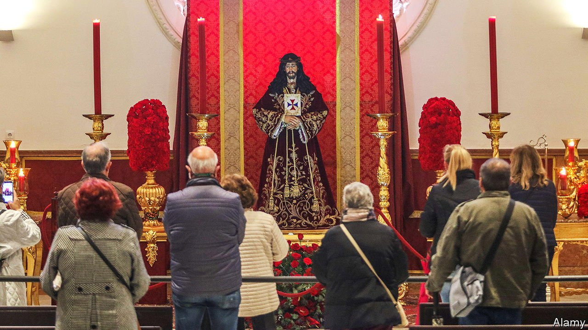

###### Empty pews, big pulpit

# The lingering influence of Catholicism in increasingly secular Spain 

##### Hugely powerful in Franco’s day, the church still wields clout 

 

> May 1st 2021 

DESPITE PANDEMIC restrictions and damp weather, on Good Friday evening several hundred people queued to enter the Basilica of Jesús de Medinaceli in the centre of Madrid to pay their respects to a 17th-century image of Christ. Most of the worshippers were over 40, but there were some younger couples. The Christ of Medinaceli is “very important for madrileños”, said Magdalena, a regular worshipper. She added: “They say Spain is not a Catholic country any more, but it’s a lie.”

Certainly it is a paradox. In the past four decades of democracy Spain has become a secular society with astonishing speed, perhaps faster than anywhere else in Europe. But the Roman Catholic Church retains considerable influence in some areas of national life. In fact, that is unsurprising. In no country in Europe was the church as powerful for many centuries as it was in Spain. Its power provoked militant anti-clericalism in a cultural conflict that was one of the roots of the Spanish civil war. Not coincidentally, the dictatorship of Francisco Franco embraced “national Catholicism” as its official ideology. But after the Second Vatican Council of 1962-65, sections of the church began to oppose the dictatorship. Agreements linked to the constitution of 1978 separated church and state, but acknowledged Spaniards’ religious faith.


Since then, public attitudes have changed fast. Religious observance has declined steeply, especially among the young. Surveys find that although 82% of respondents identified as Catholic in 2001, only half do now. Only around a fifth of Spaniards go to mass regularly—though that still amounts to almost 10m people. Not only has the number of marriages each year declined in the past decade, despite a growing population, but in 2019 only a fifth of weddings were in a church.

The church has lost its grip over public morality, too. Divorce was legalised in 1981. Thereafter, Socialist governments legalised abortion, gay marriage and stem-cell research. In March Spain became only the fifth country in the world to legalise euthanasia, by a parliamentary vote of 202 to 141. Although conservative parties opposed these steps, many of their voters do not, notes Julia Martínez-Ariño, a sociologist.

And yet in some ways Catholicism remains woven into the fabric of Spanish life. Although there is no longer a Catholic party, “it is what feeds Spanish political culture”, says Pablo Hispan, an MP for the conservative People’s Party (PP). Almost every Spanish town has its religious processions, and an annual “patronal festival” with an official mass in which the mayor joins the priest. It is not rare to find crucifixes in public buildings. The church wields particular influence in social welfare, education and the management of heritage. Caritas, a Catholic charity, has helped to feed hundreds of thousands during the pandemic. Church-run (but publicly subsidised) schools still educate around a quarter of Spanish children. And the church manages thousands of historic buildings. All this may be why a third of taxpayers choose to donate 0.7% of their income tax to the church, without increasing their total tax bill. The church’s haul from this was €284m ($318m) in 2019.

It is an apparently stable compromise, but one that is sometimes questioned. “The church invades the public space, laws, budgets and education,” says Juanjo Picó of Europa Laica, a pressure group. Education is the most neuralgic issue. Campaigners on the left want religious instruction dropped as a curriculum subject; it is optional, but around half of children in state schools take it. Conservative parents are alarmed at “gender ideology”, sex education which they think encourages homosexuality, transgenderism and feminism, although not much of this actually takes place. A law that was approved by Pedro Sánchez’s left-wing coalition government last year makes it harder to set up new church-run schools. That prompted demonstrations. The PP defends “freedom of choice” in schooling.

Campaigners for a lay state say the place for religion is church, not school. They complain that the church has registered its ownership of some 20,000 buildings, in some cases without legal title. In France and Portugal church buildings are owned by the state. “There’s an entente cordiale” between church and state, says Mr Picó. “We have to move to a real separation.”

The scandal of paedophile abuse by priests has had less impact in Spain than it has in some other countries. El País, a newspaper, has tracked down 364 cases involving 872 victims. The bishops have carried out no official investigation.

Some in the church fear a new anti-clerical assault. Its critics “don’t see the church as a religious entity but as a political entity”, says José Francisco Serrano, a Catholic journalist and historian. That may be so, but appetite for the battle is restrained. A new generation of bishops is seeking a less public profile, concentrating on strengthening ties with the faithful. And the governing Socialists show little desire for an open confrontation with the church. “The road is a long one,” sighs Mr Picó. ■

