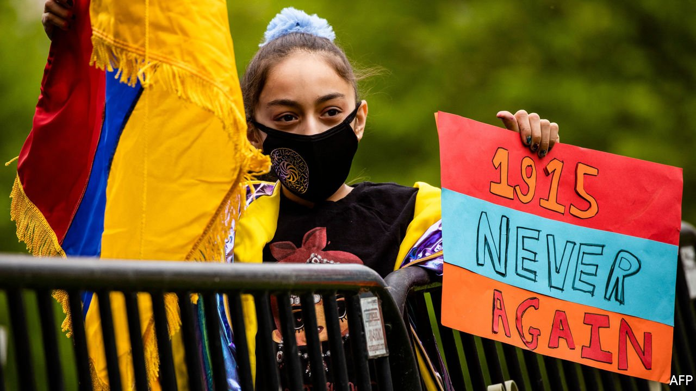
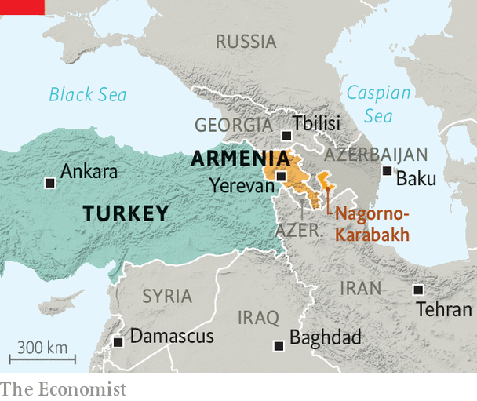

###### The Caucasian knot

# Turkey and Armenia show no signs of reconciling 

##### The genocide a century ago is just one source of contention 

 

> Apr 29th 2021 

BOTH PAST and present haunt relations between Turkey and Armenia. A century ago, Ottoman troops carried out a genocide of Armenians. A few months ago, Turkey helped Azerbaijan defeat Armenia in a war. For decades, the border between Turkey and Armenia has been closed.

Yet in December Turkey’s president, Recep Tayyip Erdogan, held out hope of “a new era” in Turkish-Armenian relations. The unlikely setting was a military parade in Azerbaijan celebrating victory over Armenia. Using Turkish arms, Azeri forces had just recaptured parts of Nagorno-Karabakh, an enclave populated and controlled by ethnic Armenians, and some adjacent districts that had been occupied by Armenia for three decades. Army convoys rolled past Mr Erdogan and the Azeri president, Ilham Aliyev, displaying the wreckage of Armenian tanks, as well as the Turkish drones that had pounded them into the ground. Mr Erdogan hinted that Armenia might have learned a lesson from its defeat, and later suggested that Turkey could open its border with Armenia.


Nothing of the sort has happened. On the contrary, tempers flared again on April 24th, when President Joe Biden formally declared the killings and deportations of over a million Armenians by Ottoman forces in 1915-17 to have been a genocide. Most historians agree with Mr Biden, but previous American presidents have  to avoid upsetting Turkey, which furiously denies that the killings were as widespread or systematic as the evidence suggests they were. Turkey’s foreign ministry called Mr Biden’s statement “a vulgar distortion of history”.

 


Turkey’s ties with America may not suffer much. With its shaky currency, Turkey cannot afford another crisis with its NATO ally.But Turkish officials suggest their country’s offer of detente with Armenia may be a casualty. Ilnur Cevik, an adviser to Mr Erdogan, says the end of the Nagorno-Karabakh war removed obstacles to reconciliation. (Turkey backed Azerbaijan’s territorial claims, and now deems them more or less settled.) However, he says, “if Armenians continue to antagonise Turkey, forcing the Americans to recognise genocide, then this is not going to go anywhere.”


Turkey closed its border with Armenia in 1993, out of solidarity with Azerbaijan. Reopening it would relieve tensions with Armenia “in a dramatic way”, Nikol Pashinyan, Armenia’s prime minister, told The Economist in March. Armenia, he also said, would be ready to establish relations with Turkey “without preconditions”. Mr Pashinyan, who was pilloried for losing the war, resigned on April 25th in order to trigger early elections.

If there were a broad regional settlement, “everybody would win”, says Ahmet Davutoglu, a Turkish former prime minister. Opening borders would help stabilise the entire Caucasus, offer Armenia, the region’s poorest country, access to markets in Turkey and beyond, and connect Turkey to the energy-rich Caspian Sea and Central Asia. Mr Davutoglu, who now heads a small opposition party, was foreign minister when Turkey and Armenia came close to normalising diplomatic ties in 2009. The process foundered after a backlash from nationalists in both countries. Those in Turkey blocked any deal unless Armenia withdrew from Nagorno-Karabakh. Those in Armenia demanded that Turkey recognise the bloodshed of 1915 as genocide.

Western diplomats have long believed that a settlement between Turkey, a NATO power, and Armenia would diminish Russia’s influence in the Caucasus. Today the opposite may be true. Instead of pulling Armenia into the West’s orbit, normalisation could draw Turkey deeper into Russia’s. “Russia’s plan is to have an open border between the Eurasian Economic Union and Turkey,” says an Armenian ruling-party MP, referring to a Russian-led trade bloc Armenia joined a few years ago. Turkey itself, having , does not look keen nowadays to help Western interests in the Caucasus.

Russia may have as big a say in the conciliation process as Turkey and Armenia themselves. Russian troops have patrolled the Armenian side of the border with Turkey ever since the fall of the Soviet Union; Armenia would doubtless insist that they continue to do so. “Armenia is more locked in Russia’s orbit than ever before,” says Richard Giragosian, an analyst. “Normalisation with Turkey will only deepen this.”

As good as it may look on paper, a regional settlement seems as elusive as ever. Some Armenian officials cautiously welcome the prospect of direct trade with Turkey. But much of the political class and society at large seem unready for any kind of engagement. Some also fear that detente with its powerful neighbour would force Armenia to relinquish its claims to Nagorno-Karabakh. In a country of barely 3m people, which remains shaken by the war, fear of Turkey is greater than in recent memory. “This was a war that was triggered by Turkey, instigated by Turkey and managed by Turkey,” says an Armenian official. “There is no confidence.”

Turkey and Azerbaijan have not exactly sounded reassuring. During that victory parade in Azerbaijan, Mr Erdogan praised Enver Pasha, one of the architects of the genocide. Mr Aliyev recently presided over the opening of a ghoulish “Spoils of War” theme park, featuring mannequins of wounded Armenian soldiers with hooked noses and grotesque faces, along with neatly arranged helmets of Armenians killed in the war. How to square such displays with Azerbaijan’s offers of peace is a puzzle. What Mr Erdogan and Mr Aliyev are offering Armenia looks less like an olive branch than the short end of the stick. ■

A version of this article was published online on April 27th, 2021

