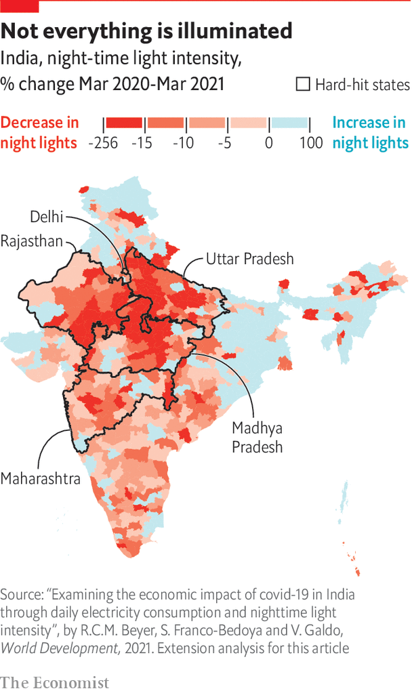
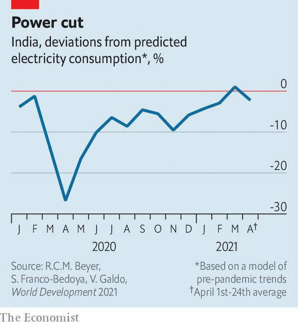

###### Lights, power, inaction

# Tracking the economic impact of India’s second covid wave 

##### The damage is already visible from space 

 

> May 1st 2021 

RIVERS CHANGE course, forests catch flame, glaciers melt: Raj Bhagat Palanichamy of the World Resources Institute India, a research centre, has tracked all of these injuries to India’s landscape through satellite images. In the past year, he has been trying to map a different kind of harm, identifying infection hotspots, pinpointing hospital beds and cross-checking official fatality numbers by examining infrared images of the fires at crematoria.

The murderous toll of India’s second wave of covid-19 infections is impossible to miss but hard to measure. The same is true of its toll on the economy. GDP data for April to June will not be released until the end of August. Figures for industrial production in April will not appear until mid-June and will anyway miss the service sector, which is likely to be hardest hit. India’s government publishes a “periodic” survey of the labour force. But Himalayan glaciers could shrink in the time it takes for it to appear. Hence the keen interest in less conventional indicators of economic activity, such as electricity consumption, mobile-phone data and views from space.

 


Just as satellite images can see the increased intensity of India’s pyres during the day, they can capture the reduced luminosity of its cities at night. In March last year, when Narendra Modi, India’s prime minister, introduced a strict nationwide lockdown, India’s night-time lights darkened by 5.6% compared with a year earlier, according to Robert Beyer, Sebastian Franco-Bedoya and Virgilio Galdo of the World Bank. By May 2020, India was 10% dimmer. The country as a whole has brightened since. But 31 of Maharashtra’s 36 districts (including Mumbai) and all but a handful of those in Madhya Pradesh and Uttar Pradesh shone even less brightly in March 2021 than a year earlier.


 


Mr Beyer and his colleagues have also taken advantage of India’s daily statistics on electricity consumption, which they have “scraped” from the website of the grid operator. During April 2020, consumption fell by almost 27% below the amount that past patterns would predict, given the temperature and the underlying upward trend in India’s power usage. Consumption finally surpassed its expected level in March 2021. That recovery, however, has retreated in recent weeks (see chart).

The economy’s prospects for the rest of the year depend on how the pandemic evolves and the government responds. Mr Modi has left it up to the states to decide how and when to reimpose restrictions on gathering. The country therefore faces a patchwork of impediments to moving and mingling. One way to measure their stringency is to tally up the different types of restrictions, such as school closures or event cancellations. Another is to use smartphone data tracking the drop in users’ mobility. Goldman Sachs, a bank, has combined both approaches into a single lockdown index. It gave India a score of 87 out of 100 at the worst point last year, far more severe than the peaks recorded in America (57) or even Britain (74). By comparison, the latest restrictions warranted a score of only 47 on April 23rd.

Analysts at Goldman reckon lockdowns today disrupt the economy less than did similar lockdowns a year ago, as businesses and consumers have adapted. If India’s restrictions remain only around their current level for the three months from April to June, economic activity will be 2.9% smaller than it was in the previous three months, they predict. If the pandemic then relents, GDP could still be much bigger this year than it was last. But that says as much about the awfulness of 2020 as it does about the prospects for the rest of 2021. ■

Dig deeper

All our stories relating to the pandemic and the vaccines can be found on our . You can also listen to , our new podcast on the race between injections and infections, and find trackers showing ,  and the virus’s spread across  and .

