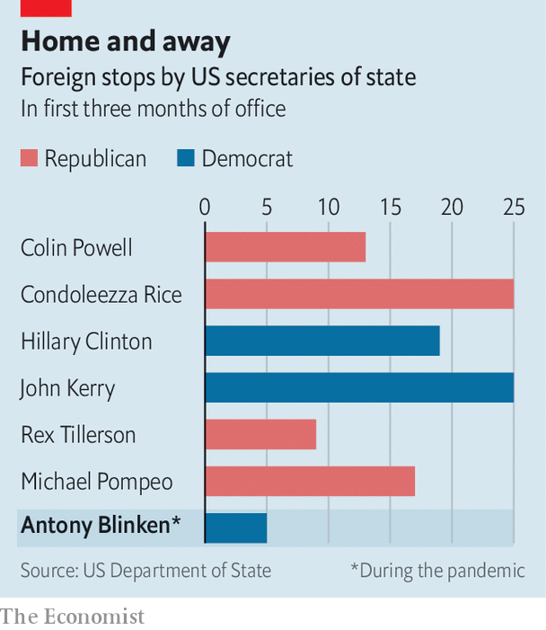
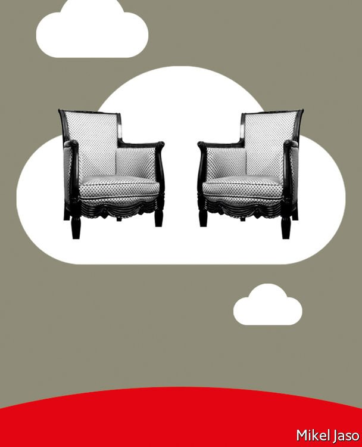
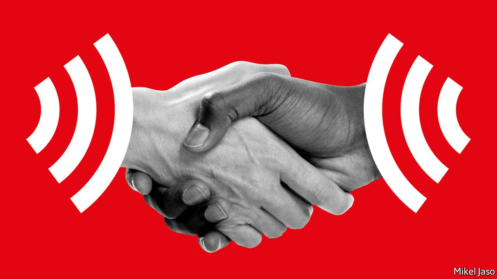

###### The Zoom where it happens

# Diplomacy has changed more than most professions during the pandemic 

##### Covid-19 has hastened the arrival of hybrid diplomacy, a blend of the physical and digital 

 

> May 1st 2021 

WHILE ASSORTED G20 “Sherpas”, officials who do the donkey work on summits, gathered in Dhahran in Saudi Arabia in March last year, lockdowns were starting and international travel was stopping. A scramble to get home began. But within weeks, after some teething troubles with videoconference technology, the Sherpas were conducting talks over Zoom and Webex, and their bosses were holding a leaders’ summit by video. Diplomacy had gone virtual.

“For a long time we’ve been talking about the advent of digital diplomacy,” says Jonathan Black, Britain’s sherpa. “It has really now arrived.” Over the past year diplomats have all but abandoned big multilateral meetings in the flesh. The United Nations General Assembly (UNGA), which normally clogs up New York for two weeks in September as thousands of delegates jet into the city, became a more modest affair with leaders joining via screens.


In the parts of the world that have secured vaccines “in-person” diplomacy is slowly restarting. When Dominic Raab, Britain’s foreign secretary, hosts fellow G7 foreign ministers for “covid-secure” talks in London on May 3rd-5th, it will be the first time the group has met in the same room since they did so in Saint-Malo in France in April 2019. Current plans envisage that the full G7 summit in Cornwall in June, and a NATO one in Brussels immediately afterwards, will be in-person too.

In the meantime, a great experiment in virtual diplomacy has been under way. In February, for example, Joe Biden held his first summit meeting as president, with Justin Trudeau of Canada, by videoconference. Without leaving the White House, he has since joined a virtual meeting of fellow G7 leaders hosted in London in February—cyber-hopping across to Germany on the same day to speak at the Munich Security Conference—as well as the inaugural summit of the “Quad” (America, Australia, India and Japan) in March. In April he brought together 40 world leaders on screen for a climate summit. Diplomats everywhere, accustomed to ceaseless flying around the world, have spared the national coffers and done their bit to save the planet by cutting out travel.

“Diplomacy has not stopped; it’s accelerated in some respects,” says Nicholas Burns, a former ambassador, now at Harvard University. Communiqués have been agreed upon, resolutions passed, relationships nurtured. In some respects diplomats have probably never been busier.

Hurdles have had to be overcome. At the UN, Russia has refused to accept anything other than physical presence for the Security Council, depriving virtual meetings of formal status. That has slowed things down. Since the seats in the council are not sufficiently socially distanced, a system had to be worked out for voting by emailed letters. With receptions and other forms of entertainment ruled out, diplomats have had to adapt. Instead of the usual dinner to mark their stint as president of the Security Council in February, for example, the British distributed picnic baskets to other missions—placing an unusual amount of diplomatic weight on Branston pickle and Fortnum &amp; Mason tea.

The main workarounds, however, have involved not tea but technology. Zoom, Microsoft Teams and other platforms have both enabled diplomacy to continue and opened new possibilities for efficiency and reach. “We’re a lot better off now because of covid, in terms of diplomacy and mediation, because we’ve been forced to think more carefully about how to do our job,” says Martin Griffiths, the UN’s special envoy for Yemen. “It’s a huge seismic change to the way we do business.”

It is not the first time that technology has transformed the world of diplomats. Ambassadors used to be “the equivalent of ship captains”, says Charles Freeman, a former American ambassador, now at the Watson Institute for International and Public Affairs at Brown University. “They were far away and not subject to control.” At the Congress of Vienna in 1814-15, the British foreign secretary, Lord Castlereagh, enjoyed great autonomy, since letters to London might take four to six weeks to arrive. “I did not wait for instructions at Vienna,” he later told Parliament. “I took upon myself the responsibility of acting.”

The telegraph changed all that. News and instructions travelled instantly, to generals in battle and diplomats in embassies. Envoys bemoaned their loss of autonomy (one British diplomat lamented the “telegraphic demoralisation of those who formerly had to act for themselves”). Diplomatic power became more centralised.

The pace could still be leisurely. Winston Churchill fished with Franklin Roosevelt and painted with Dwight Eisenhower. Leaders invested time “tending the diplomatic garden”, as George Shultz, America’s secretary of state under Ronald Reagan, put it. In his final year in office, in 1988, Shultz undertook an eight-country, three-week tour of Asia, “unthinkably long by today’s standards”, recalls Mr Burns, who accompanied him.

Cables and wireless

Since then, air travel and the demands of the news cycle back home have led to shorter summits and a general acceleration of diplomacy. Email and social media have further speeded things up, often bypassing careful drafting and clearance procedures developed to avoid mistakes. Under the presidency of Donald Trump, an impulsive tweet could short-circuit the best-laid diplomatic plans. Modern diplomats have had to adjust to “the annihilation of distance and the compression of time”, as Mr Freeman puts it.

 


Now covid-19 has shaken things up still more. For one thing, it has played havoc with foreign services’ plans and personnel. At the top, foreign trips have been scaled right back (see chart). Down the ranks, many diplomats have been withdrawn from their posts because of health precautions, or find themselves on extended tours without their families. The pandemic itself has also become a core element in diplomacy, whether as part of soft-power manoeuvring between America, China and Russia, or among allies in tensions stoked by vaccine nationalism. But its longer-term impact will probably be on how diplomacy is conducted, changing practices in three important ways.

First, in the often staid world of diplomats, it has accelerated the adoption of technological tools. Videoconferencing and other means of direct communication, especially via WhatsApp and (for greater security) Signal, have been used more widely. Foreign services’ investment in secure video technology is expected to grow.

Martin Waehlisch, who leads an “innovation cell” at the UN in New York, says the pandemic has boosted adoption of virtual-reality (VR) technology to give decision-makers in New York a sense of what it is like to be on the ground in conflict zones. He sees this as “the future of briefings”, replacing the traditional reports in “Times New Roman, single-space, black-and-white block text”. “Iraq 360”, a VR experience to help mobilise donors, showed the possibilities in 2019. Now the restrictions on travel have led to an investment in other immersive storytelling projects as an extra format for briefing the Security Council. Such projects are under way for Yemen, Sudan and Colombia. Mr Waehlisch hopes this will become standard practice.

 


The second change is improved productivity, thanks to videoconferencing. Interacting with people around the world has become a lot simpler. “I’ve been able to reach out to more people because I’m not constantly in an airport or on the road,” says Rosemary DiCarlo, the UN’s undersecretary-general for political affairs. Thanks to Zoom and other platforms, it has become possible for diplomats and political leaders to show up for speeches and meetings that they would almost certainly not have attended had their physical presence been required.

For example, 12 foreign ministers and a prime minister might not have flown to New York in February to discuss global vaccine access, but they did all take part in a virtual Security Council meeting on the subject. Scott Morrison, Australia’s prime minister, would hardly have travelled from Canberra to the Rocky Mountains just to address the Aspen Security Forum, as he did last August. It takes months of planning to assemble all the people necessary for a G20 or ASEAN gathering, but you can bring presidents and prime ministers together on a video screen with relative ease. For peace talks, too, virtual platforms make it possible to bring in people who probably wouldn’t find the time to get on a plane and spend several days cloistered in Stockholm or Geneva.

Virtual meetings also cut out a lot of the formalities and pomposity of traditional diplomacy. They are “a great leveller”, says a diplomat from a UN Security Council member: “They’re in their bedroom and you’re in your bedroom.” In the bigger gatherings, officials feel less need to be loquacious than when they have the floor after travelling for a day to deliver a message. As a result, they can sometimes achieve much the same outcome, insiders say, only faster.

Blessed are the peacemakers

The third change may be the most important: the pandemic has accelerated experiments in ways to include a wider range of voices in peace efforts. For some time “inclusivity” has been a buzzword in the world of conflict resolution. Diplomats know that peace processes are often perceived as being imposed from above, or from outside, and that any such deals may not enjoy widespread support. A number of private-diplomacy outfits, such as the Centre for Humanitarian Dialogue (HD), based in Geneva, have worked to facilitate the involvement of grassroots representatives, including women and young people. But the logistics can be hard. Getting a handful of women from a conflict zone to Switzerland for a few days of discussion is a challenge at the best of times. During a pandemic it can be an impossibility.

So mediators turned to technology—and found relatively quick and easy ways to bring in people who are not normally consulted on a political or peace process. Diplomats are now excited about the potential. “This should become a standard part of how we operate,” says Ms DiCarlo. Her innovation cell in New York repurposed a commercial tool normally used for market research to develop the ability to conduct what it calls “large-scale synchronous dialogues”. These digital focus groups feel like a texting chat, but have the scale of an opinion poll.

The first experiment was in Yemen. A regular poll with 20-30 questions in that country would cost €250,000 ($300,000) and take a month to get the answers, according to Mr Waehlisch of the innovation cell; the digital dialogue cost only a modest consultancy fee for the question design, and produced results instantly. “It’s quite extraordinary for the UN to be in the forefront of this stuff,” says Mr Griffiths, the envoy for Yemen. “It’s terrific, it’s 21st-century diplomacy, because of course it gets away from men in rooms.”

The absence of alternatives

Libya shows the impact this can have. Last year the pandemic pushed negotiations between the country’s rival forces onto video platforms—Zoom for the political dialogue, Teams for the military track. In the summer, with the help of HD’s mediators, a physical meeting in Montreux led to a road map for reconciliation, the Libyan Political Dialogue Forum (LPDF). Stephanie Williams, at the time the UN’s acting special representative for Libya, realised she needed to expand the numbers in the dialogue for it to be more representative.

In September she started doing big Zoom sessions with mayors, women’s groups and youth activists; representatives of each group reported back to the LPDF, giving their suggestions. In all, Ms Williams says, some 200 women took part, as well as 100-150 young people and the majority of Libya’s 130 municipalities. And then, between November and January, she held five digital dialogues, averaging over 1,000 people for each one, typing back and forth in Arabic. “It really took off with the Libyans,” says Ms Williams. “And it turned out to be a great tool.”

The dialogues included spot polls, which confirmed a lot of what she knew Libyans wanted from the political process, “but we were also able to use it to push the political class, to say, hey, it’s not just the UN mission that’s saying what Libyans want.” In particular the dialogues were useful in pressing the need for unified institutions before elections, which are planned for December. In giving Libyans a voice, the UN’s diplomats reckon, the Zoom calls and dialogues not only boosted confidence in the peace process but improved the prospects for it lasting. An opinion poll (of the traditional sort) in February by Diwan Research found that 71% of Libyans were satisfied with the LPDF process to select a new government, and 68% deemed the process fair and transparent.

Sooner or later these tools would have been put to use in diplomacy. But the constraints of covid-19 had the effect of hastening their adoption, in Libya saving valuable time. “I don’t think that we would have considered things like the digital dialogues had it not been for the pandemic,” Ms Williams says.

Even enthusiasts for the new possibilities of digital diplomacy, however, are keenly aware of its limits. Building a rapport is harder on Zoom than in person. Samantha Power, when appointed by Barack Obama to be America’s ambassador at the UN, went to the trouble of paying a visit to each of her 192 fellow mission heads (with the sole exception of North Korea’s), an investment in relationships that could no doubt be done far more easily today by Zoom, but with much less impact.

Part of what is missing are the signals you can pick up about an interlocutor in a physical meeting: the visible reaction. “When you ask a tough question, do they blanch or do they back up, do they lean into it?” says Mr Burns of Harvard. “You’re not going to get that on Zoom.”

And the really hard part of a negotiation is best done in person. If things aren’t going well, a chat at the bar, or a stroll in the grounds, may help create a breakthrough. The plus side of virtual meetings, the efficiency gains, are also their minus side: you lose the time spent on the margins, the space for informal conversation that helps to establish trust. Difficult messages, often the stuff of diplomacy, can be delivered with more nuance, and less lasting damage to a relationship, face to face than when struggling with a poor connection. At a distance, diplomats say, it is easier to camp on a red line than when you are in the same room. Confidentiality is another concern: “The most delicate issues aren’t amenable to virtual,” says Mr Griffiths.

 


For all these reasons the toughest agreements—such as Britain’s Brexit deal with the EU—and the hardest conversations will still have to be worked out in person. It is one thing for the White House to convene world leaders to make worthy on-screen statements about tackling climate change, as happened on Earth Day in April. It is another to cajole and corral countries into a difficult agreement, as happened in the negotiating rooms at COP21, the Paris climate summit in 2015. Hence the hope that COP26 in Glasgow later this year can be held in person too.

So physical summitry will not end. Neither is the role of the resident ambassador under serious threat, despite the ease of direct digital communication between governments. Diplomats insist there is still no substitute for that man or woman sitting in the foreign capital, soaking up the culture, the politics, the media, the arguments, and being the acknowledged interpreter of that culture back home.

Diplomatic immunity

But any complacency about a simple reversion to pre-pandemic habits of diplomacy would be misplaced, just as it was after previous disruptions such as the telegraph and the jet plane. The big diplomatic jamborees of the past, such as UNGA, may never return in quite the same way. Digital tools, from virtual meetings to inclusive focus groups, have proved their worth. The diplomatic handbook is ready for a rewrite.

Covid-19 has hastened the arrival of hybrid diplomacy, a blend of the physical and digital. Quite what the ideal mix turns out to be has yet to be worked out, but it is something international negotiators and foreign services are starting to think through. In America Mr Biden and his secretary of state, Antony Blinken, want to reinvest in a State Department that had been badly neglected. The money and training should go on preparing for tomorrow’s diplomacy, not yesterday’s. ■

