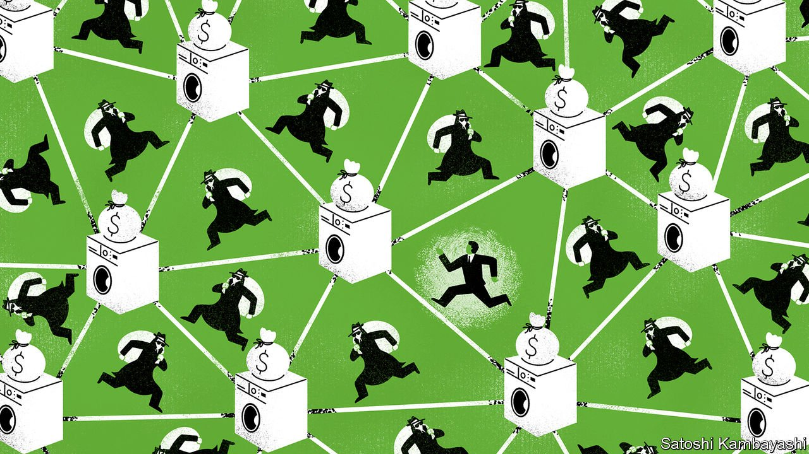
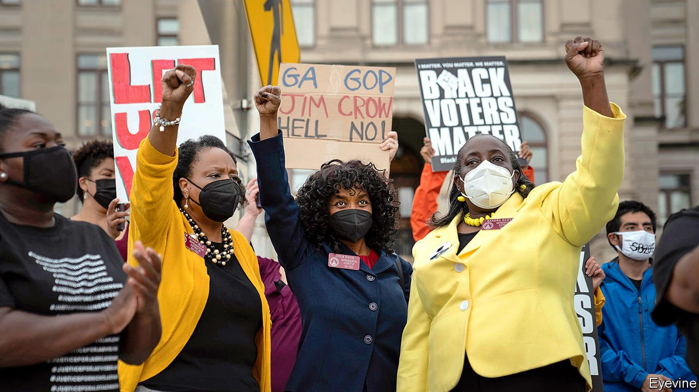
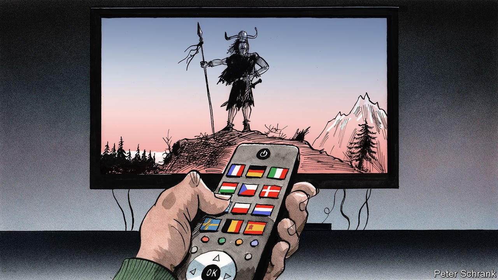
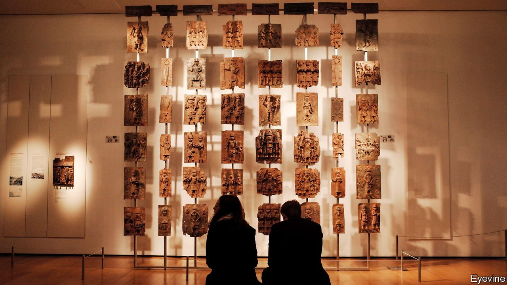
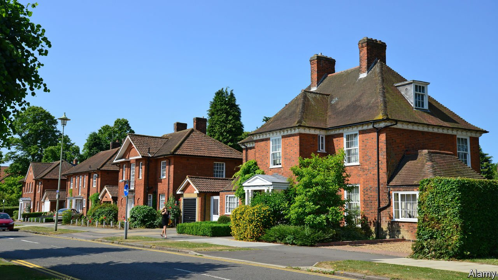

###### On money-laundering, voting in Georgia, European TV, museums, Ebenezer Howard, simplifying

# Letters to the editor 

##### A selection of correspondence 

 

> May 1st 2021 


Fight the good fight

The war against money-laundering is not lost; it continues, and we should not wave the white flag just when its most promising strategies are gaining ground (). One such strategy is enforcement. The fact that last year banks had to pay $10.4bn in anti-money-laundering (AML) fines could be seen as a failure to stop illicit flows, but it also reflects a greater willingness to crack down on violations outside the United States. And although forming AML teams has indeed been a Herculean task, imposing big regulatory changes on firms across the world is no easy feat. Such investments are not aimed at the problems of the past, but at the future. Technological advances, such as artificial intelligence, are only now beginning to fortify the compliance controls developed over previous decades.


More work is needed, including by governments. For one, financial supervisors should rethink punitive policies that largely leave institutions in the defensive posture of meeting technical obligations, rather than focusing solely on rooting out illicit funds. Efforts to bring together investigators, supervisors and compliance officers in mission-driven task-forces are now starting to bear fruit.

SCOTT LILES

President

Association of Certified Anti-Money Laundering Specialists

Columbus, Ohio

Big companies and big countries prefer to be judged on process over results. The leading centres of money-laundering are London, New York, Shanghai and other big financial centres. These hubs and their regulators tick the right boxes on processes and never appear on official money-laundering blacklists that trigger sanctions.

Professional money-launderers want to hide in a crowd of similar transactions. Yet countries that are labelled as threats include the likes of Cuba, Vanuatu and Yemen. Many have exchange controls. Some don't even have an international bank. These are the last places you will find big money-launderers. They are blacklisted and do not have the political influence to get off.

The politicisation of AML lists is dangerously creating a safe tunnel for such criminals, who are good at getting around prescriptive processes. Switching the focus to heavy sanctions for actual money-laundering instead of tick-box exercises on applied process would harness the private sector's ingenuity to win this important war.

AVINASH PERSAUD

Emeritus professor of Gresham College

London

As your article noted, outsourcing policing functions to the private sector may be problematic. Instead, enhancing the powers of financial-intelligence units to monitor and even postpone suspicious transactions may be a more efficient measure and would be fully compliant with countries’ legal obligations. The Parliamentary Assembly of the Council of Europe recently passed a resolution urging governments in Europe and beyond to do just that.

JAN KLEIJSSEN

Director

Information Society and Action against Crime

Council of Europe

Strasbourg

 


Georgia’s election laws

As a professional engaged in the industry of electioneering in Georgia, I wanted to provide some context to the reforms in the Election Integrity Act ). Of notable importance is the environment in which those reforms took place. After the governor’s election of 2018 (which Stacey Abrams wrongly claimed was stolen from her), Georgia replaced an election system that was dated, susceptible to security breaches and lacking a paper trail. The overhaul of equipment brought significant change in how votes were counted, local-election officials were trained and voters verified.

Although the system was tested locally, no statewide election had occurred before the pandemic in 2020. Last year’s public-health orders highlighted significant cracks in its implementation, staff training and voter verification. The system didn’t anticipate millions of people voting at a distance, demonstrating the unreliability of signature-matching technology. Boxes to drop ballots in, popular among Republicans and Democrats alike, were not even legal. They only existed because of gubernatorial fiat.

None of this is to suggest that nefarious activities took place. As a Republican, I challenge anyone to prove elections were “stolen”. Democrats performed meekly in state-level offices when they thought they’d win the state house. They didn’t even come close. Their cries of voter suppression are naked partisan gimmicks designed to rile their base for a competitive election in 2022.

ROBERT LEE

Dallas, Georgia

 


Europe’s TV beats the invaders

How appropriate that should choose “Barbarians” to illustrate his notion that Netflix is creating a common European culture (April 3rd). That show, made in Germany, portrays the efforts of Rome as a supposedly superior and sophisticated imperial invader to impose its laws and manners on apparently uncivilised barbarians (the Greeks termed barbaroi for anyone who did not speak Greek).

Memories are short. It has been only a few years since series like “The Bridge” hit screens through European TV networks, creating a huge internal market of European programmes, subtitled or dubbed. In addition to that Nordic triumph, some of Europe’s leading networks are collaborating on high-end drama, such as “Leonardo”. Looking at Europe’s public broadcasters alone, annual investment in content is just shy of €20bn (24bn) a year.

VANESSA O’CONNOR

Director of member relations and communications

European Broadcasting Union

Geneva

 


Museum collections

* Your article “ (April 20th) rightly notes that returning objects is “far from simple” and acknowledges the legal restrictions which exist. However, it is untrue to say in the case of the British Museum that “most of the bronzes are kept in storage where no one can see them”. Illustrated records for the collection of objects from Benin are available via our online database and objects are–under normal, non-covid circumstances–accessible to anyone via our study rooms. There are collaborative research projects exploring the Benin material in the collection, including a current project on West African Bronzes, and we are working with The Legacy Restoration Trust and Adjaye Associates on a major new archaeology project to support the development of the Edo Museum of West African Art (EMOWAA).

HARTWIG FISCHER

Director

British Museum

London

 


Ebenezer good

Your piece on Welwyn Garden City described Sir Ebenezer Howard as “a farmer turned urban visionary” (). A visionary indeed but not really a farmer. Howard spent a few months as a young man farming in Nebraska, but then trained as a stenographer in Chicago and spent his entire professional life thereafter in London as a parliamentary reporter with phenomenally fast shorthand, in essence a forerunner of today’s Hansard reporters. Maybe there is something about listening intently to parliamentarians that encourages visionary thinking.

DAVID NATZLER

Clerk of the House of Commons, 2015-19

London

 


Clear your mind

The article on people’s tendency to add things when improving something rather than simplifying them () reminded me of Lao Tzu, an ancient Chinese philosopher. He observed that “To attain knowledge, add things every day. To attain wisdom, remove things every day.”

JASON GART

Rockville, Maryland

When it comes to solving problems, creating a “sub-par result” is surely an improvement for a golf course.

JOHN ALLAN-SMITH

New York

* Letters appear online only

