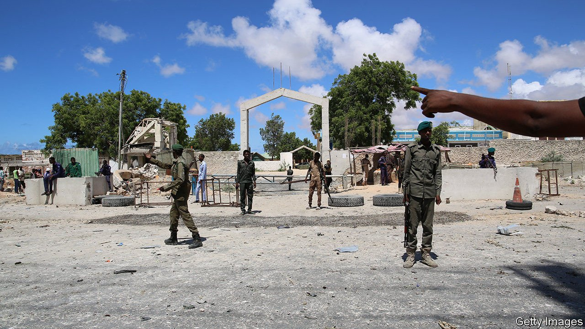

###### Villa-squatting

# Somalia’s power-hungry president has taken his country to the brink 

##### Why Farmaajo will not go 

 

> May 1st 2021 

MOHAMED ABDULLAHI MOHAMED, better known to his people as Farmaajo, was once a popular figure. Residents in Mogadishu, the capital of Somalia, welcomed him to the presidency in 2017 with celebratory gunfire. They saw him as a reformer who would fight corruption. There were indeed some reforms, enough to secure promises of debt relief from the World Bank and IMF. But Mr Mohamed’s chief interest seemed to be the accumulation of power, so much so that, when his term expired in February, he refused to give it up.

Setting off a political crisis is always a risky business. Unleashing one in a country that has known little peace for 30 years, and where your opponents are at least as well armed as you are, seems doubly foolhardy. On the evening of April 25th violence duly broke out in Mogadishu. This time there was nothing celebratory about the gunfire. Somalis were shooting not into the air but at each other.


A ceasefire has since restored calm, but Somalia remains in a more precarious position than it has been for years. Mr Mohamed’s opponents have retreated to their strongholds in the north of the capital, where they are protected by armed clansmen. Many of these fighters are army defectors. Fragmented to begin with, Somalia’s security forces look close to disintegrating along clan lines. Mr Mohamed, a Darod clansman in a city dominated by the rival Hawiye, is thought to have full control of just five of Mogadishu’s 16 districts. Somalis talk gloomily of civil war.

Whether such a disaster can be averted depends in large part on how Mr Mohamed responds. In a bid to defuse tension he has promised to ditch a law, forced through parliament in April, extending his term by two years. He has also agreed to return to talks on how to hold elections.

Neither offer is likely to placate his opponents in the National Salvation Council, an alliance between Mr Mohamed’s main challengers for the presidency and the leaders of the two federal regions most hostile to him. The council regards Mr Mohamed not as president but as a squatter in the Villa Somalia, the official presidential home. As a condition for returning to negotiations, it is likely to demand the resignation of Mr Mohamed, or at the very least that he should be reduced to the nominal head of a caretaker government until an election is held.

Mr Mohamed’s choices appear to be narrowing. His power grab has cost him most of his remaining political capital abroad. Western powers, the UN and the African Union, guilty of dithering and sending mixed messages in the past, all opposed his attempts to extend his presidency. He is struggling financially, too. His finance minister recently called on Somalis living abroad to help pay the country’s public-sector wage bill by depositing money in government bank accounts.

Mr Mohamed could yet opt to settle things on the battlefield. Officially he still commands the loyalty of foreign-trained special-forces brigades, as well as units within national intelligence and the army. Yet even here clan loyalties are straining cohesion, says Matt Bryden, director of Sahan Research, a Somalia-oriented think-tank. Diplomats hope Mr Mohamed will be sensible and capitulate rather than risk a civil war he may well lose.

 


If he goes, his departure may not be the end of the story—indeed, it could be the easy part. His opponents are presently united by their loathing for Mr Mohamed. His absence could cause them to turn on each other, as happened in 1991, when the dictator Siad Barre was ousted, only to unleash a civil war fought along clan lines. Lessons have since been learned and more recent elections have passed off peacefully enough, but they were not contested in so febrile an atmosphere.

As Somalia’s latest crisis worsens, only one faction is enjoying the show: al-Shabab, the al-Qaeda affiliate that controls much of the countryside (see map). The lust for power and the tawdry squabbling that presently grip Somalia’s politicians play into the jihadists’ hands. Only the establishment of a rules-based system that brings genuine benefit to the people will thwart them: a sadly distant prospect. ■

