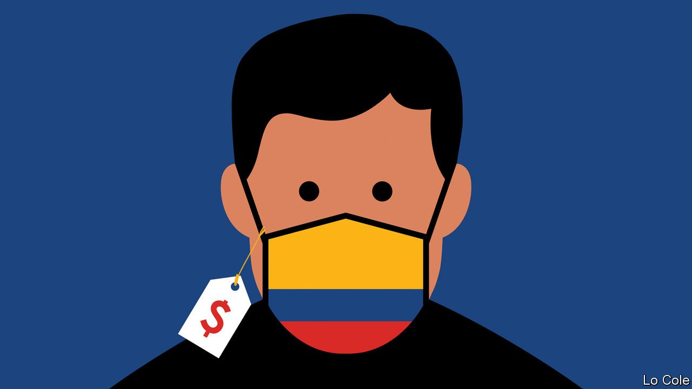

###### Bello

# How will Latin America’s covid-19 bill be paid? 

##### Colombia is a test case of the difficult fiscal decisions governments will face 

 

> May 1st 2021 

THE TIMING could hardly be more awkward. Colombia is suffering a third peak of covid-19, even more deadly than its predecessors. Almost all intensive-care beds in the main cities are full, and oxygen tanks are running short. Bogotá, the capital, is under a red alert, with the working week cut to four days and a curfew at 8pm. Yet in April the government of President Iván Duque sent a bill to Congress proposing stiff tax rises. Although the increases would be phased in, the government thinks it must signal now its intention to raise more revenue, particularly if it is to provide emergency aid to its people until the pandemic is over. Many of the country’s politicians disagree, and the bill was the target of a large national protest on April 28th.

Colombia is an early example of the fiscal dilemmas Latin American governments will soon face. The region has suffered grievously in the pandemic. Its economy shrank by 7% last year, more than double the average contraction around the world. As lockdowns eased a couple of months ago, there was optimism that recovery might exceed the 5% growth of most forecasts. But then the P.1 variant of the virus, first detected in Brazil, began to run wild. Like Colombia, other South American countries have been forced to restrict movement yet again. Meanwhile vaccination is happening slowly. The result is that 2021 is shaping up to be another difficult year.


Matters would be even worse had governments not been able to soften the blow with aid to poorer households and to firms. Though not on the generous scale of many rich countries, this fiscal stimulus was much more than the region managed in past slumps. According to a study by the IMF, it averaged about 4.5% of GDP. With revenues falling because of the recession, fiscal deficits ballooned and public debt rose last year from an average of 64% of GDP to 72%.

That would once have been seen as a dangerously high figure. But low international interest rates make it more affordable. Nonetheless, several governments are scaling back aid even as the pandemic continues. Many economists think that is a mistake. Investors will tolerate deficits and debts provided governments set out—and preferably approve—credible measures to curb them once economies have recovered.

“It’s right to spend during the pandemic,” argues Alejandro Werner, the IMF’s outgoing director for Latin America. “But it’s also right to start thinking about tax and spending reforms.” In a typical Latin American country, paying for the better health care and social assistance citizens are demanding while at the same time servicing higher debt requires a rise in government revenue of between 1.5% and 3% of GDP. (Some countries would need instead to trim ineffective spending.) If recovery turns out to be slower, tax rises could be postponed.

This is the path Colombia’s government wants to follow. Its bill raises around 2% of GDP in additional revenue, mainly by widening the net of income tax and removing exemptions in VAT. Mr Duque says that would allow the government to continue to make emergency payments of $44 per month to over 3m poorer households, compensate them for levying VAT on basic goods and continue a furlough scheme. It would also safeguard Colombia’s investment-grade credit rating, which makes borrowing cheaper for firms and the government.

The bill is praised by tax specialists but, with a general election due next year, it has prompted political uproar. Woundingly for Mr Duque the critics include Álvaro Uribe, a conservative former president who is his political sponsor. Mr Uribe has submitted an alternative bill that would cut the revenue gains in half.

Other countries will soon face similar decisions. The region is not facing a debt crisis—or at least not yet. But the credit-rating agencies are flashing an amber light. Joydeep Mukherji of Standard &amp; Poor’s, one agency, notes that with 13 downgrades since the pandemic began and nine “negative outlooks”, Latin America’s credit score has been hit harder than that of any other region.

If Colombia’s tax reform is thwarted by short-term political considerations, that sends the wrong message to other governments. The risk is that “we’ll end up with not enough stimulus and problems with the financial markets,” says Mauricio Cárdenas, a former finance minister in Colombia. That would mean Latin America would have to say adiós to a robust economic recovery.

