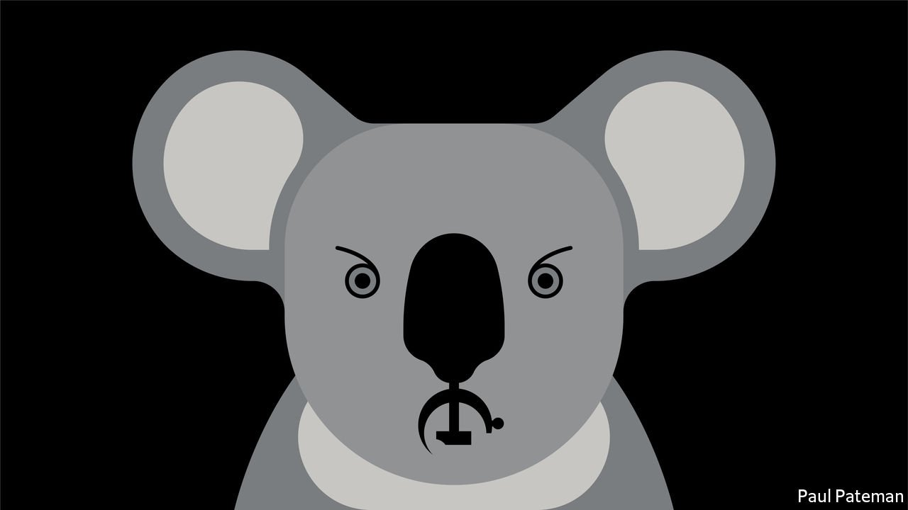

###### Banyan

# Australia’s debate about China is becoming hot, angry and shrill 

##### The increasingly one-sided discourse helps no one 

 

> May 8th 2021 

CHINA’S COMMUNIST PARTY has given Australians plenty to be dismayed about, from its vituperative anger when the Dalai Lama visits, to buying off Australian politicians, to trying to influence academic research at Australia’s universities. China is not best pleased, either. In an extraordinary outpouring of bile last year, the Chinese embassy in Canberra enumerated 14 grievances against Australia. These included the passing of a law against foreign interference in politics and calling for an independent international inquiry into the murky origins of the novel coronavirus. Putting Australia firmly on the naughty step, China has blocked a raft of Australian exports to China, the unlucky country’s biggest trading partner.

Australia long needed a public debate about China, but politicians were loth to broach one. Even as China’s power and reach grew under President Xi Jinping, Australia’s leaders, and voters, were happy striking an awkward balance in which it got its prosperity from China—through vast exports of iron ore and coal and imports of Chinese students—and its security from an America-led order. But, given Chinese rage, having it both ways is no longer an option.


The government of Scott Morrison, prime minister since 2018, relishes calling China out. By now, though, the rhetorical flourishes are starting to sound as though it were girding for war. Mr Morrison says Australia must speak with “one voice” on foreign policy, as if scrappy debate was uncalled for, or even unpatriotic. The new defence secretary, Peter Dutton, told the Sydney Morning Herald ( SMH) that Australia was “already under attack” in the cyber domain. He warned that a war over Taiwan could not be discounted and that the priority was defending Australia’s waters. A senior civil servant, Michael Pezzullo, weighed in with talk of the “drums of war”, pointing the finger at China without naming it.

Yet if war is not actually imminent, which it is not, then the government line is not helpful. Natasha Kassam of the Lowy Institute, a Sydney think-thank, argues in the Guardian that while the reasons for talking about regional challenges are sound, “there are also real risks…from causing panic and hysteria.” Not even Taiwan talks of imminent war.

Kevin Rudd, a former prime minister and cogent observer of China’s rise, goes further. Australia’s “highly problematic” relationship with China is certainly because of Mr Xi’s much more assertive posture. But it is also, Mr Rudd argues in the SMH, because Mr Morrison and his team “are addicted to the drug of ‘standing up to China’.”That may play well at home, but “the public language on China, Taiwan and the possibility of war…serves zero national security purpose.”

What is more, the line from Canberra poisons a wider domestic discourse over China, in which those arguing for engagement, nuance or open debate are shouted down. A furore erupted when Jane Golley, a prominent academic at the Australian National University, argued that debates about China were being stifled by a “dominant narrative”. She was perhaps unwise to choose the topic of China’s brutal treatment of Uyghurs in Xinjiang, which she does not contest, as her example. But the outcry seemed to bear out her broader point.

Separately, a researcher and prolific tweeter at the Parliamentary Library, Geoff Wade, has claimed widespread Communist Party influence over Australian life. When a handful of commentators, including one with former business ties to China, challenged the basis of his claims, Mr Wade issued defamation suits against them. James Paterson, a senator who is part of a group of China hawks in Parliament, claimed Mr Wade was the object of “state-backed coercion”. (Also without evidence, Mr Wade’s critics counter that murky forces are paying for his legal campaign.)

One veteran Canberra hand describes a dangerous “ideological intolerance” in which moderate voices are drowned out and the debate about China is reduced to emotion. Another senator, Eric Abetz, last year even called on Chinese-Australians appearing before his committee to denounce the Communist Party. That points to a further risk, says Greg Barns, a lawyer: pinko paranoia plays to a xenophobic, racist undercurrent that has long run through Australian life.

Such an undercurrent risks resurfacing if Chinese-Australians face questions or abuse about their loyalty. If the hawks’ tactics end up making Australia seem a less civil, tolerant or welcoming place, then the country will be the poorer for it.

