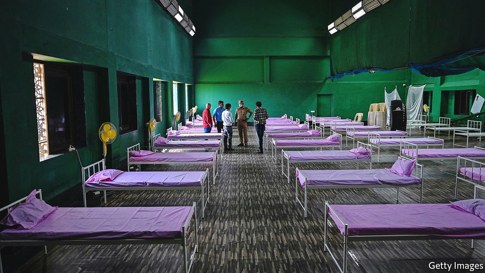

###### Urbs prima in Indis

# Why is Mumbai handling its second wave better than Delhi? 

##### Credit a sensible administrative structure, decentralisation and data-driven planning 

 

> May 6th 2021 

WHEN THE world sees images of India’s covid-19 crisis, it is through the eyes of the citizens of Delhi.That is not just because most foreign correspondents and photographers live—and are stuck—there. The capital’s caseload has been among the highest and deadliest of any city in the country. On May 3rd alone, 448 deaths were reported and untold numbers died unrecorded. One in every four tests is coming back positive, typical of an outbreak that is out of control.

On May 5th the Supreme Court, situated in Delhi, told the national government, which is there too, to “look to Mumbai and take note” of its successes in managing the supply of oxygen. But the city has a lot more to teach. Even proportional to its somewhat smaller, if denser, population, a fifth as many people are dying there each day as in the capital.The positivity rate of tests, at around 11%, is less than half of Delhi’s. There are thousands of vacant beds. Of the beseeching tweets and WhatsApp messages asking for beds or oxygen, few give an address in Mumbai.


In interviews with the local media, the commissioner of the Municipal Corporation of Greater Mumbai (MCGM), an enthusiastic marathon-runner named Iqbal Singh Chahal, describes an immense, data-driven operation in which information and action-plans are managed and co-ordinated through a distributed network of 23 “war rooms”, or control centres, one for each of the city’s administrative districts. An online dashboard, visible to the public, is constantly updated by each war room and every hospital, displaying the availability of beds and a trove of other data. About 40% of Mumbai’s present capacity is in “jumbo” field hospitals, built during the first wave and wisely kept in a state of readiness even as emergency operations in other cities were closing shop. Mr Chahal’s task-force is already at work drawing up plans to combat an inevitable third wave, which it expects will arrive in July. Seen from Delhi, such foresight sounds like science fiction. How did the fates of India’s two biggest cities diverge so much?

The answer comes down to administration, in three different ways. The first is the structure of government. Mumbai has a unitary municipal corporation, whereas Delhi is a morass of overlapping authorities. There is no equivalent of Mr Chahal in Delhi. Instead, executive functions are divided messily between the national government; the elected quasi-state government, currently run by Arvind Kejriwal, its chief minister; and five municipal corporations, including one controlled by the armed forces. The national parliament voted recently to grant veto power over Mr Kejriwal’s government to a lieutenant-governor appointed by Narendra Modi, the country’s prime minister.

It is bad enough that Delhi has no dedicated government looking out for the city. Worse is that the overlap of interests means it also lacks what Yamini Aiyar of the Centre for Policy Research, a think-tank in the city, calls “political maturity”. Mr Kejriwal’s government is hamstrung at the best of times but, at times like this, the politicking between different levels of government is frantic. Party workers are hiring auto-rickshaws to deliver oxygen to hospitals and tweeting evidence of their heroics, since it is parties, not administrators, that are top of mind.

By contrast, Daksha Shah, a senior health officer at the MCGM, explains that one of the biggest benefits of her city’s unified chain of command is apparent in its system of triage. People who are afraid that they may not be able to get life-saving treatment are inclined to hoard it, like Westerners with loo roll last year. The MCGM‘s war rooms see test results before any of the city’s patients do. That way their field agents can bring the news to the identified cases and escort them to and from hospital beds exactly when and where the best treatment can be provided, to maximise efficiency.

Second, Mumbai may have had an advantage of administrative boundaries, too. India’s second wave started in the state of Maharashtra, of which the city is the capital. When cases began to rise in the central and eastern parts of the state, that caused warning lights to flash early for the local government. Likewise some of Delhi’s disadvantages may be because of its neighbours. The city spills over its borders to take in the most urbanised bits of two states with much worse health care. Neelkanth Mishra, a strategist for Credit Suisse, a bank, guesses that Delhi may be absorbing desperate cases from a wider area.

Lastly, the fact that the national government has some role to play in directly running Delhi may have contributed, too. When it gets it right, the city benefits. But when it is sluggish and dithering, as in recent weeks, that affects the people of Delhi more directly than those of any other region. The result has been to make India’s capital, in normal times a synonym for the country, the face of its catastrophe. ■

Dig deeper

All our stories relating to the pandemic and the vaccines can be found on our . You can also listen to , our podcast on the race between injections and infections, and find trackers showing ,  and the virus’s spread across  and .

