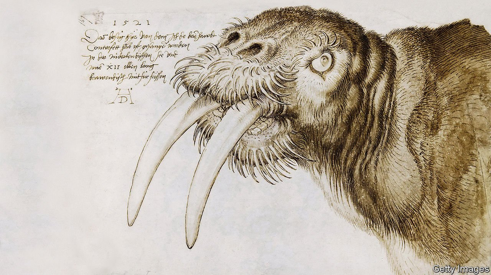

###### Renaissance art

# Albrecht Dürer lived in a world of wonders 

##### They inspired his art, which in turn has inspired his admirers for centuries 

 

> May 8th 2021 

Albert and the Whale. By Philip Hoare. Pegasus Books; 304 pages; $28.95. Fourth Estate; £16.99

MARVELS WERE commonplace in Albrecht Dürer’s world. As Philip Hoare writes in his captivating study of the German artist, the potentates of early 16th-century Europe traded wonders like playing cards. Erik Walkendorf, an archbishop in Norway, presented Pope Leo X with “the head of a walrus, salted in a barrel like a dead admiral”. Meanwhile, a Portuguese ambassador sent a rhino from India to his king in Lisbon, who tired of his pet and passed it on to the pope. En route to Rome, the ship sank in the Ligurian Sea; shackled on deck, the animal went down with it.


Dürer probably never saw either creature. But his luminous sketches of them are among the works Mr Hoare considers in “Albert and the Whale”. More slippery than a straight biography, the book instead swoops cormorant-like into Dürer’s life and times. Above all, Mr Hoare is interested in the afterlives of Dürer’s art in the five centuries since his death. It enraptured William Blake, Herman Melville and Oscar Wilde and inspired Thomas Mann’s novel “Doctor Faustus”.

He was born in Nuremberg in 1471. His Europe, explains Mr Hoare, was both recognisable and deeply alien. It was “a place of taxes and printing presses”, but an ordinary person could expect to see fewer human-made images in a lifetime than today’s internet mavens encounter in a minute. Dürer was perhaps its first internationally recognised artist, seizing on the new technologies of woodcuts and printing to market his sizeable body of work—100 paintings, 300 prints and over 1,000 drawings. He mechanised his genius.

Mr Hoare’s portrait glitters with arresting details. He recounts a visit Dürer made to the Archduchess Margaret of Austria to sue for her patronage. He was deterred by her retinue, which included a greyhound, a green parrot and a beady-eyed marmoset. Her habit of displaying the embalmed heart of her late husband, a Spanish prince, as a charm may also have put him off.

“Dürer was living on the edge of new revelations, a world shifting nervously in space,” Mr Hoare writes. In 1493 Christopher Columbus returned from the New World; 50 years later Copernicus published his heliocentric theory of the cosmos. Yet death and disease were incessant. Dürer saw the sky shot through with blood-red streaks, “auguries of the plague”. His woodcuts of the end times were bestsellers. Apocalypse crackled in the air.

In his previous writing, on subjects including “Moby Dick”, Mr Hoare pioneered a hybrid style that merged memoir, biography and criticism. In “Albert and the Whale” he pushes this technique further than ever. His readings of Dürer’s work grow woozy with enthusiasm, dissolving into a kind of modernist poetry. Readers who prefer their art history to have both feet on the ground might be unmoored; others will be intoxicated.

Dürer died in 1528, aged 56. Eight years earlier he travelled to the fen country of Zeeland in search of a stranded whale. The animal vanished before he arrived. Instead he caught “a strange illness”, possibly malaria, which would shorten his life. Still, his journey to that haunting landscape fired his art. “Zeeland is wonderful to see because of the water,” he wrote. “The great ships sail about as if on the fields.” Even then, Dürer saw marvels. ■

