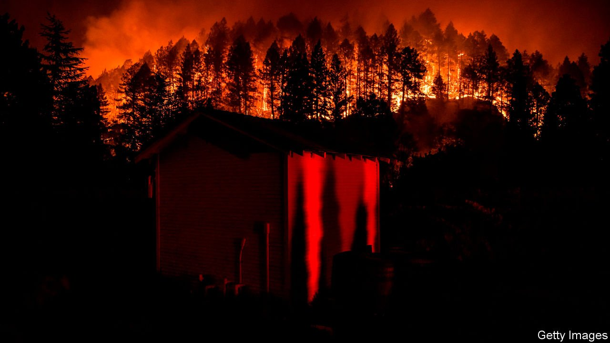

###### With a whimper

# Blame politics for disasters, says Niall Ferguson in “Doom” 

##### His new book is an elegant historical tour that lacks a convincing argument 

 

> May 8th 2021 

Doom. By Niall Ferguson. Penguin; 496 pages; $30. Allen Lane; £25

A BOOK ABOUT “Doom” that in its first chapter quotes from “Dad’s Army”, “Beyond the Fringe” and Monty Python, all classics of British comedy, lifts a reviewer’s spirit. But although “The Politics of Catastrophe”, as Niall Ferguson’s latest work is subtitled, takes off with the pacey prose, grand historical sweep and fine detail for which the author is renowned, it does not live up to its early promise. In a big-idea book, which this aims to be, those scholarly and stylistic virtues need to serve a striking argument. That, sadly, is lacking.


Its central contention is that “all disasters are at some level man-made political disasters, even if they originate with new pathogens”. A society’s character, in other words—its resilience, fragility and ability to manage the fallout of catastrophe—determines the effect on it of even the most apparently natural disasters, such as volcanic eruptions, earthquakes and plagues.

This is the subject of the moment. Many factors shape the way a country copes with covid-19; some have yet to be identified. But its varying impact at least partly reflects societies’ different responses—and their underlying strengths and weaknesses. The world has, in effect, been set the same exam. Some places (Taiwan) have passed with flying colours, some (India) have failed dismally and most (America, Europe) could have done better.

But the set of disasters under consideration is key. If it is drawn narrowly enough to include only those that seem natural, such as pandemics, Mr Ferguson’s observation is interesting but not original. Amartya Sen, a Nobel-prizewinning economist, made it in 1981 in “Poverty and Famines: An Essay on Entitlement and Deprivation”; his perception that famine is caused not by crop failure but by politics made his name. If the set takes in the Titanic, the Challenger space shuttle, the war in Syria and a possible conflict with China, and if “politics” includes the way people and organisations work together—which is how Mr Ferguson defines both concepts—his main contention becomes a statement of the obvious. When bad things happen to humanity, humanity is largely to blame.

Mr Ferguson offers a wealth of deep research, some of it gripping—such as Thucydides’s account of the unravelling of ancient Athenian society after a plague, the reasons for the lifeboat shortage on the Titanic and the views of Richard Feynman, a renowned physicist, on the organisational causes of the Challenger disaster. But a book that ranges so widely needs a strong thread to hold it together. Here you may find yourself turning to the long chapter descriptions at the start to see why you are reading about the Battle of the Somme or the decline of the Ming dynasty. Whistle-stop tours of world history succeed if the itinerary plots an arresting case; “Doom” supplies the tour, but the reader is left wondering what the point of it is.

There is also a problem of timing. About a quarter of the book is about covid-19, which is presumably the reason why it was written. Perhaps Mr Ferguson wanted to get in before the competition, but he would have done better to wait. His account of the pandemic is a summary of the story up to last autumn; six months on, his perspective at times feels mistaken. He roundly condemns the American and British governments, praising not just the east Asians’ management of the disease but also the benefits of European transnational co-operation. “European institutions”, he writes, “rose to the challenge posed by covid-19.” That claim is less convincing now.

From within a somewhat misconceived book, a better one is trying to get out. Mr Ferguson’s chapter on the growing conflict between the West and China—“cold war II”, as he calls it—is forceful, coherent and angry. He dismisses the idea of “co-opetition” and believes that the best way of avoiding a real war is for Western countries to unite and confront Beijing. His prose is best when he is roused. He should write a book on China soon; it may prove more compelling than this one. ■

