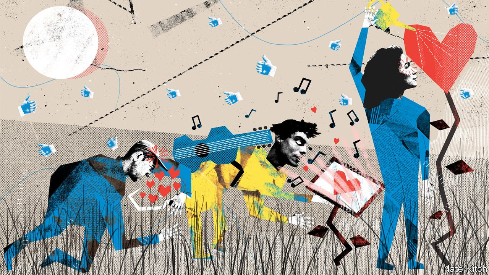
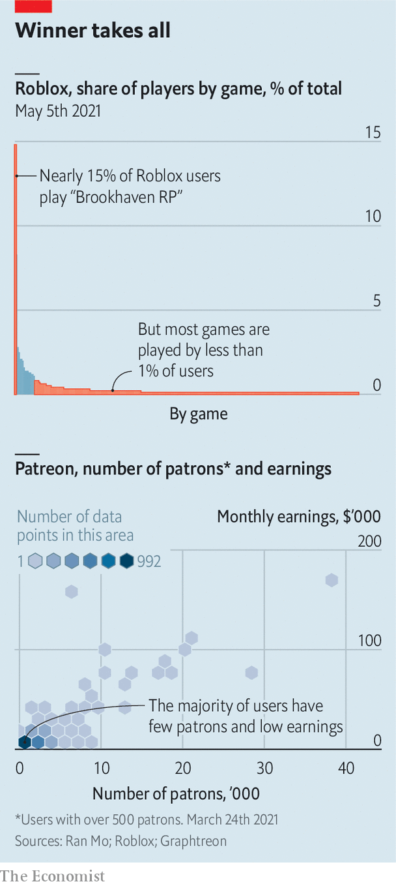
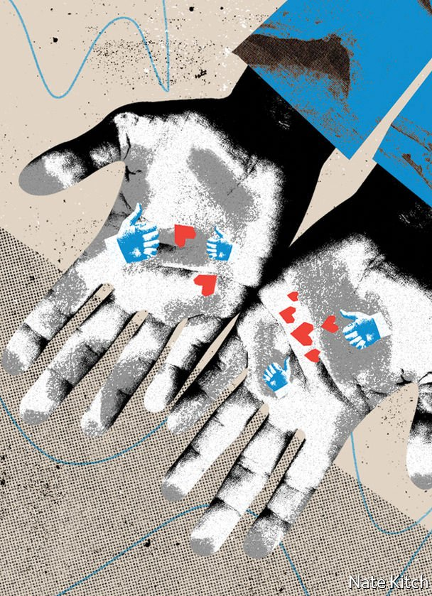

###### Serfing the web

# The new rules of the “creator economy” 

##### Social-media platforms used to get most of their content for free. That dynamic is changing 

 

> May 8th 2021 

“LOOK AT YOU down there, trying to run for your life,” jeers Summer Solesis, peering down at the camera. “You don’t stand a chance against my giant, size 11 feet!” Standing over her phone, she pretends to stamp on the viewer, who gets the effect—sort of—that Ms Solesis is a “giantess with dirty feet getting rid of the tiny men infesting my house”, as one video is captioned. The production quality is low-fi, but viewers seem not to mind. “Unforgettable sweet crushing,” swoons one fan, Sven, in the comments below.

The pseudonymous Ms Solesis, a personable 26-year-old Floridian, reinvented herself as an online “foot goddess” last March after covid-19 did for her restaurant job. “My mom’s just always told me I had pretty feet,” she says. So “I was just like, well, let’s see if the internet thinks I have pretty feet.” It did. On Instagram she gained 20,000 followers. Some offered money for personalised photos and videos. A few months later she joined OnlyFans, a London-based subscription platform. About 50 people around the world pay $10 a month for Ms Solesis’s newsfeed, adding up to around $5,000 a year after OnlyFans takes its 20% cut. She roughly doubles that with tips and merchandise, including unwashed socks ($10 per day worn).


In the past decade anyone with a phone has become a potential content creator. Cameras have got sharper, processors more powerful and networks faster. Apps can improve even the shoddiest content. Instagram, launched in 2010, provided filters that made ordinary photos look cool. TikTok has made it as simple to edit video. In April Facebook unveiled recording tools that aim to do for amateur podcasters what Instagram did for bad photographers. The internet’s limitless, free distribution and searchability has made it possible for this output—videos, music, jokes, rants and all manner of things that defy categorisation—to find an audience, however niche.

Yet apart from a few megastar “influencers”, most creators receive no reward beyond the thrill of notching up “likes”. Facebook, the world’s largest social network, has built a $92bn-per-year advertising business by selling space alongside posts by its 2.8bn happily unpaid user-suppliers. Twitter makes $3.4bn a year flogging ads among the free editorial typed by its 350m contributors. Being on the platform can feel like “the greatest unpaid internship of all”, Samhita Mukhopadhyay, an American journalist, recently tweeted.

But the serfs tilling the internet are increasingly finding that their output can command a price, with the effect that some of the internet’s most successful companies are being forced to adapt their business model. New platforms are offering creators ways to capture the value of their output for themselves, as Ms Solesis did when she moved from Instagram to OnlyFans. Bloggers and tweeters are moving their musings to paid newsletter services like Substack; amateur video-game makers are selling their pixelated creations on platforms like Roblox; viewers are paying to watch experts play them on streaming services like Twitch, owned by Amazon.

The upstarts are forcing incumbents such as Facebook to compensate users for the unpaid work they may not have realised they were doing. And they are helping professional creators, who once relied on middlemen, reach their audience directly.

The abundance of content in the internet age has meant that the success of online media platforms has depended on their ability to help users discover it. Rather than commissioning videos or articles, they have focused on building algorithms or content-management systems which serve users the best of others’ creations.

One consequence of the internet is that “value has shifted away from companies that control the distribution of scarce resources to those that control demand for abundant ones,” writes Ben Thompson, author of the tech newsletter, Stratechery, who calls such firms “aggregators”. Because the platform sets the conditions for a piece of content’s success, via its algorithm, suppliers have to adapt to its rules, thus commoditising themselves. In this world of abundant supply, content providers become as interchangeable, and have as little bargaining power, as Uber drivers.

All things are become new

Yet something in this model is changing. Though there is more content than ever, platforms are competing harder than ever to get it. “There's an arms race to acquire creators,” says Li Jin, founder of Atelier Ventures, a venture-capital firm. Startups are developing new ways for creators to monetise their work. Substack gives writers 90% of the subscription fees they charge for newsletters; together its top ten authors earn more than $15m a year. Twitch gives its game streamers more than half of its subscription fees, plus a cut of ad revenue and the money paid to “cheer” their performance. Cameo, a platform on which 40,000 celebrities sell personalised videos to fans, passes 75% of the spoils to contributors. Brian Baumgartner, an actor in “The Office”, an American sitcom, was its top earner last year, making over $1m. Clubhouse, a social-audio app, allows tips and has an “accelerator programme” for promising hosts. It plans to test features such as tickets and subscriptions.

In response, platforms that once paid little or nothing to creators are ponying up. Companies “need to either offer some way to monetise that content on-platform, or…they'll become just a promotional hub, where people essentially advertise the content that they're monetising on other platforms,” says Josh Constine of SignalFire, another venture-capital firm.

Twitter was in danger of becoming a promotional tool for Substack writers and Clubhouse broadcasters. It is now trying to beat both at their own game. In January it bought Revue, a newsletter firm, and cut its commission to 5%, half Substack’s. On May 3rd it added Spaces, a Clubhouse-like audio feature; soon it will let users sell tickets to chats they host. The ability to sign up for a newsletter or join an audio room directly from Twitter, without the friction of moving apps, gives the company an edge over its startup rivals, says Mark Shmulik of Bernstein, a research firm.

Facebook is also trying to make creators stick around. Last year it made paid subscriptions widely available and enabled tips. It is now testing a Cameo-like feature called “Super”, a Substack-esque newsletter platform, and is paying gamers big bucks to join Facebook Gaming, its tribute to Twitch. In all, it says, the number of content-makers earning over $1,000 a month on the platform almost doubled in 2020.

“In developing all of these things, we’re actually really focused on the creator side, even more than on the consumption side,” said Mark Zuckerberg, Facebook’s boss, in a recent interview with Casey Newton, author of the Platformer newsletter. In an effort to attract more of them, it is offering creators not just money but power: newsletter authors will own their recipient list and be able to take it to another platform, the equivalent of being allowed to move one’s Facebook friends over to Twitter.

YouTube, which has long given regular video-posters a 55% cut of ad revenue, is developing new features including tips in the form of paid “applause”. It says the number of channels joining its paid “partner programme” in 2020 was more than double that in 2019. In all it has paid contributors $30bn in ad-revenue shares and subscription fees in the past three years, far more than any other social platform. Last year TikTok, a short-video app, launched a “creator fund” which it says will dispense more than $2bn to users in its first three years. Douyin, its Chinese twin, is investing $1.5bn with the aim of doubling its creators’ revenues. Snapchat, another social-video app, last year launched Spotlight, a sharing feature through which it is paying $1m a day to the creators of its most popular clips.

Newer types of media are joining in. Douyu and Huya, China’s largest game-streaming platforms, each paid out 7.1bn yuan ($1.1bn) to streamers last year, 31% more than in 2019. Spotify and Apple, the two biggest podcast platforms, are wooing amateur broadcasters. Last month Apple announced that it would let podcasters charge subscription fees, of which it would take a 30% cut for the first year, then dropping to 15%; days later Spotify followed suit—but said creators could keep the lot (from 2023 it will take 5%).

As platforms fight over the most popular content, bargaining power is being transferred to the people who make it. Simon Kemp of Kepios, an internet research firm, compares platforms’ negotiations with top creators to TV networks’ wrangling with the cast of “Friends” over each season’s contracts. Many offer better terms to their most successful creators: Twitch reportedly pays a higher share of subscription revenues to its top streamers; Substack offers advances to writers it believes will be a hit. The share of revenue that creators can earn seems to depend on how easily they could leave. Moving one’s email list away from Substack is simple, so the firm lets writers keep 90% of their revenues. Game-makers on Roblox, who are basically stuck there, keep about 25%.

The dancers of TikTok and pranksters of YouTube, whose popularity rises or falls on the tweak of a recommendation algorithm, may seem easily replaceable. In reality, the opportunities for interaction with online stars may make their audiences more loyal than those of other celebrities, Mr Kemp points out. Jennifer Aniston and her buddies were in people’s sitting rooms for half an hour a week. Charli D’Amelio, TikTok’s top bopper, is in their pockets all day. “After a decade of building their audiences, a class of Super Creators have emerged that have leverage over their aggregators,” wrote Rameez Tase, head of Antenna, an audience-measurement company, in a recent blog post. “They simply built such large, engaged audiences that those audiences would follow them anywhere.”

A great multitude

Yet what of those creators with more modest followings? A few online stars earn megabucks, but the tail is long (see charts). Spotify says it wants to give “a million creative artists the opportunity to live off their art”. But only about 0.2% of the 7m-plus musicians on the platform make more than $50,000 a year in royalties; just 3% make more than $1,000. There are 20m gaming “experiences” on Roblox, but nearly 15% of all play takes place on one game, “Brookhaven RP”, according to analysis by Ran Mo of Electronic Arts, a game developer. On Patreon, where people can subscribe to creative services of all sorts, 200,000 creators earn a total of $1bn a year. The top earner makes around $2m, but about 98% make less than the federal minimum wage of $1,257 a month.

 


The main way to monetise online content has been advertising. Making real money requires a huge audience: even 1m views on YouTube might make the poster only about $2,000. Some types of content attract even lower ad rates. PornHub says its amateur contributors earn an average of $0.60 per 1,000 views; 1m hits would net just $600. Ads can make megastars rich, but cannot provide a living for small-time foot goddesses and other niche creators.

The trend towards subscriptions, and other models of monetisation, is changing that, bringing with it the possibility of a creator middle class. Consider Craig Morgan. The sports journalist was laid off last year by the Athletic, an online publication, after the pandemic put live sport on hold. A friend suggested he try writing a newsletter. AZ Coyotes Insider was launched on Substack in July. Its detailed updates about a single National Hockey League team—everything from goaltender Darcy Kuemper’s knee injury to the immigration woes of defenceman Ilya Lyubushkin—are not designed for a wide audience. But with a subscription model, they don’t need one.

 


Ten months on, Mr Morgan has more than 1,000 people paying a minimum of $5 a month (about 18% voluntarily pay more, he says), close to his old salary on the Athletic. Mr Morgan misses bouncing ideas off colleagues, and the safety-net of an editor. But he can write what he likes—and, he adds, “No one can lay me off anymore.”

Mr Morgan is a living example of the observation in 2008 by Kevin Kelly, a technology writer, that any artist could make a living with just “1,000 true fans” willing to spend $100 a year or so on whatever the creator makes. With that, he wrote, “You can make a living—if you are content to make a living but not a fortune.” The broadening range of online monetisation methods is making it easier to wring that sort of money out of devotees. Video-gamers can top up the money they make from streaming by working as paid wingmen on gaming platforms such as China’s Heizhu Esports. Some creators see non-fungible tokens, a method of certifying digital creations, as a way to earn more from their superfans. With platforms like Teachable or Podia, which deal in pricey online courses, creators can plausibly get by with more like 100 true fans, Ms Jin reckons.

 


The more possible it becomes to make a living out of online content, the more precarious becomes the position of the companies that have acted as intermediaries between creators and consumers. Newspapers, which solved a physical distribution problem that no individual writer could hope to overcome, are one example. Substack’s leaderboard includes journalists such as Glenn Greenwald and Matthew Yglesias who have found that readers are willing to pay them far more than the outlets that used to employ them (and that newsletters give them greater editorial freedom, too). Some newspapers, most recently the New York Times, have forbidden writers from launching personal newsletters without permission. A tyrannical few deny their writer-serfs bylines, ensuring that the value from every article accrues to the brand and not the author.

Record labels are another endangered middleman. They have historically taken care of turning a song into a hit, in return for an ongoing share of revenues. But more and more artists are going it alone. More than 60,000 new songs are uploaded to Spotify every day, most by bedroom-based rockstars who can use new online services to handle the logistics themselves. UnitedMasters, a music-distribution platform which bills itself as “a record label in your pocket”, recently raised $50m in a venture-capital round led by Apple. Tools like Splice make recording easier. Companies like Fanjoy take care of merchandise.

And financing is getting simpler. One startup, HIFI, helps artists manage their royalties, paying them regularly and fronting them small sums to make up shortfalls. Another, Karat, extends credit to creators based on their follower count. Helped by such services independent artists took home 5.1% of global recorded music revenues last year, up from 1.7% in 2015, calculates MIDiA Research, a consultancy. In the same period the share of the three largest record labels fell from 71.1% to 65.5%.

What has been will be again

Just as the internet allowed brands to bypass physical shops and sell directly to customers online, social platforms “offer a path for creators to communicate directly with their audience,” says Mr Shmulik. Yet they still need the new media platforms, which are becoming more like old media companies. Rather than simply helping consumers navigate a mass of commoditised online content, they play an active role in commissioning and curating it.

Substack insists that advances are determined by “business decisions, not editorial ones”. Yet it offers writers mentoring and legal advice, and will soon provide editing services. YouTubers can post what they like, within broad guidelines, but they cannot monetise content around what YouTube deems “controversial” subjects, including abortion. Twitch has imposed rules for its streamers’ behaviour offline. On May 5th Facebook’s “oversight board”, which rules on editorial matters, upheld Donald Trump’s ban from the platform.

Mr Zuckerberg has said that his social network ought to be treated like something between a phone company, through which information merely flows, and a newspaper, which has editorial control of its content. As his and other platforms more actively court and compensate creators, they are moving further towards the newspaper end of that continuum. ■

