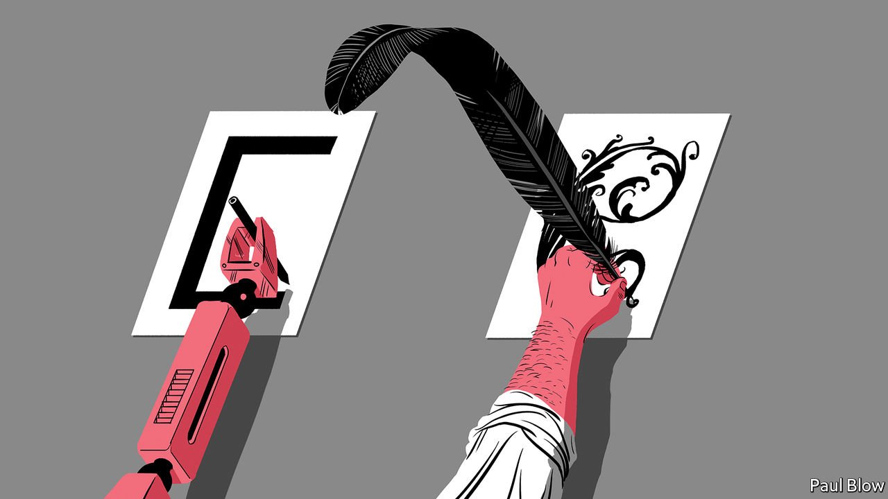

###### Bartleby

# Can human creativity prevent mass unemployment? 

##### The market for artisan goods is likely to grow. But organised craft could lose its charm 

 

> May 8th 2021 

IN “THE REPAIR SHOP”, a British television series, carpenters, textile workers and mechanics mend family heirlooms that viewers have brought to their workshop. The fascination comes from watching them apply their craft to restore these keepsakes and the emotional appeal from the tears that follow when the owner is presented with the beautifully rendered result.

Perhaps the idea of craftsmanship is not simply nostalgic. In a new paper* in the Academy of Management Annals, five academics examine the idea of crafts as a way of remaking the organisation of work. They define craft as “a humanist approach to work that prioritises human engagement over machine control”. Crafts require distinct skills, an all-round approach to work that involves the whole product, rather than individual parts, and an attitude that necessitates devotion to the job and a focus on the communal interest. The concept of craft emphasises the human touch and individual judgment.


Essentially, the crafts concept seems to run against the preponderant ethos of management studies which, as the academics note, have long prioritised efficiency and consistency. Frederick Winslow Taylor, a pioneer of management studies, operated with a stopwatch and perceived human workers as inefficient, and potentially disobedient, machines. Craft skills were portrayed as being primitive and traditionalist.

The contrast between artisanship and efficiency first came to the fore in the 19th century when British manufacturers suddenly faced competition from across the Atlantic as firms developed the “American system” using standardised parts. Initially these techniques were applied to arms manufacture but the worldwide success of the Singer sewing machine showed the potential of a mass-produced device. This process created its own reaction, first in the form of the Arts and Crafts movement of the late 19th century, and then again in the “small is beautiful” movement of the 1970s. A third crafts movement is emerging as people become aware of the environmental impact of conventional industry.

There are two potential markets for those who practise crafts. The first stems from the existence of consumers who are willing to pay a premium price for goods that are deemed to be of extra quality. This niche stretches all the way down from designer fashion through craft beers to bakeries offering “artisan” loaves.To the extent that automation takes over more sectors, this niche seems likely to become more lucrative; there is “snob value” in owning a good that is not mass produced. The second market lies in those consumers who wish to use their purchases to support local workers, or to reduce their environmental impact by taking goods to craftspeople to be mended, or recycled.

For workers, the appeal of craftsmanship is that it allows them the autonomy to make creative choices, and thus makes a job far more satisfying. In that sense, it could offer hope for the overall labour market. Let the machines automate dull and repetitive tasks and let workers focus purely on their skills, judgment and imagination. As a current example, the academics cite the “agile” manifesto in the software sector, an industry at the heart of technological change. The pioneers behind the original agile manifesto promised to prioritise “individuals and interactions over processes and tools”. By bringing together experts from different teams, agile working is designed to improve creativity.

But the broader question is whether crafts can create a lot more jobs than they do today. Demand for crafted products may rise but will it be easy to retrain workers in sectors that might get automated (such as truck drivers) to take advantage? In a world where products and services often have to pass through regulatory hoops, large companies will usually have the advantage.

History also suggests that the link between crafts and creativity is not automatic. Medieval craft guilds were monopolies which resisted new entrants. They were also highly hierarchical with young men required to spend long periods as apprentices and journeymen before they could set up on their own; by that time the innovative spirit may have been knocked out of them. Craft workers can thrive in the modern era, but only if they don’t get too organised.

