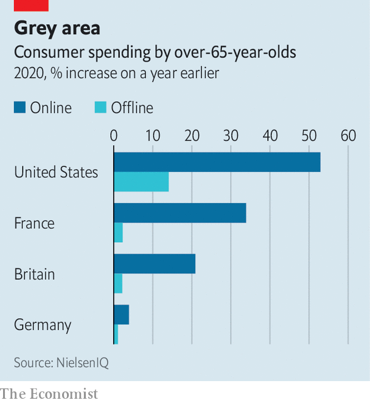

###### The boomer boom

# Older consumers have learned new tricks in the pandemic 

##### Companies had better keep up 

 

> May 8th 2021 

BABY BOOMERS, aged 57-75, are as the name implies, plentiful. Healthier and more adventurous than similarly aged cohorts in the past, since 2018 over-65s have outnumbered the under-fives. They are also wealthier. America’s boomer-led households spend $64,000 a year, almost twice as much as those headed by youngsters born from 1997 onwards. Together with the earlier “silent” generation, they account for two-fifths of American consumer spending. Yet brands and retailers have long given older shoppers short shrift, focusing most of their attention on the wrinkle-free. As with many things, the pandemic is demanding a rethink.

For one thing, fear of covid-19, more deadly for the elderly, has ushered oldies online. Last year British over-65s made up 30% of consumer-goods purchases online, up from 20% in 2019. In August Britain’s Office for National Statistics reported that 65% of them had shopped online in the preceding 12 months, compared with 54% the year before. America’s over-65s spent 53% more on internet shopping than the year before, according to NielsenIQ, a research firm (see chart).


Hinge, an e-commerce consultancy, says that sales of products disproportionately bought by older people, from meal replacements to adult nappies, have jumped by 50% or more, outpacing overall sales. Businesses catering to older consumers are adapting. The staple of GoGoGrandparent used to be helping greying North American technophobes book ride-sharing services by phone. With social distancing this business dwindled, says Justin Boogaard, its co-founder. In April 2020 the firm diversified into delivering food to old folks with dietary restrictions; these are up by 300% since then, it says.

 


It isn’t just products aimed specifically at the old that the elderly are snapping up on the internet. Their online spending on booze nearly quadrupled in America, estimates NielsenIQ. SilverSingles, a dating website, reports healthy growth in the number of new monthly users. Virtual first dates featuring wine tasting, food deliveries and film streaming are all the rage, affording brands the chance to offer their wares to oldies who have signed up.

Brands are also attempting to appeal to the elderly through such things as “healthy ageing” products, which the pandemic has turned into a craze. Nestlé, a Swiss consumer-goods giant, has launched a milk drink in China, which supposedly aids mobility. Reckitt Benckiser, a British rival, is marketing one that targets immunity. Danone, a French yogurt-maker, is investing in developing similar products. Companies are also thinking about spending more on wrinkle-friendly adverts; just 3% of America’s ad spending is aimed at people over 50, reckons Joseph Coughlin, who runs the AgeLab at the Massachusetts Institute of Technology.

Some innovations welcome in a pandemic may be less so once it passes, especially for retailers. Maintaining priority slots for online deliveries to the elderly, and not charging them a delivery fee on what tend to be small orders ferried at a loss, is going to be costly, warns one supermarket boss. Yet companies will face pressure to keep them to retain custom, especially with ever more physical shops shut for good.

They may also need to make online shopping easier than it already is. That could mean fewer forms that the elderly (and everyone else) find fiddly, and more options as to how and when to pay, to reassure older shoppers who worry about sharing credit-card details. Having taught oldies some new tricks during the pandemic, firms must now learn a few themselves. ■

Dig deeper

All our stories relating to the pandemic and the vaccines can be found on our . You can also listen to , our podcast on the race between injections and infections, and find trackers showing ,  and the virus’s spread across  and .

