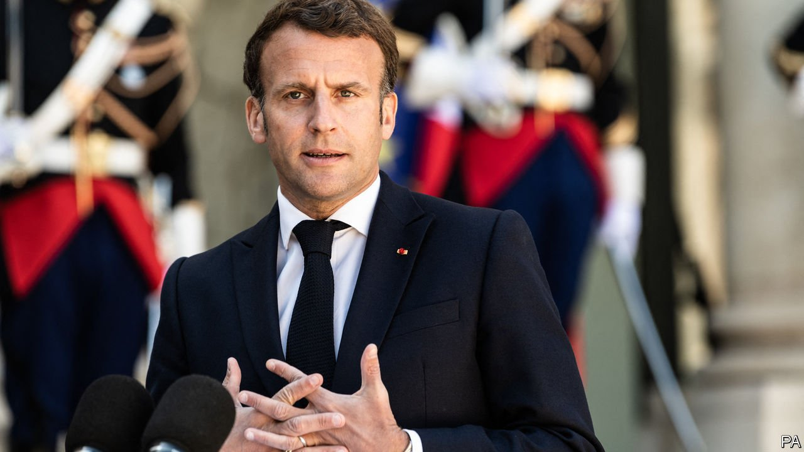

###### Prison break

# France worries about how to handle released terrorists 

##### Many more are due to leave prison soon 

 

> May 8th 2021 

“BEING LOCKED up is a piece of piss if the guy was ready to die,” said Youssef, who had been jailed for jihadism. “Ten years in prison? It’s fi sabilillah (in the cause of Allah). I’m going to learn the Koran, and leave even stronger.” Youssef (not his real name) was speaking to Hugo Micheron, a researcher conducting a study on jihadism in France. By the time the book was published last year, Youssef had served his term and been set free.

France is grappling with an unfamiliar challenge: how to handle those let out after serving time for terrorist-related offences. Of the 500 or so such detainees now behind bars, 58 are due for release this year, and a total of some 100 by 2023. Most were convicted for joining jihadist groups in Syria or Iraq, or helping others to do so. They were often sentenced to terms of only five to six years. Far stiffer sentences, including life, were handed down last December to accomplices in the terrorist attacks in Paris in 2015.


Last year Jean-François Ricard, the chief anti-terrorist prosecutor, told the National Assembly that he had “a real fear” about what would happen to the “dozens of people who will leave prison, who are very dangerous”. Current law enables such prisoners, after a risk assessment, to be put under surveillance and their movements limited for up to a year after their release. A new anti-terrorism bill, which entrenches and extends measures introduced in 2017 to end a state of emergency, would increase this to two years. It would enable courts to compel freed offenders to check in with probation officers and other authorities, and to enrol in training schemes, work or psychological support, for up to five years.

France’s Constitutional Council last year rejected a previous version of some of these measures as a breach of fundamental freedoms, and told legislators to revise the bill. A reworked version is now going through parliament. Critics nonetheless worry about the mixed evidence of recidivism among released jihadists. A Belgian study, cited by Marc Hecker in a report for the French Institute of International Relations, suggested that just 2% of the 557 individuals convicted of jihadist terrorism between 1990 and 2019 re-offended.

In France, however, out of a sample of 137 individuals sentenced for cases related to jihadism between 2004 and 2017, at least 22 re-offended, left for jihad, attempted to kill a prison warden or breached the law against justifying terrorism. One of those released, Chérif Kouachi, took advantage of his freedom to help shoot and kill 12 people in 2015 at Charlie Hebdo, a magazine that had published cartoons satirising the Prophet Muhammad.

France is giving itself extra means, as well as legal powers, to fight terrorism. Since 2017 it has recruited an extra 1,900 intelligence officers and increased their budget. It has a new post of national counter-terrorism and intelligence co-ordinator. Fully 36 attacks have been foiled.

Yet the security services worry that there is nonetheless a pool of potential recruits to jihad on French soil who are increasingly difficult to detect. Each of the past eight terrorist attacks in France has been carried out by an individual who was previously unknown to the services. These include the fatal stabbing of a female police official in Rambouillet, west of Paris, last month, and the decapitation of Samuel Paty, a schoolteacher, in October.

Terrorism, according to a poll, is now a greater worry for the French than unemployment. Marine Le Pen, the nationalist leader who polls suggest will in 2022 again reach the second-round run-off of the presidential election, misses no chance to stir up panic. President Emmanuel Macron’s term in office, she recently declared, has been marked by “terrorist chaos”, and if he were re-elected this would provoke an “explosion”. Less than a year before the vote,Mr Macron cannot afford to appear timid towards terrorism.■

