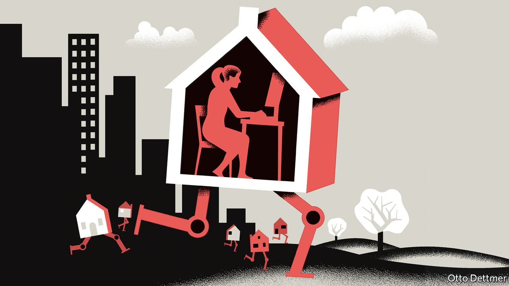

###### Free exchange

# A new age of suburbanisation could be dawning 

##### Americans’ pursuit of leafiness contains hints of a transformative shift 

 

> May 6th 2021 

THOUGH THE pandemic has not fully released its grip on America, signs of an incipient boom are everywhere: in surging demand for workers, imports and, above all, houses. Residential property prices rose at an annual rate of 12% in February—the fastest pace since 2006—buoyed by rising incomes, low interest rates and the belated plunge into housing markets by a crisis-battered generation of millennials. A clear preference for large but affordable suburban homes over pricey city-centre flats seems to be emerging. That covid-weary Americans might be eager for suburban life is hardly surprising. Yet the latest pursuit of leafiness and expansive floor plans contains hints of a potentially transformative shift in how Americans choose where they live.

People’s housing decisions incorporate much more than mere economic concerns. Yet the geographical distribution of households reflects some rough balancing of the costs and benefits of living in one place rather than another. Other things equal, people flock to areas that provide access to good jobs or desirable amenities, like pleasant weather, or a lively arts scene. Movement towards attractive places is ultimately checked, however, by the associated costs—congestion, say, and the price of housing—which rise until there is no longer much to be gained from relocating.


From time to time, however, economic shifts disrupt the prevailing equilibrium and trigger large-scale movement. In the mid-20th century cars and highways enabled people to obtain more for their money by moving into suburbs while still maintaining access to city-centre jobs and amenities. Explosive suburbanisation followed. In 1940 about half of Americans lived in metropolitan rather than rural areas, and most metropolitan residents—about one-third of the total population—resided in city centres rather than suburbs. By 2000, in contrast, 80% of all Americans lived in metropolitan areas, but the vast majority—accounting for half the total population—lived in the suburbs.

In the past two decades, shifts in demand have given rise to a new equilibrium. Rising incomes in knowledge-economy industries attracted workers to a few highly productive places (like New York and the Bay Area), and increases in congestion and commuting costs encouraged many to live near work. Housing costs in high-wage cities rocketed, propelled by restrictive zoning policies that prevented housebuilding from keeping up with demand. Highly paid elites were concentrated in pockets of wealth, while many other Americans settled in places offering jobs of middling productivity and pay, but where housing was more affordable.

Though it is early days yet, covid-19 may have disrupted this pattern. Before the pandemic, about 5% of full-time-work days in America came from people working at home. That figure rose above 60% last spring; though it has since fallen back, it remains well above pre-pandemic levels. Broad adoption of remote work stands to drastically alter households’ locational calculations. Recent research by Jan Brueckner of the University of California, Irvine, and Gary Lin and Matthew Kahn of Johns Hopkins University considers two ways in which a transformation might unfold. People with high-productivity jobs could work remotely from anywhere, potentially severing the link between a local economy’s productivity and the demand to live there, and thus enabling a large-scale migration from high-cost cities to low-cost ones. And remote work could allow workers to spend more time at home while still occasionally commuting into the office. In that case, remote work would reduce the cost of a given commute and might thus lead metropolitan areas to become more sprawling.

In fact, both appear to be occurring. In 2020 price gradients flattened between metropolitan areas, as house prices in low-cost cities rose faster than those in high-cost cities, and also within them, as prices in low-cost suburban counties rose faster than those in high-cost urban ones. Another recent paper, by Arpit Gupta and Jonas Peeters of New York University and Vrinda Mittal and Stijn Van Nieuwerburgh of Columbia University, arrives at a similar conclusion. In the year to December 2020 and across America’s 30 largest metropolitan areas, house prices rose faster the farther one moved from urban hubs. Prices of properties 50km from a city centre grew by 5.7% more than those in centres.

Whether these trends continue depends on the extent to which remote-working habits stick. But even a modest persistent change would have large knock-on effects. One recent estimate, by Jose Maria Barrero of the Instituto Tecnológico Autónomo de México, Nicholas Bloom of Stanford University and Steven Davis of the University of Chicago, suggests that the share of hours worked remotely is likely to stabilise at about 20%. In that case, dense city centres could face a cycle of straitened circumstances like that which accompanied car-driven suburbanisation, as local spending and tax revenues decline, leading to cutbacks in amenities. Spending within city centres could drop permanently by 5-10%.

Sometimes I wonder if the world’s so small

A new equilibrium might also yield striking macroeconomic benefits, however. Slow growth in housing supply in high-productivity cities has weighed on the economy by rationing access to high-wage jobs. Had building rules in New York and the Bay Area been no stricter over the last third of the 20th century than those of the typical American city, then the growth rate of national output would have been a third higher, according to one estimate. Remote work stands to relax this constraint on growth, by allowing workers to take high-wage jobs without having to buy costly homes within easy commuting distance.

The geographically disruptive potential of information technology has long been apparent. In a book published in 1997 Frances Cairncross, formerly of this newspaper, imagined that it might yield a “death of distance”. It may have taken the public-health imperative to stay away from others to help realise it at last. ■

