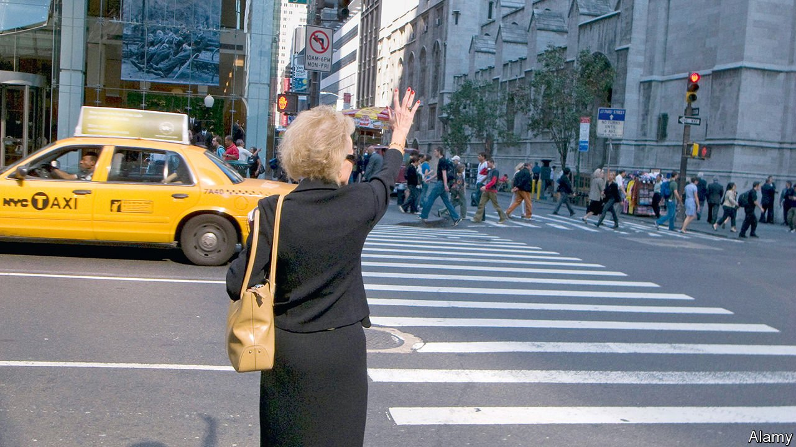

###### Rich pickings

# Older women are getting richer. How will wealth managers adapt? 

##### The gains from experimentation could extend beyond older women 

 

> May 6th 2021 

ELLA PRICHARD found herself rebuilding the family fortune after Lev, her husband of 46 years, died during the global financial crisis. She went from having little to do with the finances to firing the family’s longtime advisers at JPMorgan Chase, interviewing banks and eventually hiring a team at Brown Brothers Harriman. “That move from smiling spouse to client was not easy,” the 80-year-old says.

Older women like Ms Prichard control a growing share of the world’s wealth. In 1989 the median American household headed by a woman over 65 was poorer than average. By 2019 it was 20% richer. That partly reflects the fact that older women today are more likely to have had careers of their own than their mothers and grandmothers. But inherited wealth also plays a role—and indeed will become more important in the years to come.


Some $68trn in wealth is estimated to change hands in America alone by 2042, in large part as baby boomers die, according to Cerulli, a research firm. A lot of it will flow first to widows, who in heterosexual couples tend to be younger and live longer than their husbands. Researchers estimate that about half of women over 65 outlive their husbands by 15 years. In a report last year McKinsey, a consultancy, reckoned that much of boomers’ wealth would be managed by women by 2030. These huge transfers are forcing wealth managers, long used to serving men, to rethink their approach to clients.

There is little evidence that older women invest drastically differently than men, or have radically different views towards risk or asset allocation. The stereotype may be of a kindly, cautious granny. But American tax data suggest that wealthy older women are as likely to hold stocks, which are riskier than bonds, as the average rich person. Women seem to place more emphasis on sustainable investing, but seem less bothered by charity. A global survey by the Economist Intelligence Unit, our sister organisation, found that 22% of boomer women think charitable giving is not important to how they manage their wealth, compared with 16% of men.

What is clear is that boomer women want a different experience at the bank. Many women say they resented the way advisers treated them when their husbands were still alive, making no eye contact at meetings or printing just the one copy of financial reports. Once they are calling the shots, they want personal service. In a recent McKinsey poll of rich investors, over half the women surveyed said it was “extremely important” to find an adviser who matches their personality, compared with around 40% of men. Advisers say these women want help meeting goals, be that paying grandchildren’s college fees or buying another home in Cap Ferrat, not just beating the market.

Another requirement seems to be financial education: three-quarters of wealthy widows and divorcees say they don’t feel knowledgeable about investing, according to a survey by UBS. The problem may be confidence rather than competence, though. Women think it is really important not to shoot from the hip, says Sharon Oberlander of Merrill Lynch Wealth Management.

Banks are sitting up. Wealth management, which generates steady fees and does not require as much capital as lending or trading securities, is an increasingly important part of their business. And dissatisfied clients, like Ms Prichard, vote with their feet: over a fifth of widows who had a financial adviser with their husbands go on to find a new one, reckons a survey by Spectrem Group, a research firm. Losing a client means losing a shot at managing her heirs’ wealth, too.

Banks are trying lots of things in response. One is simply to understand what clients want. UBS produces reams of research on female investors. Goldman Sachs tells its advisers to get to know the accountants and lawyers of the ultra-rich; JPMorgan’s training for advisers begins with a section on getting into investors’ hearts and minds.

Another approach is to offer more female-friendly service. On a superficial level, golf is out, and spa days are in. Most banks are hiring more women and training advisers to interact with families, not just men, and to manage personal conversations better.

No one knows yet what strategy will prove most successful, but the gains from experimentation seem likely to extend beyond older women. Financial decisions are no longer the preserve of men alone. Women control about a third of household wealth in America, and the share is likely to rise. Surveys suggest that millennial investors too want financial education and, when they seek advice, want it to be tailored to them. The firm that adapts the fastest could reap the rewards for generations to come. ■

