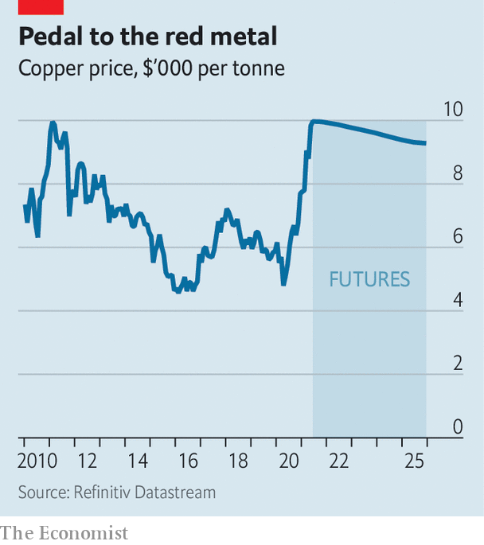

###### Buttonwood

# The broader lesson from booming copper prices 

##### Shortages in commodity markets offer a paradigm for the post-virus economy 

 

> May 8th 2021 

BLESSED ARE the cheesemakers. A revival in restaurant visits in America has fed demand for one of the more obscure financial instruments—cheese futures. The number of contracts traded on the Chicago Mercantile Exchange surged last month. It is not only cheese that has melted up. A year-long rally in broader commodity markets shows few signs of cooling. Iron-ore prices are at record highs. A boom in American housing has driven timber prices to a new peak. Corn and soyabean prices are at their highest since 2013.

If you are looking for a paradigm for the immediate post-virus economy, in which supply snags lead to higher prices as activity revives, then commodity markets provide it. Bottlenecks are everywhere. Corn production has been hurt by dry weather. The supply of industrial metals has been held back by slower ore production in virus-hobbled South American mines. The archetypal commodity is copper, which has broad uses in industry and construction. “Dr Copper” is closely watched in markets because of its ability to diagnose important shifts in the world economy.


Amid excitement about a new commodity “supercycle”, copper has one of the stronger bull cases. Plans for fiscal stimulus in America and Europe lean heavily towards greening the economy, which in turn favours copper demand. A bigger question-mark hangs over the supply response. Here Dr Copper may offer some uncomfortable lessons.

Commodity prices are subject to wild swings, reflecting periodic gluts and shortages. The market for copper and other commodities, including oil, is currently in “backwardation”, a state in which futures prices are below cash prices (see chart). In theory stock levels should respond to the spread between cash and future prices. In a backwardated market, the marginal benefit of adding to copper stocks is low. So backwardation is a prompt for stocks to be run down to meet immediate demand. It is a telltale sign of physical shortages. The opposite condition, in which futures prices are above spot, is “contango”. A market in steep contango signifies a short-term glut.

 


Some analysts believe that the current copper shortage will prove to be a structural feature. A recent note from Goldman Sachs, a bank, predicts that prices will rise to $15,000 per tonne by 2025, from $10,000 today, as the red metal undergoes a new supercycle, a longish period in which demand outstrips supply. The spur to rapid demand growth will come, not from China, whose urbanisation lay behind the supercycle of the first decade of this century, but from the greening of richer countries. As a pliable, cost-effective conductor of heat and electricity, copper is a vital input to green tech. It takes four or five times as much copper to build an electric vehicle as a petrol-fuelled one. Copper goes into the cabling for EV charging stations, and into solar panels and wind turbines. At present, annual “green” demand for copper is 1m tonnes, or just 3% of supply. Goldman reckons that will reach 5.4m tonnes by 2030.

For some people, the case for another commodity supercycle has more holes in it than Swiss cheese. Policymakers in China, the world’s largest consumer of raw materials, are already putting the brakes on. Without a boom in China, there cannot be a supercycle. And high commodity prices are often their own nemesis. The response in agricultural products is simply to grow more crops. In the oil market, shale production can ramp up if prices warrant it.

But copper supply is far less flexible. It takes two to three years to expand output at an existing copper mine and a decade or more to develop a new one. And mining firms, burned by the commodities bust of the early 2010s, have focused more on paying out dividends than on investing in new supply. “Capital discipline” is an industry slogan. It will take further rallies in copper prices to chip away at this mindset.

That brings us to the wider lesson. The view of central bankers is that today’s supply shortages are likely to be temporary and inflation will prove transient. Recent history is on their side. Supply shocks have generally washed out of inflation quickly. If this time proves to be different, it will be because of a peculiar clash. Habits of capital discipline formed in the previous, slow-growth business cycle are not obviously well suited to an economy running hot. As the cycle unfolds, copper prices will signify just how smoothly supply is responding to demand. Dr Copper’s most important diagnosis may yet lie ahead.

