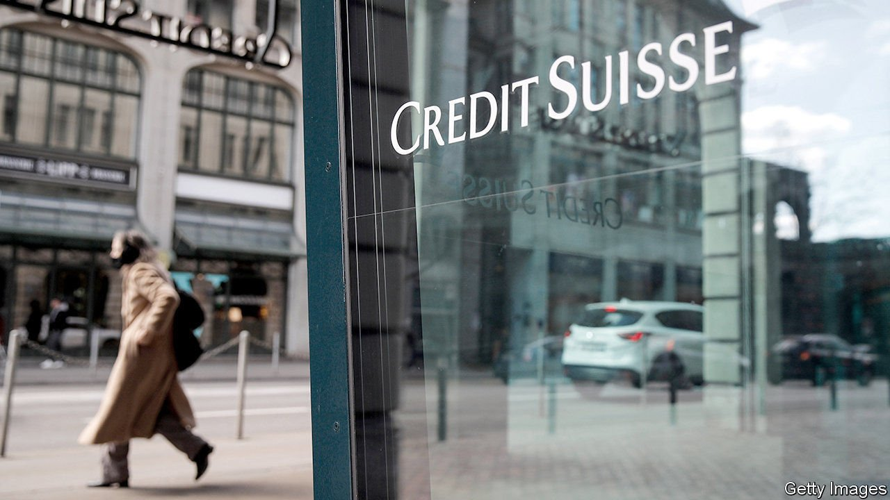
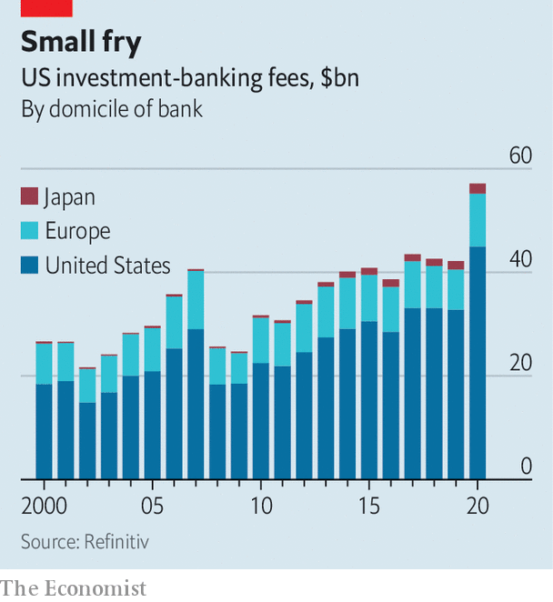

###### Farce and furious

# Why foreign banks’ forays on Wall Street have gone wrong—again 

##### The litany of setbacks is probably not over 

 

> May 8th 2021 

THE IMPLOSION of Archegos Capital, a New York-based investment firm, in April splashed egg on many faces. Banks that had lent it vast sums to bet on volatile stocks have revealed over $10bn in related losses in recent weeks. America’s leading investment banks, barring Morgan Stanley, were largely absent from the big casualties, though. Instead the grim league table featured foreign champions. Most notable, because of its huge loss of $5.4bn, was Credit Suisse, a Swiss bank; also among them were UBS, its compatriot, and Nomura and Mitsubishi UFJ Financial Group, two Japanese banks.

This humiliation is the latest in a long series of foreigners’ setbacks on Wall Street. That they would covet its spoils is understandable. Much of American economic activity is funded through capital markets, in contrast to Asia and Europe, where bank lending reigns supreme. That makes America the world’s largest and most profitable investment-banking market, accounting for 53% of global revenue, according to Dealogic, a data provider.


Challengers have gone at it with gusto. Credit Suisse fired first, taking control of First Boston, an investment bank, in 1990. Deals accelerated around the turn of the millennium. Deutsche Bank bought Bankers Trust for $10bn, followed by UBS’s purchase of Paine Webber, a broker, and Credit Suisse’s swoop on DLJ, a private-equity specialist. Japanese banks bought stakes in Wall Street institutions. A symbolic moment seemed to come in 2008, when Barclays, a British bank, picked up the spoils of Lehman Brothers.

 


The campaign, however, soon turned into a rout. Overstretched foreign lenders were the hardest hit by America’s subprime meltdown. As regulators forced them to raise capital, they culled American assets and jobs. Their share of investment-banking fees in America has shrunk. Even in their heyday, most outsiders never made it into the top-five fee earners on Wall Street. The one that did, Credit Suisse, has fallen from third in 2000 to sixth, and looks set to recede further.

Still, as the Archegos debacle illustrates, foreigners have not fully given up on Wall Street. Rock-bottom interest rates at home, and thus fewer opportunities to make money, make it tempting to chase lucrative deals abroad. But, as was the case during their previous offensive, the foreigners still lack a clear competitive advantage, be it on the cost of capital, technology or talent. Incumbents’ powerful brands and deep local networks, meanwhile, allow them to lure customers and staff without taking on too much risk and cost.

In an attempt to compensate, challengers have often made three bad decisions. One is to overpay for acquisitions. In 2000 Credit Suisse offered about twice as much for DLJ as did Lehman Brothers, the closest bidder, says a former investment-banking boss at the defunct firm. Another is to lure staff with golden pay packages, buoying costs and attracting cowboys. The third is to take too much risk by accepting business locals do not want: Deutsche Bank, for instance, continued to lend to Donald Trump’s ventures long after rivals deemed them to be too risky. It does not help that investment banking, especially in America, is a more complex business than the foreigners are used to.

The odds are now stacked against them. Investment banking has become a game of scale; the market value of BNP Paribas, Europe’s biggest investment bank by market capitalisation, is 17% of that of JPMorgan Chase, America’s biggest. European banks are no longer exempt from the leverage ratios that once constrained only American rivals (an edge they held in the 2000s, before it backfired spectacularly). Their fickle shareholders, who often slam on the brakes at the first sign of problems, do not help craft consistent overseas strategies, says Ronit Ghose of Citigroup, an American bank.

This leaves European and Japanese champions in a tricky spot. They have become too small to be global, but are too big to be regional players. One idea might be to merge their investment-banking arms into a super-bank that can take on the Americans. But, notes Stuart Graham of Autonomous, a research firm, shareholders would probably want to own the bank that gets out, rather than the one that stays in.

More likely, Europe’s big investment banks will muddle through. Some reckon progress towards a capital-markets union and the rise of green finance will bolster Europe’s domestic market. (Japanese banks, whose home market remains tiny, cannot entertain such visions.) Yet Wall Street giants, which have been nabbing market share in Europe of late, would also no doubt win some of the new business. The battle is being fought on the home front, too. ■

