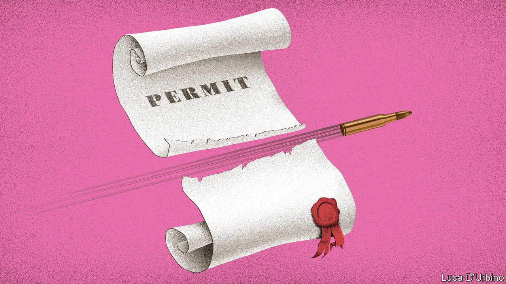

###### Bearing harms

# Permitless-carry gun laws are misguided and should be scrapped 

##### More states are falling for an extremist take on the Second Amendment 

 

> May 8th 2021 

EVERY AMERICAN state requires you to have a licence to drive a car, hunt or become a barber. Yet by the end of this year at least 20 states will allow you to carry a handgun in public without a permit. So far in 2021 five have already passed “permitless carry” laws, and five more, including Texas and Louisiana, are considering them. If these became law, around a third of Americans would live in states where it was legal to carry guns around without any need for a licence or training.

Anyone who considers the 181 mass shootings that have taken place in America since January, or the recent spike in violent crime, would be forgiven for wondering why some states want fewer restrictions on guns, rather than more. The pro-gun lobby, including the National Rifle Association (NRA), argues that having more armed civilians will help boost public safety, making it more likely that “good guys” with guns can intercept “bad guys” with guns. With the help of Republican state legislators, they are advancing an interpretation of the Second Amendment which imagines that America’s founders intended no restrictions on guns or gun ownership whatsoever. Backers of permitless carry call it “constitutional carry” to make it seem legitimate and to appear to give it a pedigree.


Do not be fooled.  is a radical departure from tradition and should be opposed. One reason is that the gains to gun owners are trivial. In most of the states considering permitless carry, it is already possible to be armed with a handgun concealed in public if you have a licence.

Obtaining a licence is hardly onerous, given what guns are capable of. Applicants are often required to do training and to pass a shooting test. Searches help screen out people who should not be trusted with a gun, such as those who have committed violent crimes or who have a history of mental illness.

Doing away with these conditions is not in the public interest. Just as communities are made safer by drivers being required to pass tests before they can legally operate a car, so it makes sense for people to learn how to use a lethal weapon and impose restrictions on when, where and how they can carry guns around. In most places where permitless carry is being considered, police forces have spoken out against it, because it would make their jobs harder and more dangerous.

The NRA has spent the past 20 years successfully loosening gun laws. The latest wave of deregulation was “shall issue” requirements for gun licences, giving officials less discretion about when to withhold them. A study of these laws by researchers at Stanford found that they resulted in a 13-15% increase in violent crime in the decade after they came into force. By the same logic, permitless carry would also probably cost lives.

Permitless carry is also a misreading of history. Romanticising America as a country that intended no restrictions on guns is incorrect. In the 19th century, most Southern states had stricter gun laws than they do today. Even in Wild West settlements like Tombstone, Arizona, newcomers had to leave their guns on the outskirts of town or register them with the sheriff. A century ago the NRA backed permitting laws as a way to promote responsible gun ownership and helped draft the country’s first federal gun-control laws in the 1930s. By arguing for permitless carry, it is not faithfully adhering to the past but drifting further towards an extreme.

America is the world leader in gun-ownership, with about six times the rate of France and Germany, and more than double war-torn Yemen, which comes second. The rate of violent gun-deaths is perhaps 100 times higher than in Britain. Most of America’s peers impose stricter laws—even gun-friendly Switzerland and Canada. Because of the near-permanent deadlock in Congress, the federal government will not pass sensible gun reforms. It is up to the states to take responsibility for the welfare of their citizens. Permitless carry will only do them harm. ■

