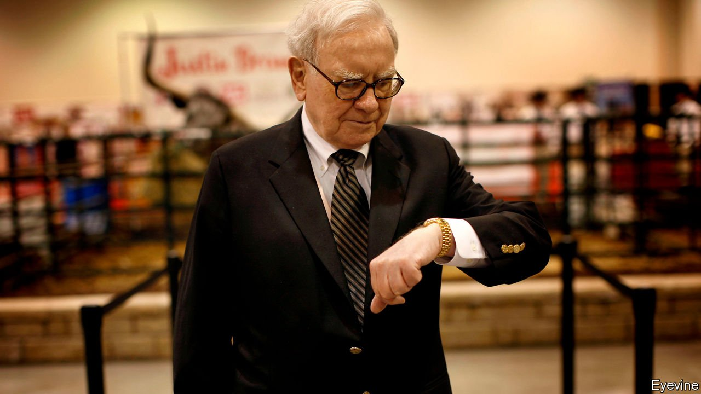

###### Time’s up

# Warren Buffett should step aside for his chosen successor 

##### Berkshire Hathaway needs a leader who will take a fresh look at performance and governance 

 

> May 8th 2021 

AT 90, WARREN BUFFETT continues to lead Berkshire Hathaway, wearing the three hats of chief executive, chairman and chief investment officer. For years, the question of whom the feted investor would  to run the giant conglomerate has been the subject of boardroom gossip. The world now knows the answer, though only because of a slip of the tongue by Mr Buffett’s 97-year-old right-hand man, Charlie Munger, at the annual shareholders’ meeting on May 1st. That forced Mr Buffett to confirm that his heir apparent as chief executive is Greg Abel, 58, a trusted lieutenant who runs Berkshire’s non-insurance businesses.

The cack-handed way in which the succession plan became public fits a bigger pattern. Berkshire is a huge public company, with a stockmarket value of $645bn and an army of devoted retail investors. It is, though, structured and run in much the way it was when Mr Buffett took it over in the 1960s. He has never hidden his reluctance to retire. He once joked that he’ll step down five years after he dies. However, Berkshire needs to make changes if it is to keep up with the times—and that includes having a new person at the top.


That is not to denigrate Mr Buffett or his achievements. In his 56 years in charge, Berkshire’s total returns have been double those of the S&amp;P 500 index. He can claim to be the greatest value-investor who ever lived. He has instilled an admirable trust-based culture at Berkshire. The dozens of fawning books he has inspired constitute their own genre of business publishing.

However, cracks have started to appear. One is Berkshire’s financial performance, which has been mediocre over the past decade. Mr Buffett has made some costly mistakes, such as bad bets on airlines and Kraft Heinz, a consumer-goods giant. He has admitted to overpaying for acquisitions, including a big metal-parts-maker that later wrote off $11bn. Were it not for a valuable stake in Apple, the bottom line would have looked limper still. Suspicion is growing that Mr Buffett has lost his magic touch in allocating capital, perhaps because, like other star fund managers, he is too big to outperform the market by much.

Berkshire’s governance needs rethinking, too. For all the autonomy its divisions enjoy, Mr Buffett still has to sign off on the big decisions. He has special shares with greatly enhanced voting power. The board is stacked with Friends of Warren; five of its 14 members are 89 or over. Berkshire’s failure to write or disclose its policies on investor priorities such as climate risk and diversity irks some shareholders, including big institutions like BlackRock. When investors called Buffett-style governance “unique” they used to mean it as a compliment. No longer.

The company’s lousy disclosure looks out of step with the times, too. Berkshire offers little beyond mandatory filings and the occasional press release. It does not hold analyst meetings or investor days; it does not even have a functioning investor-relations department. The closest thing to outside scrutiny it tolerates is the three hours of friendly shareholders’ questions, teed up by a genial reporter from CNBC, at the annual conclave.

The company needs to start dealing with these deficiencies now, or face the increased risk of a drama—such as an attempt by activist investors to break up Berkshire, or a regulatory rumble—when Mr Buffett does eventually leave. There is no need to stoop to the box-ticking corporate conformity that he so loathes, an aversion reflected in his public criticism of the metrics and questionnaires wielded by ESG campaigners.

Get the job done, Warren

New blood and greater openness would be a good start. Naming a successor is a first step. The next should be to replenish the board with outside appointments. Investors must get the information they need to make informed decisions, including analysis of where the firm is creating value, and the tax and other synergies that justify keeping the conglomerate intact.

The biggest question of all is when Mr Buffett should go. He may want to die at his desk, but the longer he stays, the more he risks becoming a liability. He said at this year’s AGM that bad leaders are the biggest risk companies face. Good leaders who stay too long are not far behind. Mr Buffett has had a wonderful run. But now that the succession is out in the open, it is time to move aside and let Mr Abel fix what isn’t working. ■

