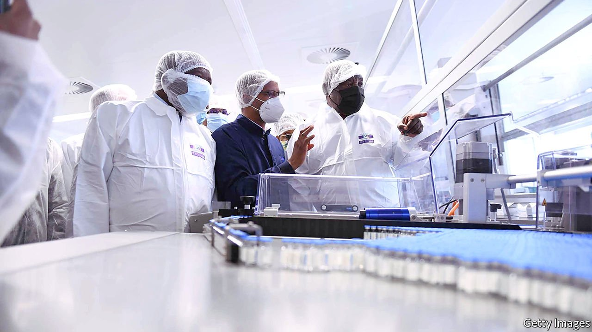

###### Home brewing

# Covid-19 has exposed Africa’s dependence on vaccines from abroad 

##### There is a big push to change this 

 

> May 8th 2021 

UNTIL RELATIVELY recently, India had seemed to have evaded the worst impacts of covid-19. This inspired hope that Africa, with its young population, might also fare well. Yet what is happening in India is a “wake-up call for the continent”, says John Nkengasong, the director of the Africa Centres for Disease Control, a pan-African body. The calamity overseas has also brought another problem into focus: India has stopped exporting covid-19 vaccines in order to serve its own citizens, leaving Africa in a “very dicey situation”, says Dr Nkengasong.

Alarm at the lack of vaccine-making capacity on the continent has been growing for some time. South Africa has been pushing hard for a waiver on the patents on covid-19 vaccines through the World Trade Organisation. On May 5th America backed a temporary suspension.


Although Africa’s 1.3bn people offer a huge market for medicines, it imports 99% of the vaccines it uses (and 70% of its pharmaceutical products). Poor countries elsewhere such as India show that it is possible to make vaccines almost anywhere. Yet with reliable and cheap supplies from abroad, there was little incentive for Africa to make them. Since the pandemic began, that calculation has changed.

The quickest way to boost production would be to invest in sites that currently make other vaccines or supplies for them. Last year Aspen Pharmacare in South Africa agreed to make the Johnson &amp; Johnson covid-19 vaccine at an existing facility. It can churn out 300m doses a year. Its first have already arrived.

There is also potential in Senegal, Egypt, Tunisia, Morocco and Algeria. All have experience in making vaccines, such as those used for yellow fever, tetanus and cholera. Ghana, Kenya and Rwanda are also seen as promising locations for vaccine-making. There are plans afoot in Nigeria and Ethiopia, too. The Institut Pasteur in Dakar, Senegal’s capital, is working with France and the European Investment Bank to produce about 300m covid vaccines a year starting in 2022. Algeria has agreed to start making the Russian Sputnik vaccine from September.

Rwanda is particularly eager to make mRNA vaccines, which use the latest technology. Paul Kagame, its president, has been talking to two mRNA vaccine manufacturers about setting up in his country. Other new vaccines, such as a protein-based vaccine for malaria, might also offer long-term business opportunities.

Because setting up takes time, Africa’s covid-19 jabs will still need to come from overseas for years. The goal of the AU is that 40% of Africa’s vaccine needs could be met on the continent within 20 years. This expansion will be challenging, but the world has done something similar before. In 2006 a technology-transfer programme overseen by the World Health Organisation ramped up production of flu vaccine in developing countries. The ingredients for success were a long-term commitment from governments, collaboration with private firms and an experienced partner.

It also takes finance. New projects need contracts to supply vaccine for 10-15 years, says Solomon Quaynor of the African Development Bank. Financiers also look at “soft” infrastructure, such as good governance, stable politics, government spending on health care and support for scientific research.

One of the challenges to the business case is what a vaccine manufacturer will do when there is no pandemic. The solution is to make some of the hundreds of millions of doses of childhood vaccines that Africa uses every year. Yet any new facility will struggle to compete with the economies of scale at India’s Serum Institute, the world’s largest vaccine producer.

Private firms are showing interest. The Serum Institute plans to start production outside India, though it has not said where. Stéphane Bancel, the boss of Moderna, which makes the high-tech mRNA covid-19 vaccine, has said he is looking at how to set up a plant in Africa. Beyond covid-19, Moderna is interested in making vaccines for yellow fever, chikungunya, dengue and Zika.

One inducement is Africa’s Continental Free Trade Area, which came into effect at the start of this year and is a big step towards creating a huge single market for vaccines on the continent. But a missing piece needed to make this market work is the establishment of a continent-wide African Medicines Agency (AMA), a proposed regulator that would be able to certify vaccines and root out fake or low-quality medicines. A treaty to establish the AMA was drafted two years ago, but not enough countries have ratified for it to come into force. “If African countries are serious about vaccine manufacturing they have to ratify,” says Mr Quaynor. “It has to happen.” When it does, that will be the strongest signal so far that Africa is ready to make more of its own vaccines. ■

Dig deeper

All our stories relating to the pandemic and the vaccines can be found on our . You can also listen to , our podcast on the race between injections and infections, and find trackers showing ,  and the virus’s spread across  and .

