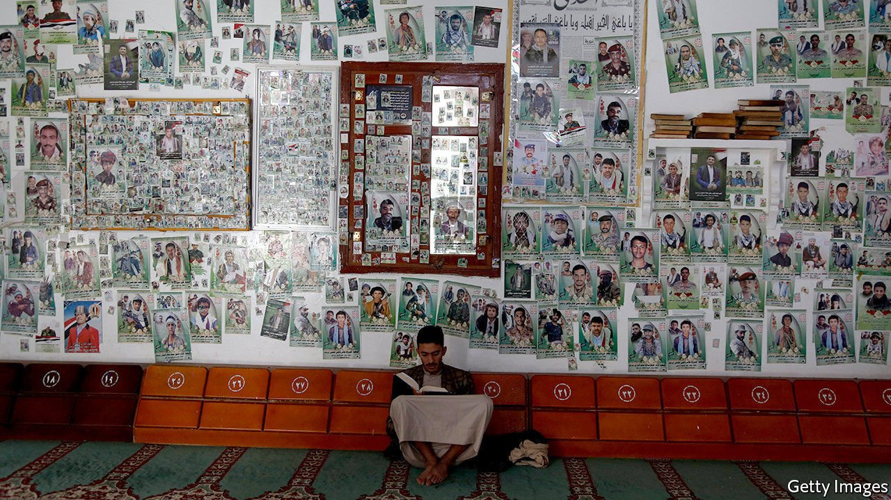
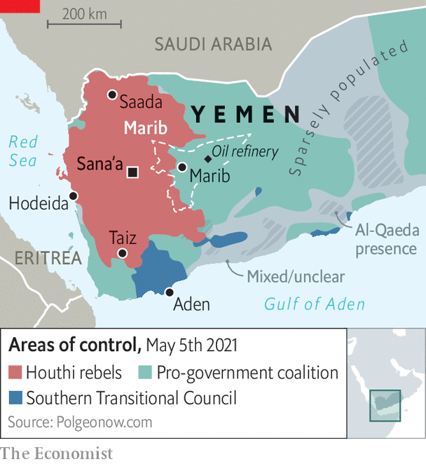

###### Peace on hold

# Houthi rebels look to take Marib, prolonging Yemen’s war 

##### The battle, like the war, could be long and bloody 

 

> May 8th 2021 

JUST TWO years ago, from the mountains to the east, forces loyal to the Yemeni government could see the capital, Sana’a. It was the closest they had got to the city since the Houthis, a group of Shia rebels, overran it in 2014. But now the government’s forces are on the defensive. They have been pushed back to Marib, the last big city in the north still held by the government (and seat of a province with the same name). The Houthis are within 4km of it (see map). Only air strikes by Saudi Arabia, which supports the government, slow their advance.

Marib had until recently been one of Yemen’s safer cities. Those displaced by fighting elsewhere took shelter there. The Saudis made it a base for operations. But the battle for it shows just how badly things have gone for the government and its backers. They would gladly accept the UN’s call for a ceasefire. The Houthis, who control much of the country, ignore it. If they take the city, they will control the north’s only oil refinery and the gateway to oilfields in the east and south. “It will be a disaster,” says a Western diplomat who was in Marib last month.


The territory controlled by the Houthis is home to 70% of Yemen’s 30m people. The rebels have been installing a repressive theocracy like the one in Iran, which arms them. Political opponents and curious journalists are locked up or executed. Students are taught to hate the West. Cafés where men and women once mixed have been closed. An actress who modelled without a veil was arrested this year. Some of Yemen’s last remaining Jews were expelled by the Houthis in March.

 


A Saudi blockade has crippled the economy in the north. But the Houthis compound the suffering. They divert aid and sell it for profit. The UN’s rollout of covid-19 vaccines in the north has been suspended because the Houthis want to control delivery. Across the country, at least 400,000 Yemeni children could die of starvation this year without urgent intervention, warned four UN agencies in February.

The Houthis still manage to keep their war machine humming, though. Smugglers haul fuel to the north from ports in the south that are controlled by the government or its nominal allies. Houthi checkpoints double as customs posts, raising revenue to pay fighters. Iran uses the same route to smuggle “significant volumes of weapons and components to the Houthis”, according to a UN panel of experts. It supplies parts for their drones and missiles that are used to attack Saudi Arabia.

Marib’s loss would further demoralise the pro-government coalition, which is already fragmented. Yemeni soldiers complain about unpaid salaries and a lack of arms, while the president, Abd Rabbo Mansour Hadi, remains in gilded exile in Saudi Arabia. A separatist movement called the Southern Transitional Council (STC) is ostensibly a member of the coalition, but it has fought the government for Aden and now controls much of it. Many of the STC’s leaders cheer on the Houthis. Some of the tribes around Marib flirt with them, if only to extract more cash from the government.

The government’s international backers are losing interest in the war. The United Arab Emirates pulled most of its troops out of Yemen in 2019. Shortly after taking office, President Joe Biden said he would end “all American support for offensive operations in the war in Yemen”. The Saudi campaign, launched in 2015, has fallen into a quagmire. Instead of curbing Iranian influence, as intended, the war has enhanced it. In an interview last month Muhammad bin Salman, the Saudi crown prince and de facto ruler, appealed to the Houthis to join him at the negotiating table.

So far the Houthis have refused. The UN’S envoy to Yemen, Martin Griffiths, has been persona non grata in Sana’a for a year. In February Mr Biden removed the Houthis from America’s list of terrorist organisations, a move aimed at increasing the flow of aid and kickstarting the peace process. But since then the Houthis have marched towards Marib.

Taking the city would strengthen their bargaining position. But it will not be easy. Marib’s defenders and most of its inhabitants detest the Houthis' politics and reject their religious beliefs. The open ground around the city makes the attackers easy targets for Saudi jets. Like the war more broadly, the battle for Marib could be long and bloody. ■

