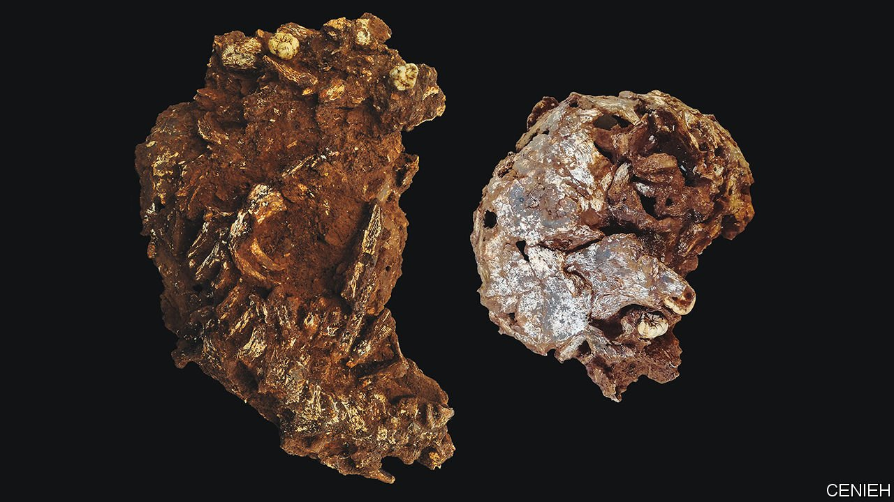

###### Human prehistory

# The oldest burial in Africa 

##### A cave in Kenya is the resting place of a 78,000-year-old child 

 

> May 6th 2021 

THESE ARE THE are the remains of an infant Homo sapiens, nicknamed Mtoto by their discoverers, found buried in Panga ya Saidi, a complex of caves near Mombasa, Kenya, in 2013. They are 78,000 years old, making them the most ancient human burial yet unearthed in Africa. The lefthand group of bones are the child’s spine and thorax; those to the right, the skull and some vertebrae. They were excavated and analysed by a team led by researchers from the National Museums of Kenya and the Max Planck Institute for the Science of Human History, in Jena, Germany, who published their findings in this week’s Nature. Mtoto, whose sex cannot be determined but whose name means “child” in Swahili, was about three years old. That the burial was deliberate seems clear. The skeleton was in a circular pit and the child is thought, from the way the bones were arranged, to have been laid out with its head on a pillow.■

A version of this article was published online on May 5th, 2021

