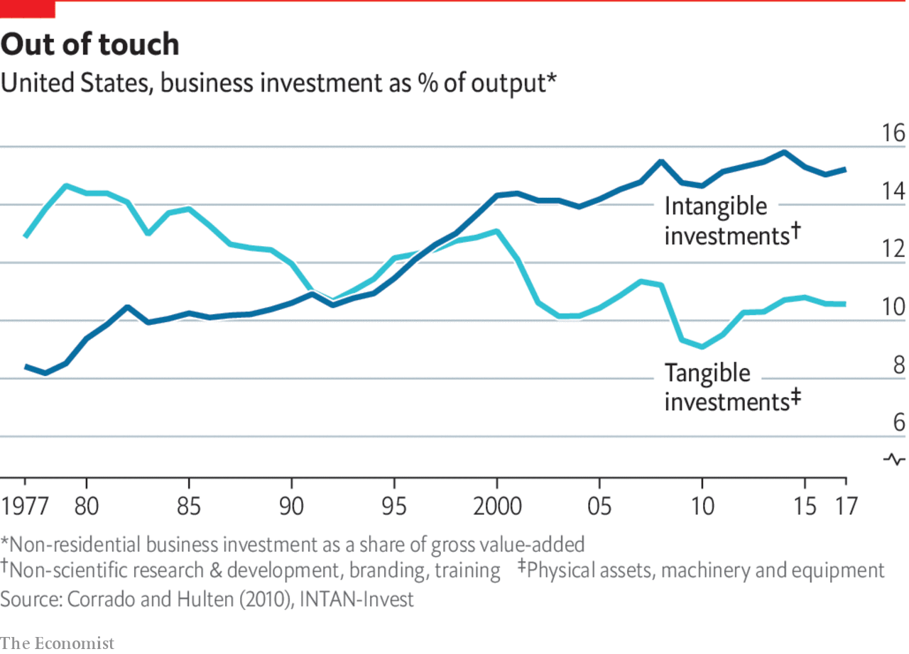

###### Debt v equity

# A bigger role for venture capital 

##### Why bankers are scarce in Silicon Valley 

 

> May 6th 2021 

TO UNDERSTAND WHAT was a risky venture in 19th-century America, visit the Whaling Museum in Nantucket. The industry thrived on this Massachusetts island, now transformed from an outpost for coarse sailors into a swanky beach spot. Two centuries ago, whales were valuable because of the lucrative oil in their head-cases. Captains amassed fleets of sloops and dozens of men armed with harpoons to hunt them. For lucky crews that found their “white whales” the rewards were enormous, but so were the risks of losing ships and souls in the hunt. In “Moby Dick” Herman Melville admonishes the reader: “for God’s sake, be economical with your lamps and candles! Not a gallon you burn, but at least one drop of man’s blood was spilled for it.”

The risk of losing all was too great for bankers, who refused to lend money to whalers. So a new breed, the whaling agent, stepped in to provide captains with capital in return for a share of profits. Although stakes in many voyages might be lost they spread the capital so that one successful voyage made up for it. This model was an oddity in the 1800s, but the trade-off will sound familiar to venture capitalists today. In their business low-probability, high-pay-off outcomes are the “allure of the long tail”. Venture capitalists fund startups by investing in a broad portfolio in hopes of finding the next Google or Amazon.


The difference between whaling agents of 19th century New England and today’s venture capitalists is their importance. Even at its peak in the 1850s, whaling contributed only 1.7% of American industrial output. Bankers financed the behemoths such as railroads, manufacturers and farmers. The first recognisable venture-capital fund, ARD in Boston, was created in 1946, but its successors loom much larger. Just shy of half all listed American companies were once venture-backed. The ascent of venture capital has come, in some ways, at the expense of other financiers. Bankers are conspicuous by their absence in Silicon Valley.

 


Why has venture capital boomed? One theory, posited in “Capitalism without Capital” by Jonathan Haskel, at Imperial College London and Stian Westlake, a researcher at Nesta, a think-tank, begins with the shift in how businesses invest. Firms once mostly invested in physical stuff (“tangible capital”) like railroads, equipment, vehicles or machinery to make things.Now they increasingly invest in research, branding and software (“intangible capital”) to produce intellectual property. According to data from Lee Branstetter of the Peterson Institute for International Economics and Dan Sichel of Wellesley College, 13-14% of the output of businesses in 1980 was invested in tangible assets and just 9% in intangible assets. By the mid-2010s these shares had switched: around 14% was spent on intangibles, and 9% on tangibles.

The rise of intangible capital may explain several capital-market trends, including the fact that private firms are tending to stay private for longer and the popularity of mergers. Software companies find it easier to protect intellectual property in private markets. Rigid accounting rules do not cope well with intangible capital, for instance by mostly booking spending on research as an expense, discouraging it.

The shift has other broad implications. Lenders like collateral: whenever financiers make loans they worry about being repaid, but they can take valuable property in case of default. Most consumer lending is secured against houses or cars.But businesses that create intangible assets do not have such collateral. This can make it harder to secure debt-financing, which is often not available unsecured for new businesses at a reasonable rate. Stephen Cecchetti, an economist at Brandeis University, calls this the “tyranny of collateral”.

American software firms have debt worth just 10% of equity. By contrast restaurants often have debt worth 95% of their assets. Tech firms frequently rely on seed funding and venture capital.This cannot be explained solely by a lack of demand: the tech firms might like to borrow if they could. “The companies that we are talking to today believe their valuations will be a lot higher next year,” says Scott Bluestein, boss of Hercules Capital, which lends to software and biotech firms. “If they can use structured debt to get there without having to raise equity, they can limit a significant amount of dilution, which can be very valuable for management and early investors.”

Some niche lenders manage. “We do lend secured,” says Greg Becker, boss of Silicon Valley Bank in Santa Clara. “We are often secured by intellectual property which, for a software company, is their ability to generate revenue from code.” This comes with other risks. “We will take losses in situations where software once had value, but the industry was disrupted in a way that it no longer does. That is just harder for traditional banks to get their arms around versus hard assets.” Most banks are less flexible.■

