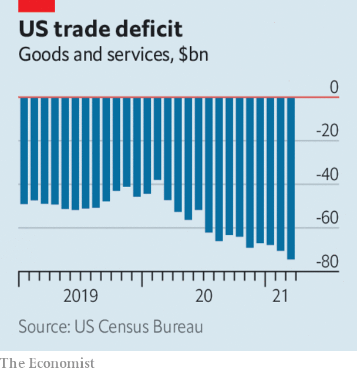

###### 

# Business this week 

#####  

 

> May 8th 2021 

After 56 years at the helm of , Warren Buffett named Greg Abel to succeed him as chief executive. It is not clear when the 90-year-old Mr Buffett will actually vacate the job. Berkshire’s share price underperformed the S&amp;P 500 over the past two years, but has rebounded in the first quarter of 2021, pleasing its legions of investors. Quarterly net income came in at $11.8bn, in part because of the soaring value of investments in Apple and other stockmarket stars.

The announcement by Bill and Melinda Gates that they are to divorce after 27 years of marriage sent shockwaves through the world of philanthropy. The deep pockets of the Bill and Melinda Gates Foundation have funded many global public-health projects, often reshaping policy discussions. It invested early in vaccines for covid-19, working with the COVAX initiative to send doses to poor countries.


The Biden administration said it would support an effort to suspend , a change in policy that the head of the WHO described as a “monumental moment”. Suspending patents might help countries such as India and South Africa to produce generic doses. Drug companies are not happy. They claim this would put more strain on supply chains and hand new technology to China and Russia.

Facebook’s Oversight Board found that its ban on Donald Trump was right, but that the decision should be reviewed in six months. Mr  after the assault on Congress by his supporters on January 6th. The board said that Facebook’s actions against Mr Trump should be proportionate to other users’ transgressions.

General Electric’s shareholders rejected a pay package possibly worth up to $230m for Larry Culp, the chief executive. The vote was not binding, but highlights growing investor frustration at the high rewards some blue-chip companies dished out to executives during the pandemic. AT&amp;T said less than half its shareholders approved a compensation plan for executives. Similar fights are brewing at Amazon, ExxonMobil and elsewhere.

Loose lips

Janet Yellen, America’s treasury secretary, made a swift about-turn and said she was not recommending or predicting a rise in interest rates, after she had remarked that rates would have “to rise somewhat to make sure that our economy doesn’t overheat”. Ms Yellen’s initial seeming support for an increase spooked markets. She offered further assurances that she is not worried about persistent inflation, but does think prices will rise in the short term as economic activity picks up.

America’s GDP grew by 1.6% in the first quarter over the preceding three months, and is virtually back to its pre-pandemic level. With lockdowns reimposed in many places, the euro zone’s economy shrank by 0.6% in the quarter following a contraction of 0.7% towards the end of 2020, which is technically a recession. Germany’s economy was 1.7% smaller in the quarter.

 


America’s deficit in goods and services jumped to $74.4bn in March, a monthly record. Imported goods from China soared to $48.2bn, as households flush with stimulus cheques splashed out.

Telenor, a telecoms company backed by the Norwegian government, wrote off its entire investment in Myanmar, where it is one of the biggest providers of phone services. It blamed the deteriorating security situation since the military coup on February 1st, but said it was not leaving and would continue to operate in the country.

A trial got under way in California to decide whether Apple abused its market dominance when it booted  off its app store last year after the game’s owner, Epic Games, tried to offer an alternative payment system for enhanced features. The case comes soon after Apple was accused by the European Commission of distorting competition in the market for music streaming, following a complaint from Spotify. The tech giant has 12 weeks to respond.

Darktrace made a successful stockmarket debut on the London Stock Exchange: the cyber-security company’s share price rose by a third, giving it a market value of £2.2bn ($3.1bn). Unconditional trading began on May 6th. The IPO was seen as a test of the demand for tech offerings in the City, after Deliveroo’s dud listing a month ago.

A blast from the past

Still knocking around from their early days as internet trailblazers, AOL and Yahoo were sold by their current owner, Verizon, for $5bn to . Despite their outmoded image the pair continue to generate sizeable revenues, providing Verizon with $1.9bn-worth in the first quarter. Apollo may try to enhance the sports-related bits of the platforms.

