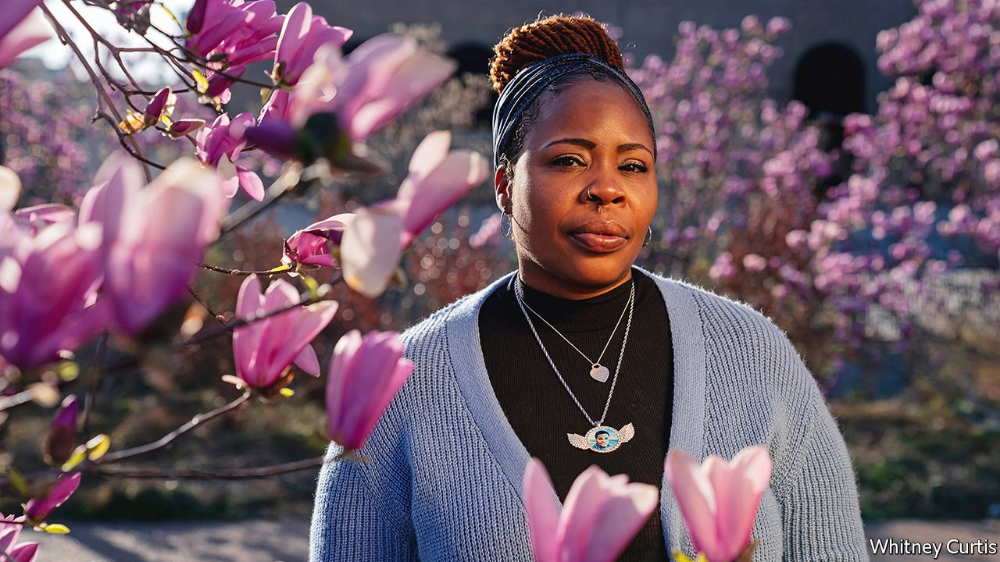

###### Crime without punishment

# America’s homicide rate has declined since the 1990s. So have homicide-clearance rates 

##### What happens to a city when homicides go unsolved 

 

> May 8th 2021 

“I  TRY TO keep them close,” says Maria Miller (pictured), holding out her wrist to display a bracelet composed of tiny framed pictures linked by a gold chain. They show her oldest and youngest brothers, Larry Miller and Harrol Berry, and her son Courtney Williams. All were murdered in 2014. Mr Miller was stabbed while in prison; two people have been tried for his murder. The killers of Mr Berry and Mr Williams, who was shot on a visit home from college, have never been caught.

Sadly, that is not unusual. St Louis is a violent city, and its homicide unit is overworked and understaffed. Ideally, a homicide detective should be the primary investigator on no more than five murders per year. Heather Taylor, a recently retired homicide supervisor in St Louis, said that her detectives had as many as 19.


Last year, 262 people were killed in St Louis, giving it a murder rate of 87.2 per 100,000 people—probably higher than any other American city. But police in the city cleared (meaning, generally, arrested and charged someone for) just 36% of those homicides. By contrast, last year police in St Louis County, just west of the city, closed 87% of their murders. As of May 3rd this year, things are looking up, but police have still closed only 31 of the city’s 68 murders.

This problem is not unique to St Louis. Nationally, around two in every five murders go unsolved, with troubling consequences for families, neighbourhoods and cities all over the country.

This was not always the case. Richard Rosenfeld, a criminologist at the University of Missouri-St Louis, notes that up until the early 1980s homicide-clearance rates in many cities were around 90%. Then, beginning in the 1990s, crime of all sorts began to decline—but so did clearance rates.

Murders within families and marriages, which are comparatively easy to solve, decreased. Murders involving drugs and gangs (in which victims, offenders and those with knowledge of the crime might all have criminal records, and hence want to avoid the police) came to comprise a larger share of all homicides. Those killings are harder to solve, and in any given year, when murders rise, clearance rates tend to fall, suggesting that more murders stretch police manpower, resulting in fewer clearances.

What explains the low rates in St Louis? “Fear,” says Sharon Williams. Her apartment is festooned with pictures of her oldest son Mikey, an artist and painter shot to death by young men who mistakenly believed he had stolen some guns or drugs. Ms Williams used to run a gang-abatement centre in north St Louis; her son’s funeral was the 46th she had attended for a young person killed in the city. In many cases, she explains, just because the murder is officially unsolved does not mean the killer is unknown. People say to themselves, “I live in this neighbourhood. I work in this neighbourhood. My kids go to school here. We know the perpetrators; we just can’t say it. Nobody’s offering us protection.”

Kim Gardner, St Louis’s chief prosecutor, agrees, arguing that Missouri does not give her office adequate resources to protect or move witnesses. Mr Rosenfeld calls this “a genuine chicken-and-egg problem. When overall levels of violence come down, people become more willing to co-operate with the police because the neighbourhood is less risky. But how do you drive down the level of violence? People have to co-operate with the police.”

As a result, families often see their loved ones’ killers walk free. Ms Williams has spoken with other grieving families who say, “We know where the person is, but we’re trying to do things the right way. We don’t want to take street justice, but nobody is helping us.”

Mistrust, built up over decades, between the city’s majority-white police force and the majority-black population of north St Louis also makes people reluctant to come forward. One St Louis-based FBI agent argues that “failure to handle violent crime invalidated everything else. Too many police officers try to reduce violent crimes by saying, ’We’ll knock more heads’.” This agent favours a programme of “focused deterrence [and] call-ins”, in which police bring in young men at risk of perpetrating or being victims of violent crime to offer them job training and other social services, but also to warn them that if they continue on their current path, they will face serious consequences. The FBI agent says a former police chief deemed that plan “too soft”.

But a strategy like this has worked before. In the early 2000s, St Louis had more people and fewer murders (its murder rate in 2003 was less than a quarter of last year’s), for which Ms Gardner credits an effective anti-gang unit within the police. When the unit made arrests, these were “strategic prosecutions of violent individuals that brought the crime rate down”. The community trusted the officers, says Ms Gardner, because “they weren’t just putting everyone into the system. They would help people. If they needed jobs, they’d get them jobs…They built neighbourhoods of trust.” Political disputes, she said, led to the unit being disbanded.

When running for office, the city’s new mayor, Tishaura Jones, expressed support for focused deterrence, as well as increasing investments in job-training and mental-health services. She will find eager partners in women such as Ms Miller and Ms Williams, both of whom have started charities to advocate for their causes. But she will also doubtless find that many people share Ms Miller’s view: “I have completely lost faith in St Louis city homicide. They don’t care.” ■

