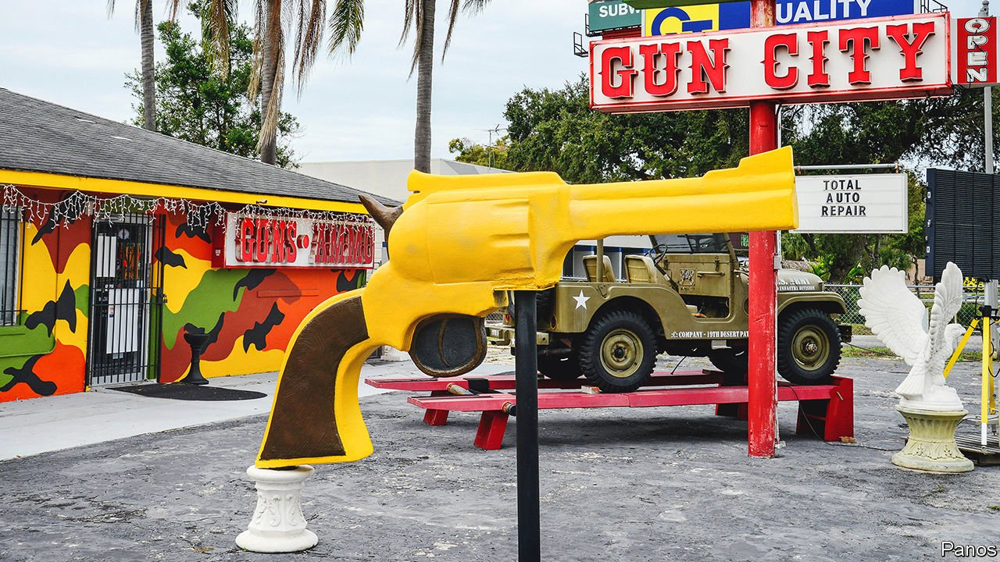
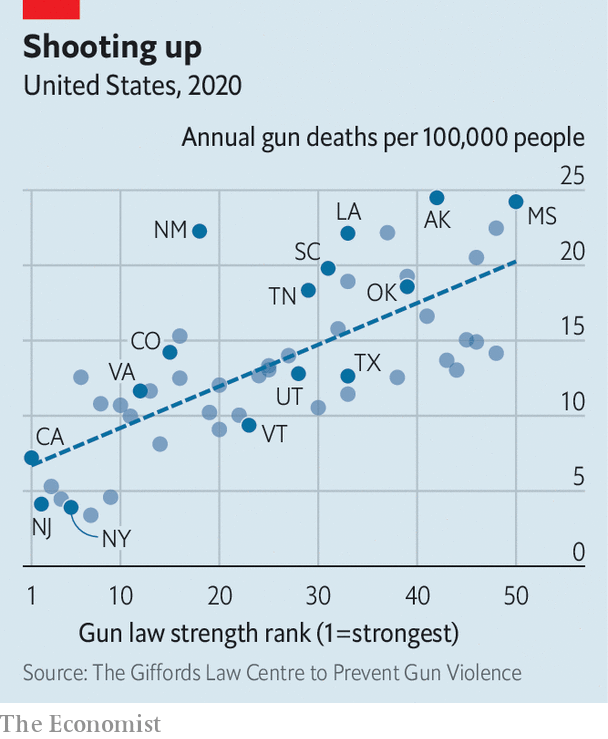
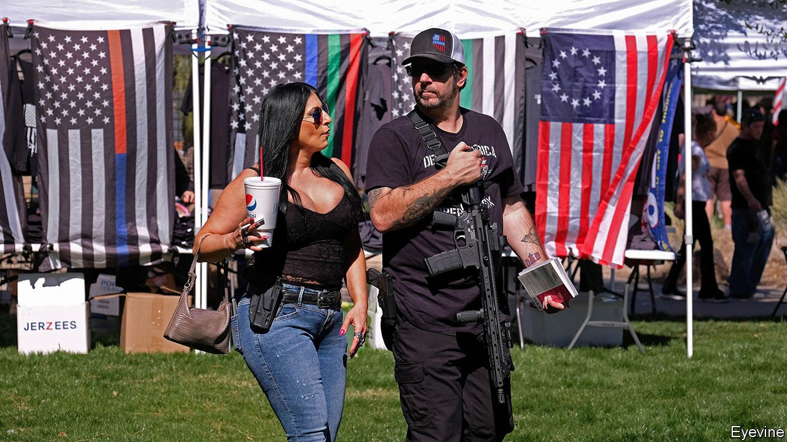

###### The spread of permitless carry

# Many states are pushing through more permissive gun laws 

##### Looking down the barrel of a troubling trend 

 

> May 6th 2021 

AFTER A YEAR spent at home in pyjamas and fitness clothes, the question of what to wear outside is on the minds of many. Some also have in mind an unexpected accessory: handguns. Across the country states are trying to make it easier for people to carry guns in public without applying for a permit, being subject to a background check or going through training. Since February five states have passed new or expanded “permitless-carry” laws.

Some states, such as Utah, where permitless carry went into effect on May 5th, require guns to be concealed (for example, in holsters tucked underneath a jacket). Others, such as Tennessee, will allow people to carry their handguns in plain sight. Five more states, including Louisiana and South Carolina, are considering permitless-carry bills, as is Texas, where the state’s Senate followed the House in passing such a bill, also on May 5th.


Twenty years ago only Vermont allowed people to carry handguns without a permit. By the end of this year, at least 20 states will. Three-quarters of them have passed permitless-carry laws in the past six years. The new laws unwind safeguards and trump “concealed carry” licensing schemes already in place. To carry a concealed handgun in Texas today requires a licence, which includes a background check, fingerprinting, training, a written exam and shooting test. Under the proposed legislation, all that would go.

 


The rise of permitless carry is notable because so many states are loosening gun laws at a time when mass shootings are frequent, violent crime is rising and gun sales have reached new heights.  were conducted for firearm sales. The first three months of this year set another record. In its most recent quarter, Smith &amp; Wesson, a gun manufacturer, recorded sales that were double—and gross profits triple—what they were a year earlier.

The pro-gun lobby, including the National Rifle Association (NRA), has armed Republican state politicians with arguments that more citizens with guns could help boost public safety and that the government should have no say in whether someone can carry a gun in public. Proponents have rebranded it “constitutional carry”, instead of “permitless”. But it was not so long ago that Republican states banned people from carrying handguns in public at all.

In the 1980s and 1990s the NRA pushed for new laws allowing people to carry concealed guns with a permit, and then, having achieved that, pushed through a new set of “shall-issue” laws that gave law enforcement less discretion over restrictions on who should receive a permit, even for people with histories of mental illness and crimes. Permitless carry is the “next frontier” for the gun lobby, says Adam Winkler of the University of California, Los Angeles, Law School. “Permitless carry is taking off because gun-rights supporters don’t have many rights left to loosen,” he says.

Permitless carry is spreading even though the NRA is , including an investigation by New York’s attorney-general into financial fraud by the non-profit’s leadership that has led it to file for bankruptcy in Texas. But the trend shows how far the NRA has already changed the political culture and interpretation of the Second Amendment through its lobbying. It also reflects how moderates have been weeded out of the Republican Party, helping radical stances on guns get more support, says Daniel Webster of the Johns Hopkins Centre for Gun Violence Prevention and Policy.


Those championing permitless carry argue that having more armed citizens will help save lives. Tennessee’s governor, Bill Lee, called his state’s new law “core to a strong public-safety agenda”. Yet in Tennessee and elsewhere police have campaigned against permitless carry, saying it endangers them and makes it more likely that criminals and felons could walk around armed. As Stan Standridge, the police chief in San Marcos, Texas, has pointed out, the Lone Star state requires licences to drive a boat and cut hair. Yet guns can wreak far more havoc than boats or hair-clippers. This is a rare issue where Republicans have split from the interests of the police in favour of pleasing their base.

Annie get your AR-15

At the risk of stating the obvious, permissive gun laws do not make people safer. There are several reasons why armed citizens rarely interrupt shooting rampages, including fear that the police may believe them to be the shooter, says Kris Brown of Brady, a gun-control organisation. A study by researchers at Stanford looked at the impact of “right-to-carry” laws and found that ten years after adoption, they were linked to a 13-15% increase in violent crime.

The full effects of permitless carry on Americans’ safety would probably take many years to establish. So many guns are already in circulation that it is difficult to discern the effects of specific changes to laws. This was not helped by the NRA successfully preventing federal funds from being spent on any firearms research that might point towards the need for more gun control from 1996 until 2020.

With Congress unlikely to pass federal gun-control regulation because of Republican opposition, the states are where gun laws are being reshaped. Some, including Colorado, New Jersey and Virginia, have tightened gun policies in response to mass shootings and safety concerns. But more states are going in the direction of gun deregulation than regulation, says Mr Webster of Johns Hopkins.

 


Meanwhile a growing number are also becoming “Second Amendment sanctuaries”, as Oklahoma and Arizona have already done this year, resolving not to comply with any new federal gun laws. Much of this is symbolic, says Mark Jones, a professor at Rice University. Ms Brown of Brady disagrees, saying that the “Second Amendment sanctuary” laws will have a “concerning, chilling effect” on police officers.

Her group may challenge them in court. But gun help will probably not come from the judicial branch either. This autumn the Supreme Court will hear its first gun-rights case in years. Justices will rule on whether a New York law, which makes it difficult to receive a permit to carry a gun in public for self-defence, is legal. Donald Trump’s three conservative nominees to the court may well have shifted the balance of views on guns towards gun-owners.

Texas, the country’s largest Republican state, will be an important test of how far politicians are willing to push their pro-gun agenda. The state is so gun-friendly that there is a separate “fast track” at the Capitol building allowing those with concealed-handgun licences to bypass metal detectors and bring their guns in. The governor, Greg Abbott, has said that Texas should become a “Second Amendment sanctuary state” and has recently come out in support of permitless carry.

The Texas legislature is considering a raft of gun bills in addition to permitless carry. These include a bill that prohibits hotels from banning guests from bringing guns to their rooms and one that prevents the state from doing business with companies that discriminate against firearms firms and groups.

Yet even in Texas, permitless carry is controversial. According to a recent survey from the University of Texas and Texas Tribune, only 34% of Texans said that the state should change its law to allow people to carry their handguns without permits, while 59% were opposed. However, most Republicans are more worried about outflanking conservative rivals in the primaries than they are about winning a general election. If Texas does pass permitless carry, it will become the most populous state to do so. But not the last.■

A version of this article was published online on May 1st, 2021

