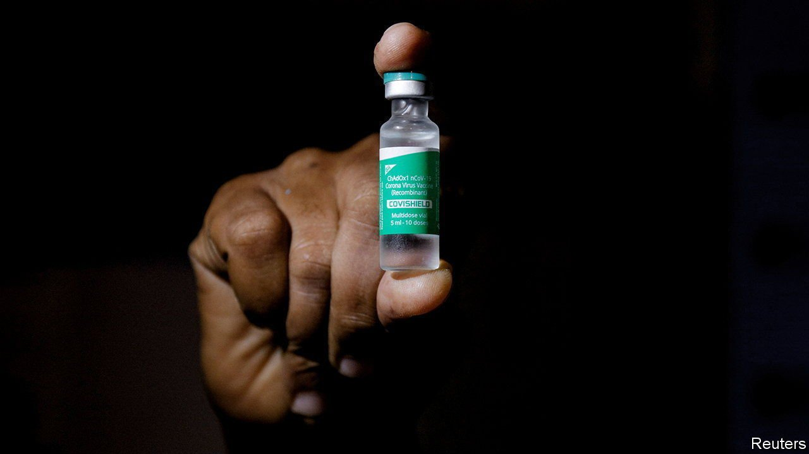
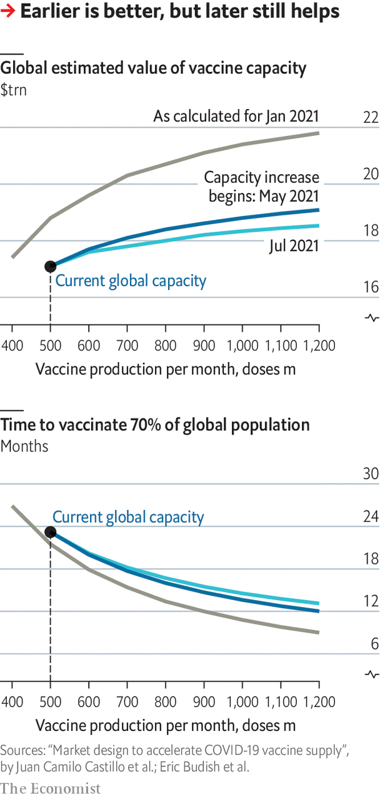
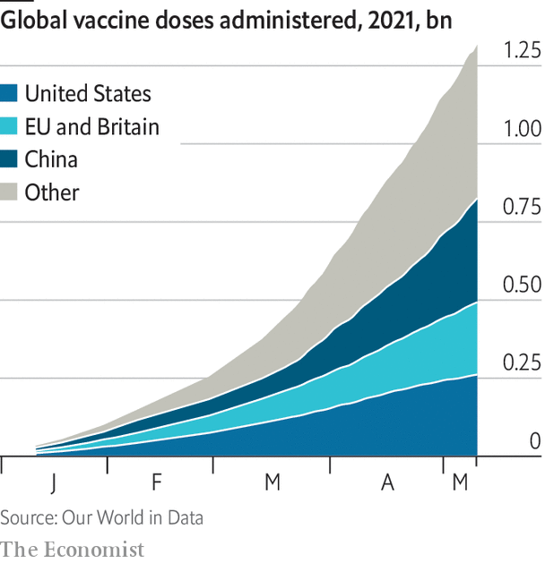
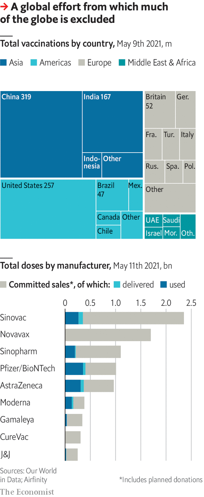

###### The whole world needs protecting

# How can more covid-19 vaccines be made available? 

##### The nuts and bolts of scaling up production matter more than intellectual property 

 

> May 15th 2021 

BIOMEDICINE HAS never seen anything like it. This time last year, no company had ever made a vaccine against SARS-CoV-2, the virus that causes covid 19, on an industrial scale. By the middle of this April a billion doses had been delivered. According to Airfinity, a data provider, a second billion doses are expected by June 1st. On current estimates the world’s pharmaceutical companies look set to provide 10.9bn doses over the course of 2021.

So far this effort has increased the world’s capacity for producing vaccines of all sorts by a factor of three to four. “It’s insane,” says Tim Gardner, the boss of Riffyn, a biotechnology startup focused on speeding up drug-production processes. “It’s an incredible success.”


At the same time many parts of the world have no smooth-running avenues of supply. The Covid-19 Vaccines Global Access Facility (COVAX), a vaccine-sharing scheme designed to provide supplies to low- and middle-income countries, has so far distributed only 59m doses. Most of the most vulnerable unvaccinated people look unlikely to be vaccinated soon. This is both inequitable and inefficient; it will increase the death toll and prolong the pandemic, increasing both economic losses and the odds of new variants of concern.

A recent report from the OECD, a club of mostly rich countries, made the case for continued government investment in vaccine-production capacity, putting the idea into the context of long-term strategies such as “co-ordinated approaches to the sharing of intellectual property and technology transfer”.

It is the sharing of intellectual property, not increased investment, which has drawn the most attention. Since last October, South Africa and India have been arguing for an arrangement whereby the World Trade Organisation no longer obliges countries to protect patents, industrial designs, copyright and trade secrets which apply to covid-19 vaccines, therapeutics and diagnostics. America, Britain, the European Union and Switzerland—home, between them, to most of the world’s big drugmakers—opposed the waiver. But on May 5th President Joe Biden broke ranks. Katherine Tai, the US trade representative, said that the administration would support proposals to waive intellectual property protections for covid-19 vaccines, winning the administration plaudits from over 100 countries which support the waiver as well as from people at home who think drug companies inherently villainous.

If such a waiver is agreed on, it will not be soon. Proponents take that in their stride: better to arrive at the end of the year with a waiver agreement close to hand and no need to use it, goes one argument, than still to be facing a global crisis of unmanageable proportions but with a diplomatic mountain to climb. That may be so. But the world’s need to create new production facilities, and ideally to work the various capabilities it has already developed even harder, will not wait. And intellectual-property rights are far from the most pressing, or most restrictive, constraint.

Billion wise, trillion foolish

The increase in capacity seen over the past year was brought about in large part because of government interventions, most notably Operation Warp Speed in America and the activities of the Vaccine Taskforce in Britain, which guaranteed payments and drove the expansion of supply chains.

 


These efforts splashed around a lot of money which, if none of the vaccines had worked, would have been lost. But with the benefit of hindsight it is now hard not to wish they had been more generous still. In March Science, a journal, published estimates from a group of economists of the total global economic loss that would have been avoided if enough money to produce vaccines for the entire world had been provided up front, rather than enough for most of the rich world. They calculated that if the world had put in place a vaccine-production infrastructure capable of pumping out some 1.2bn doses per month by January 2021, it would have saved the global economy almost $5trn (see chart).

Eric Budish of the Chicago Booth School of Business, one of the model’s authors, explains the situation using a plumbing metaphor: it is faster to lay down a wider-bore pipe at the start of a project than to expand a narrow one later. The rich world succeeded in producing effective vaccines remarkably quickly in quantities broadly sufficient to its needs: an extraordinary achievement. But the capacity of the system it built in order to do so created constraints that the rest of the world must now live with. That was a choice, not destiny.

But if the best time to invest was last year, the second best is now. Three distinct types of vaccine—based on mRNA, on DNA packaged inside an adenovirus, and on inactivated SARS-CoV-2 particles—have been widely authorised for use, if in most cases and places only on an emergency basis. Companies that play a role in relevant supply chains are able to invest with an assuredness about what is to come that they could not have had last year. Thermo Fisher, an American firm which sells a range of scientific and pharmaceutical supplies, having seen “mRNA confidence increase on the demand side”, is spending $60m on a facility in Texas that will produce more of the nucleotide building blocks from which mRNA vaccines are assembled.

 


The mRNA vaccines made by Pfizer/BioNTech and Moderna are, in general, those which Western customers are most excited about seeing scaled up. Moderna is ramping up production around the world; it recently announced that it will make 3bn doses next year. On May 10th BioNTech said it plans to create a factory with an annual capacity of several hundred million doses in Singapore. The firm is in discussion with other countries about further production sites. A joint venture with Fosun Pharma, a Chinese firm, could make up to 1bn doses a year. A number of African countries are known to be keen on bringing the technology to the continent.

Unfortunately for the vulnerable people at growing risk around the world none of this will be quick. Stéphane Bancel, the boss of Moderna, says that it takes six to nine months at a minimum to add significant capacity, which means there is no way to increase capacity this year beyond what is already planned. Even when a company has a site ready to take mRNA manufacturing equipment, machines have to be ordered, built, shipped and installed, a reliable supply of raw materials has to be arranged and people have to be hired, trained and brought up to speed on the processes involved.

Pollyanna, meet Polanyi

Building up the requisite knowledge in the new teams is the hardest task. The problem, says Rob Carlson, a veteran biotechnology investor, is that that knowledge is not stored in a format that is easy to copy between facilities. Each vaccine is produced according to a “recipe” which lists the settings for all of the things in a production facility that can be changed from job to job: every dial on every machine, timings, temperatures, masses, volumes and concentrations. Such a recipe may run to hundreds of pages. And it will still typically be incomplete; tacit knowledge matters, too, and it is for the most part lodged in the minds of very busy people.

Under pandemic conditions accessing what those people know will be complicated by the fact that they may well be on the edge of burnout. Mr Bancel says his team “has been working hard for a year, seven days a week…we are not even finished doing all the tech transfer to deliver the billion for this year.” Every day he worries that he is pushing them too close to their breaking point.

The non-mRNA Western firms have been working just as hard at transferring their technology. AstraZeneca made global production of its adenovirus vaccine a particular focus; the tech transfer of Oxford University vaccine taken forward by AstraZeneca to one British production site took about seven months, says Sandy Douglas, the Oxford professor who managed the transfer. Novavax has taken the better part of a year to transfer the insect-cell-based manufacturing system for its not-yet approved protein-subunit vaccine to the Serum Institute of India (SII), a huge and very experienced vaccine-maker. Stan Erck, the company’s CEO, says it is repeating the process in the Czech Republic, Korea, Japan and America.

All told, pharma firms have made 280 partnership contracts covering the production of covid-19 vaccines, says Thomas Cueni, head of the International Federation of Pharmaceutical Manufacturers and Associations, a trade group. About three-quarters of those deals involve technology transfer. He adds that the firms that are doing well in terms of meeting production targets tend to have relatively few production sites, pointing to the benefits centralisation offers attempts to scale up.

Biobags and bottlenecks

Despite all this activity, though, some companies which could be making vaccines are not. Teva Pharmaceutical Industries, an established Israeli generic-medicine maker, has failed to reach a co-production deal with any covid-19-vaccine-maker. At the end of April it said it had stopped trying. Incepta, a Bangladeshi firm with the capacity to fill and finish hundreds of millions of vaccine vials a year, has also complained that it has been unable to interest producers in its services.

Given the constraints on expansion, it is vital that the supply chains on which current production rests be kept in fine fettle. “The number one priority today must be to do everything that we can to ramp up raw materials and get them to the production centres,” says the European Federation of Pharmaceutical Industries and Associations, a trade group. Unfortunately, production has been slowed at various facilities by insufficient supplies of biobags (the containers in which vaccines are often made), tubing, filters and growth media for cells. Novavax’s lines in both Britain and India have been hit by shortages, at times coming to a halt; the company’s production plans have been set back significantly.

On April 16th the trouble with the Indian line led to a remarkable tweet. Adar Poonawalla, the head of SII, begged President Biden—“Respected @POTUS”—“to lift the embargo of raw material exports out of the U.S. so that vaccine production can ramp up”. At issue was America’s Defence Production Act (DPA), which grants the president broad industrial-mobilisation powers. The government is using the DPA to prioritise domestic firms’ orders for material and equipment used in vaccine production over those flooding in from other countries. Overseas producers who depend on American equipment or materials are feeling the pinch.

The SII said difficulties in getting materials from America were putting an AstraZeneca line at risk, as well as the Novavax one; between them they have a capacity of 160m-170m doses a month. On April 26th Tim Manning, the White House’s supply co-ordinator for covid-19, defended the use of the DPA, saying it is not a “de facto ban” on export and does not create supply shortages. But Biovac, a South African vaccine-maker, told Reuters that its American supplier of biobags was explicitly blaming the DPA for a 14 month backlog on biobag deliveries. Last year a number of big pharma firms started re-creating supply chains outside America to serve international customers. The SII Novavax line is still running at a fraction of its full capacity.

 


Disruptions to supply chains, whether down to the DPA or other factors, are a source of deep frustration. “Why on earth is production at the Serum Institute being delayed because it can’t get enough culture media?” asks Dr Douglas. “It’s madness! Is it because the company that makes culture media has a shortage of its own? If so let’s fix that.” Such problems have a worrying tendency to amplify themselves; when companies have concerns about supply chains they stockpile supplies, stressing the chains even more. The fact that some of the equipment needed for vaccine-making also plays a part in the production of considerably higher-margin products such as cancer treatments further complicates the situation, breeding suspicion.

Despite the supply difficulties, Airfinity says that current roll-out forecasts suggest that the America, Britain, Canada, the EU and Japan will have enough doses for their entire adult populations between the summer of 2021 and January 2022. But middle- and low-income countries are at risk. Donors have committed money to COVAX, but it has not been getting the vaccines it is meant to buy. Bruce Aylward, senior adviser to the director general at the World Health Organisation (WHO), says COVAX hopes to have the J&amp;J adenovirus vaccine by June but “who knows, it is at risk for a million reasons so maybe June, maybe July, maybe August”. Of the 40m doses that Pfizer has promised, he says, it has delivered only 960,000. There was, though, some good news for COVAX on May 7th, when Sinopharm’s vaccine was given emergency-use authorisation by the WHO. This means that the vaccine, one of two inactivated-virus formulations being made in bulk by China, can now be distributed through COVAX.

Some countries have promised to donate doses to COVAX, but the volumes are small. Spain and New Zealand, the most generous, have pledged 1.6m and 7.5m doses respectively. The organisation has so far dealt with just 100,000 donated doses, provided by France and dispatched to Mauritania, says Dr Aylward. Rasmus Bech Hansen, boss of Airfinity, says he hears that the large purchase orders made by some governments may be resold rather than donated. The possibility of donations could be further dampened by a perceived need for booster shots as new variants spread.

Fail better

Bottlenecks in supply and hold-ups in distribution have led to calls for a fresh round of state investment. Public Citizen, an American consumer-advocacy group, says that with $25bn the Biomedical Advanced Research and Development Authority, a part of America’s Department of Health which comes up with solutions to health emergencies, could scale up vaccine production enough to cut years off the tail of the pandemic. The money would be spent on stimulating production all the way along the supply chain, on technology transfer and on the construction of new facilities around the world. All of those people that The Economist spoke to who work in the existing vaccine-supply chain agreed that this was one sure-fire way to boost vaccine output yet further. The second-best time will always be now. ■

Dig deeper

All our stories relating to the pandemic and the vaccines can be found on our . You can also listen to , our podcast on the race between injections and infections, and find trackers showing ,  and the virus’s spread across  and .

