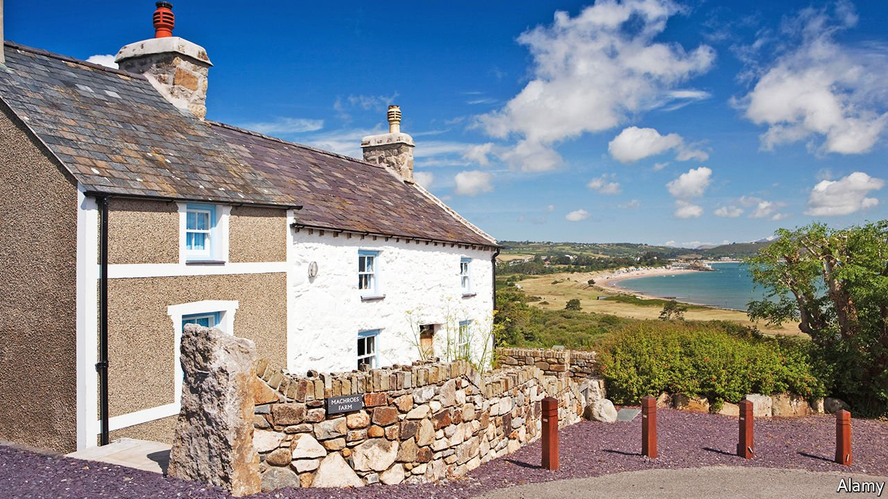

###### Second homes

# Second homes are coming under increasing attack in Wales 

##### The nationalists don’t like them 

 

> May 15th 2021 

RHYS TUDUR strides up onto the cliff edge and surveys the world below. On one side is a steep drop into the Irish Sea. On the other is Nefyn, a picturesque seaside village. But for Mr Tudur, a solicitor and local councillor, it is also a battleground. The enemy are second-home owners, and he points out their stations. Some are big mansions; others are unassuming former council houses. “Soon there won’t be a community here,” he laments.

This part of north Wales is beautiful, nationalistic and changing quickly as newcomers buy up properties. In Nefyn, around a fifth of properties are second homes. In Abersoch, 12 miles away, 46% are. That village is packed with 4x4s and sports cars driven by Cheshire’s business elite. Tensions are clear. A Welsh flag emblazoned with the words “Nid yw Cymru ar Werth” (“Wales is not for sale”) flies from a window near the seafront.


Over the past year local people have reported visiting second-home owners to the police, claiming that they have been flouting restrictions. Vandals have scrawled “Go Home” across holiday homes in Pwllheli. A few homeowners have been sent images of matchboxes on social media—a reference to the burning of English-owned holiday homes in the 1980s and 1990s. Others have made their points politely. Mr Tudur led a 20-mile march from Nefyn to Caernarfon; others dug “Hawl i Fyw Adra’‘ (“the right to live at home”) into a beach in Nefyn.

People who live in lovely areas often complain about newcomers bidding up property prices. But north Wales is unusual, in two ways. First, anxiety about domestic migrants is fused with worries about the decline of Welsh culture in one of its strongholds. Second, local politicians are both willing and able to do something to deter second-home owners.

Since 2017 Welsh councils have been allowed to impose a tax premium of up to 100% on second homes. For the past few years eight councils have imposed smaller premiums. Several have raised them in the past year. Gwynedd (which includes Nefyn) is charging the full whack. Swansea, in south Wales, also charges 100%.

St Ives, a pretty town in Cornwall, has tried to ban the construction of second homes altogether. But that intervention backfired. House-building of all kinds slumped, according to Christian Hilber of the London School of Economics. Tourism dropped and unemployment rose. Mr Hilber thinks Wales’s approach is better. Raising taxes brings in money to local councils, who can use them to build more affordable homes. But local tourism will suffer.

The second-home owners of Gwynedd are not rolling over. A Crowdfunder has raised more than £8,000 for legal advice. It argues that some of the people targeted are pensioners who cannot afford a doubling of their tax bill that will cost some more than £7,000. (“If they can afford a Rolls-Royce, they can afford the fuel that goes in it,” retorts Edgar Wyn Owen, chair of Gwynedd council.)

Locals might end up with the sort of English homeowner they most dislike. John Brynmor Hughes, a councillor in Abersoch, divides the second-home owners into two groups. The first lot inherited their houses and have amassed connections in the town; the second lot bought their homes more recently at high prices, and may be better able to afford a tax increase. One of the latter, a professional in his 30s from southern England, bought his home on a whim without seeing it in person. He is thinking about declaring his second home as his primary residence: “The councils don’t talk to each other, do they?”

Campaigners want even more powerful tools. Welsh Labour has suggested a possible devolution of the Land Transaction Tax ( LTT) to local councils. Paid when you buy or lease a building or land over a certain price, the LTT currently has a 4% increase for second-home purchases. Devolving the power to increase the tax to councils would see it rise much higher. Mr Tudur says he would want to raise it to 20%, so that a terraced house worth £180,000 would bear an additional £36,000 in tax. Looking down at the choppy waters below, he likens the council-tax premium to “a wren’s piss in the sea”. It sounds nicer in Welsh. ■

