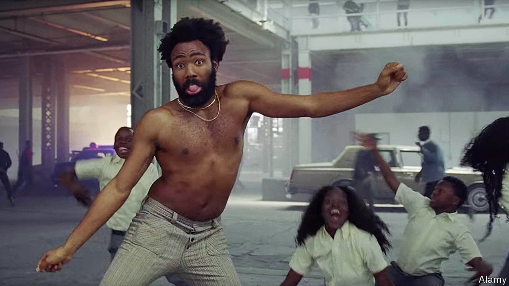

###### Writ parade

# Why American songwriters are suing each other 

##### The case against Childish Gambino is the latest in a run of copyright claims 

 

> May 15th 2021 

“YOU MOTHERFUCKERS owe me!” raps Donald Glover, better known as Childish Gambino, in his chart-topper of 2018, “This is America”. Yet according to a complaint filed in a New York court on May 6th, it is Mr Glover who is indebted. Emelike Nwosuocha, a Florida rapper known as Kidd Wes, says “This is America” borrows from his own work of 2016, “Made in America”. Mr Glover has not commented.

The complaint, which experts consider thin, is the latest in an outbreak of musical copyright claims. Between 1844 and 2014 no more than eight such cases a year were heard in American federal courts, according to George Washington University’s law school. The past six years have seen an average of 16, against the likes of Taylor Swift, Katy Perry and Drake.


One reason is a precedent set in 2015, when a jury found that “Blurred Lines”, by Robin Thicke and Pharrell Williams, had copied Marvin Gaye’s hit of 1977, “Got to Give it Up”. The Gaye family’s argument that a “constellation of similarities”, mostly not individually protected, amounted to copyright infringement was criticised by legal scholars and musicians, 200 of whom filed an amicus brief warning that it would leave artists “with one foot in the recording studio and one foot in the courtroom”.

Technology has also encouraged more complaints. Now that every track is online, it is harder for artists to use the defence that they had not heard the song they are accused of copying. Similarities are more likely to surface with armies of fans scouring YouTube. Digitisation has encouraged sampling, leading to more works of “musical collage”, says Judith Finell, an expert witness in the “Blurred Lines” case. And the sheer volume of new work means the chance of overlap is higher. As a court observed in 1940, there are many combinations of musical notes, but “only a few are pleasing; and much fewer still suit the infantile demands of the popular ear”.

Composers are protecting themselves by hiring “forensic musicologists” to vet their songs before release. Joe Bennett of Berklee College of Music says he is doing more such work since “Blurred Lines”. This month, for instance, he advised one record label to tweak a bar of a dance track that resembled the melody of another.

Despite the rash of legal cases, music is evolving in ways that may make it harder for complaints to succeed. “These days music is less and less about melody…[which was] traditionally the bedrock of why two songs were judged to be impermissibly similar,” says James Janowitz, a lawyer at Pryor Cashman, who in 1976 organised a courtroom piano rendition to show that George Harrison had copied “My Sweet Lord” from another work. Today, he says, melody takes a back seat to elements such as beat and subject matter, which are harder to claim as original.

The complaint against Mr Glover holds that “This is America” uses the same rhythmic “flow” as “Made in America” and covers the same themes, which include gun violence and racism. The effect on the listener may be that they seem similar. But the “triplet” flow that both employ is not unique. And, as Mr Janowitz points out, “thematic similarity does nothing in terms of copyright infringement”.

If more cases stumble, it may be no bad thing for musical creativity. “Some degree of influence should be encouraged,” says Mr Bennett. “That’s how art evolves.”■

