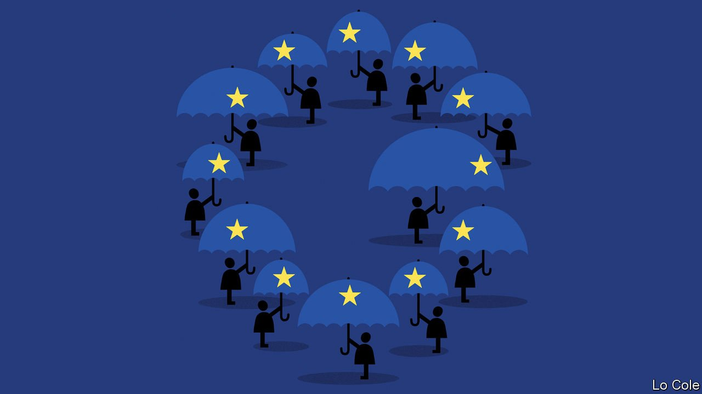
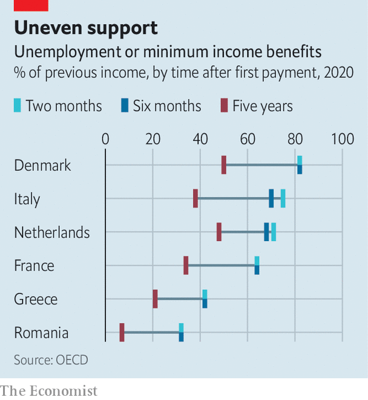

###### Protection racket

# The EU is trying to become a welfare superstate 

##### But its powers to deliver on its “social pillar” are limited 

 

> May 15th 2021 

EUROPE IS TO the welfare state what Canada is to ice hockey: the birthplace and the summit of the art. The European Union boasts a “unique social market economy” that “protects us against the great risks of life”, Ursula von der Leyen, president of the European Commission, told a summit of EU leaders on May 7th. They had met in Porto, Portugal’s second city, to approve a plan for turning the union into a bulwark of social protection, with targets for raising employment, improving job training and reducing poverty, as well as looser goals such as fighting gender inequality and regulating the gig economy.

Yet Europe’s welfare states are administered by national governments, not by the EU. The European Commission’s powerful regulatory authority rarely extends to social policy. As for EU spending, even with a new €750bn ($910bn) covid-19 recovery fund added to its regular €1.1tn seven-year budget, it amounts to less than 2% of the bloc’s GDP over the period. That pales in comparison to members’ social spending alone, which runs from 13% of GDP (Ireland) to 31% (France). Pensions, unemployment, health care, minimum wages and collective bargaining are national affairs.


That is why the level of social protection varies so much. In Romania, Emil Iliuta, an unemployed 63-year-old locksmith, has been drawing benefits since December. He gets 140 lei ($35) a month, along with occasional food donations. In exchange he performs 11 hours a month of community labour such as digging graves.

 


In the Netherlands, meanwhile, Sascha Blokzijl has been drawing benefits since January after losing her job at a data-analytics company. She gets €2,135 per month after taxes; the minimum for an adult living alone is €1,233. Rather than digging graves, Ms Blokzijl was initially required to report just one work-search activity per week. Having decided to start a business herself, she must now simply get her plan approved by the employment office.

The EU’s new social emphasis marks a reversal from the financial and euro crises between 2007 and 2011, when it required members to enact tough austerity measures. After Britain’s vote to leave in 2016, policymakers concluded that they needed to offer citizens more tangible benefits to stop anti-EU populism. “The whole idea of ‘a Europe that protects’ is linked to that wake-up call,” says Luuk van Middelaar of Leiden University. A summit in Gothenburg in 2017 adopted a “European social pillar” with 20 lofty-sounding rights, from lifelong training to work-life balance. The Porto summit was supposed to start achieving them.

Portugal’s Socialist government, which convened the summit as the current holder of the EU’s rotating presidency, is a fan of the social pillar. But other countries are less enthusiastic. Before the summit, 11 members issued a statement warning the commission not to interfere in social policy. They included fiscal hawks such as the Netherlands as well as the Nordic countries, who think EU rules might undercut their own standards.

The new action plan does not promise to equalise benefits. But it does aim by 2030 to raise the EU’s overall employment level to 78% of the population aged 20-64, a level now met only by countries like Germany, and to reduce the number of citizens in poverty by at least 15m. It also pledges annual skills training for 60% of all adults. This may be feasible for countries like Denmark, which pioneered such training and job-search efforts, known as “active labour market programmes”. For Romania and Italy it will be harder.

Backers hope the social pillar will nudge weaker member states to mimic the success of others. “The strength of Europe is in sharing best practices,” says Sofia Fernandes of the Delors Institute, a think-tank in Paris. The targets will become part of the European Commission’s system of scolding members to improve their economies. And money from the €750bn recovery fund can be used for social-pillar goals.

Yet perhaps the most successful new EU social programme is not part of the social pillar. The €100bn SURE programme, launched at the start of the pandemic, helps poorer countries pay their unemployment bills by letting the commission borrow money on their behalf, taking advantage of the EU’s strong collective credit. But making SURE permanent is not under discussion. Nicolas Schmidt, the EU commissioner for jobs and social rights, says that with the economy recovering from covid-19, it is time to focus on employment rather than joblessness.

One measure being discussed is an EU-wide social-security number or ID card. This would help ensure that companies that send workers across borders pay social-insurance premiums to the countries they work in. It would also help workers get the benefits they are entitled to, says Agnes Jongerius, a Dutch member of the European Parliament.

Another candidate for European regulation is the platform economy. Drivers for Uber and programmers on Fiverr tend to fall into a regulatory gap between employees and contractors, and lose out on labour rights. Different national approaches have created confusion, and the European Court of Justice has been forced to step in. The commission aims to come up with a legislative proposal by the end of the year.

Defining platform workers’ social-security status would be just the sort of concrete benefit European officials hope to bring about. But in most areas of social insurance the EU finds it hard to step in, says Bo Rothstein, a Swedish expert on the welfare state. Countries have dramatically different systems with deep local roots. No one thinks they will harmonise them. Ms Von der Leyen is right that Europeans want protection from economic hazards. But the EU may not be their mightiest defender. ■

