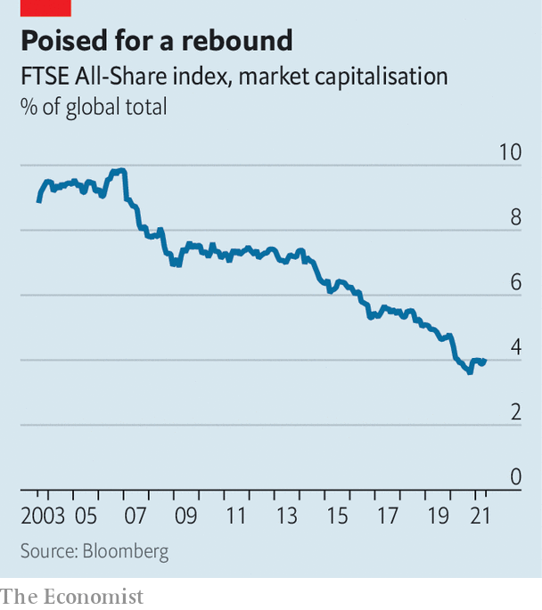

###### Buttonwood

# The bull case for beaten-up Britain 

##### The immediate outlook is rosy; structural problems might even be fixed 

 

> May 15th 2021 

ONE OF THE vices of Britons is a penchant for mourning the country’s decline. To be cured of this, Britain would probably need a different history. It was the first industrial nation. From that starting-point, its influence could only ever go in one direction: downwards. There is a large literature blaming long-term decline on sloth, complacency and amateurism. Brexit is just another opportunity to lament lost relevance.

This sense of decline is felt keenly in capital markets. Sterling was once the global currency but it now accounts for less than 5% of foreign-exchange reserves. Britain’s money markets used to stand out in Europe for their high interest rates; but no longer. And Britain’s stockmarket is a shadow of its former self. Big IPOs are as rare as rocking-horse dung. This scarcity along with years of share underperformance has seen Britain’s share of global market capitalisation shrink markedly (see chart).


So accepted has the narrative of decline become, that it is probably time to bet the other way. The economy is poised for a sharp recovery. London’s bourse is stuffed with the shares of companies—miners, banks and energy firms—that ought to do well in an environment of rising inflation. And though fixing the structural deficiencies of Britain’s capital markets is a big task, it is not impossible.

 


On cyclical grounds, there is a strong case for Britain. The immediate outlook for the economy is rosier than almost anywhere. That in part reflects the ground lost to covid-19. The Bank of England reckons that, even after a surge in activity this quarter, GDP will still be around 5% below its pre-pandemic level. But it is also because the vaccine roll-out has been impressively quick. There is a sense, too, that uncertainty is diminishing. Brexit is done. The world has kept turning. And politics is more stable. Even if a fight over Scottish, and possibly Northern Irish, independence still looms, the ruling Conservatives enjoy a handsome majority in parliament.

The FTSE All-Share index is heavy with the kind of cyclical stocks that have been in favour recently. But, lamentably, it is light on the digital champions of tomorrow. This is not for lack of innovation. Britain is rather good at fostering startups. There are various tax breaks to help fledgling companies raise seed capital. Universities have grasped that business spin-offs are to be encouraged, says Anne Glover of Amadeus Capital Partners, a venture-capital firm. Britain has four in the top ranks: Oxford, Cambridge, Imperial College and University College, London.

The country still attracts more venture capital than any other in Europe. London is an asset in this regard. If your ambition is to build a globally relevant technology company, it helps to start it in a global city. Berlin is cool and cheap, but lacks a world-class university. Paris is pretty, but French labour laws are a pain. London can be an easier place for the footloose entrepreneur to settle—though a lot rests on how post-Brexit visa schemes work.

Where Britain has fallen down is in turning fledgling companies into listed world-beaters. Promising startups reach a certain stage of maturity only to hit a brick wall in terms of funding. They are still too small to be listed, so need private funds to grow. But by and large the bigger cheques are written by American venture-capital firms. Once the board is packed with Americans, it is natural for them to seek an American exit from their investment—either a sale to a bigger company or a listing on the Nasdaq. Many British entrepreneurs are resigned to selling to a foreign buyer.

A recent government-backed review, led by Ron Kalifa, a fintech entrepreneur, proposes a series of reforms to encourage British listings. They include changing London’s listing rules to allow for dual classes of shares and smaller free-floats of stock—terms that are offered by New York and Hong Kong. There is also a proposal for a specialist growth-capital fund for pre-IPO businesses, backed by British asset managers. The goal is to turn a vicious cycle into a virtuous one, says Ms Glover. The more tech firms list in Britain, the more local analysts and asset managers will take an interest in them, encouraging further listings.

When Britain says it is “open for business”, it is taken to mean that its most promising firms are available to be gobbled up by foreign bidders. If there were local alternatives to such deals, its public markets might begin to look more attractive. Decline might even be reversed. In any event, though, the gloom has gone far enough. The case against sterling assets is oversold.

