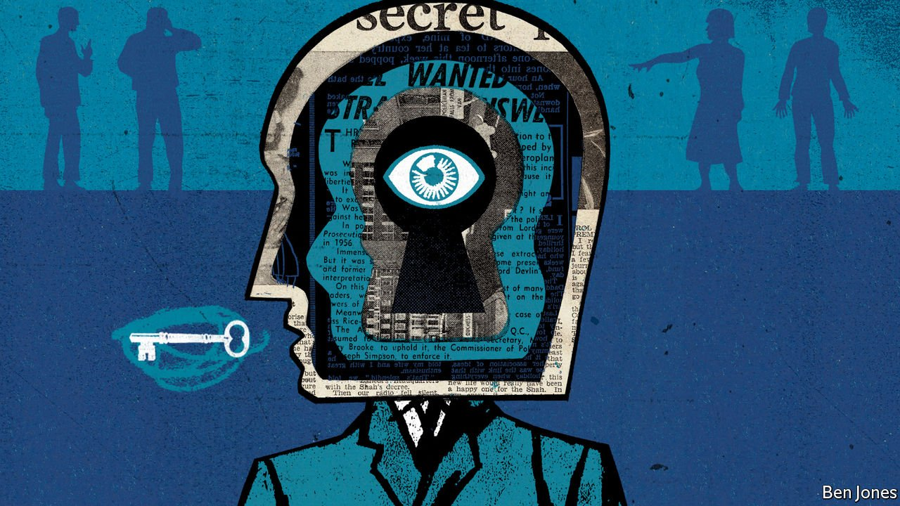
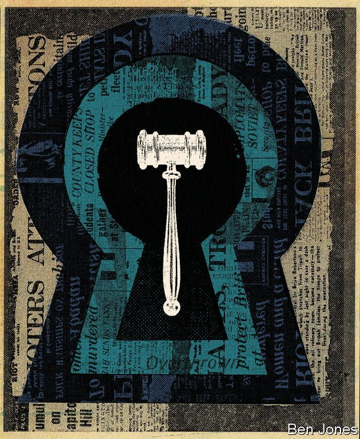

###### The agony of silence

# France is confronting its history in Algeria 

##### As other countries’ experiences show, dealing with the past is a complex undertaking 

 

> May 13th 2021 

IN MARCH, BENEATH the chandeliers of the Elysée palace, four adult cousins met Emmanuel Macron, France’s president. What really happened, they wanted to know, to their grandfather, Ali Boumendjel, a lawyer and nationalist, who died in colonial Algeria after his arrest by French troops in 1957? Officially he committed suicide. In fact, Mr Macron acknowledged, Boumendjel was tortured and killed by the French army. His body was thrown from a window to disguise the cause of death.

The president and the lawyer’s grandchildren—all of the same generation—engaged in an “extraordinary dialogue”, says Benjamin Stora, a historian who was present. The cousins’ discomfort, he says, focused on a question: “How can we live in the country that assassinated our grandfather?” Although a French general had confessed 20 years ago to ordering the murder of Boumendjel, the government had never admitted the crime. Algeria’s eight-year war for independence ended in 1962. But such questions trouble a younger generation, who feel that France should fully acknowledge the atrocities it committed.


Earlier this year Mr Macron decided to launch a “Memories and Truth” commission on France’s role in Algeria, to “look clearly at the wounds of the past”. While in Algiers during his election campaign, he raised eyebrows by calling colonisation a “crime against humanity”. In 2018 Mr Macron recognised that in 1957 the French state had tortured and executed Maurice Audin, a young communist and nationalist; none of his predecessors had done so. “France”, he declared last year, has “still not resolved the traumas” of its colonial past.

Mr Stora, author of an official report this year into memories of the war, will run the commission, starting this month. Details are still being worked out. Many of the protagonists and witnesses are dead. Mr Stora says it will involve testimony from descendants, historical work and memorials. Mr Macron has ordered the opening of classified archives relating to the time.

Over the past half-century more than 50 truth commissions have been set up worldwide. They have become a tool for countries emerging from traumatic periods of history to confront that past, try to break cycles of violence and move on.

One of the first, in Argentina in 1983, looked into “disappearances” under the military dictatorship. It took evidence from witnesses and produced a bestselling report (“Nunca Más”, or “Never Again”). In 1990 Chile established a commission to look into disappearances and killings under Augusto Pinochet. A second, in 2003, examined torture under his regime. The experience has been mixed, partly because of a fundamental tension between truth and criminal justice, and between the interests of individuals and of a country as a whole. Yet they have not lost favour. Truth commissions are under way in various countries, including Colombia and the Gambia. Britain is considering one to look at the “Troubles” in Northern Ireland.

Their purpose, according to Priscilla Hayner, author of a global study of them, is primarily “to investigate and report on a pattern of past ”. The template involves a temporary body, set up with a mandate from a government or an international institution, to gather testimony and look at past abuse over a defined period. They aim to establish what happened at a time when official histories may have silenced rival accounts, or those who could tell them. A commission generally ends with a report and recommendations.

Yet a truth commission is also a form of reckoning. It officially recognises past atrocities. It may also seek to reconcile former adversaries. Some lead to prosecutions. In Chile and Argentina judges used the reports to unpick previous amnesties. In 2017 a court in Argentina sentenced 29 former military officials to life for, among other crimes, kidnapping and drugging civilians, loading them onto planes and dumping them, alive, in the ocean.

Others are an alternative to retributive justice. South Africa’s Truth and Reconciliation Commission ( TRC), set up in 1995, a year after democracy replaced , could grant amnesty to those who confessed to certain crimes. Dirk Coetzee, a paramilitary commander who confessed to drugging, shooting and burning victims, got it for some of his crimes. “The burning of a body on an open fire takes seven hours,” he told the commission; “Whilst that happened we were drinking and braaiing [barbecuing] next to the fire.”

And you will know the truth

The French commission comes too late to be about amnesty or criminal justice. Yet, even 60 years on, the thirst for answers is surprisingly strong. “It’s absolutely necessary, indispensable,” says Nora Hamadi, a French journalist of Algerian origin. She describes “a form of trauma” among the children and grandchildren of victims, and an “anger against France for the lack of recognition and of respect”.

Algeria was ruled as part of France from 1830 until its independence. Today, some 7m French residents are linked to this history, as immigrants, former white settlers (pieds-noirs), soldiers (including Algerian harkis, who fought for France) or their families. Faïza Guène, a French novelist of Algerian descent, deplores “the transmission of silence”. “If we don’t talk about this”, she says, “we’ve got no chance of resolving the problem of belonging in France.”

The subject was long taboo. Not until 1999 did the French government recognise the conflict as a war. Since 2001 political leaders have taken further steps. Nicolas Sarkozy provided Algeria with a map of 11m landmines laid by the French army. François Hollande recognised as a “bloody repression” the massacre of Algerian nationalists in Paris on October 17th 1961.

Yet many questions remain. “France has been in denial for a very long time,” says Mr Stora. “So it’s complicated. But we need to find a way to hold a conversation, between all the different parties. Everybody is shut away in their own suffering.”

“Time in itself is not a barrier,” argues Anna Myriam Roccatello of the International Centre for Transitional Justice in New York. Some form of reckoning, even belated, can be helpful. Belgium last year opened a “special commission” into its colonial past in Congo, Rwanda and Burundi.

More important, suggests Ms Roccatello, is legitimacy and participation. Many point to South Africa’s commission. Chaired by Archbishop Desmond Tutu and endorsed by President Nelson Mandela, the TRC began amid great hope. Unlike many commissions in Latin America in the 1980s, victims told their own stories, mostly in public hearings. In two years the TRC heard 21,298 witnesses. Amnesty was given only to those who disclosed full details of crimes deemed politically motivated.

Yet South Africa also reveals the shortcomings of such exercises. The TRC ended with rancour. Both former president F.W. de Klerk and Mr Mandela’s African National Congress (ANC) tried to obstruct the final report. Mr Mandela had to insist on its publication. Mary Burton, a commissioner and anti-apartheid activist, worried that the TRC had facilitated the transition of power rather than helped the victims.

Moreover, no body was set up to enforce the commission’s recommendations. It took five years for the government to pay reparations to the victims who testified. Some received about a fifth of the money the report recommended. Some 130,000 people entitled to reparations fell foul of a cut-off date for claims. Subsequent ANC governments have done little to prosecute perpetrators who did not seek amnesty. Under President Thabo Mbeki 20 people denied amnesty by the TRC were pardoned.

“Our experience in South Africa is that truth does not always lead to reconciliation,” says Annah Moyo-Kupeta of the Centre for the Study of Violence and Reconciliation. “People felt they were being forced to forgive.” The TRC also served to “de-contextualise” apartheid, argues Mahmood Mamdani, a Ugandan academic. Apartheid was not just about death squads; it was a legal and economic system, built on colonial foundations. For Mr Mamdani, the TRC’s narrow framing made it easier for white South Africans who benefited from apartheid, but were outside the security state, to deny their complicity.

Yet for all its flaws the TRC has been unfairly maligned, argues Mikhail Moosa of the Institute for Justice and Reconciliation in South Africa. He points out that the report’s recommendations were radical—including, for instance, wealth and windfall taxes to tackle the economic legacy of apartheid. It is the fault of ANC governments, not the TRC, that some apartheid-era criminals got off scot-free, and that South Africa is not better run today.

Besides, the TRC made it impossible for white South Africans to say, “I didn’t know.” They heard four white policemen confess, for example, to beating Steve Biko, leader of the Black Consciousness Movement, chaining him up and leaving his injuries untreated. Biko died after being transported—naked, handcuffed and unconscious—to a prison hospital halfway across the country. The apartheid state said he died of a hunger strike. The TRC also gave some, if not all, victims, closure. In 2019 a poll found that 66% of South Africans agreed that it “provided a good foundation for South Africa to achieve reconciliation”.

Such commissions entail profound trade-offs. , Chile and  showed that they can be compatible with prosecutions. But this can be controversial. In El Salvador the promise of a commission helped end civil war. It ran under UN auspices in 1992-93 and documented 22,000 complaints in a hard-hitting report, whose impact was blunted by an immediate amnesty. Usually a choice has to be made upfront. Without amnesty, many South Africans would not have learned what happened to their families. Public exposure itself can be a form of punishment.

Painful choices

The interests of those who suffered and society’s must also be balanced. For some individuals, the process revives old traumas. Nomfundo Walaza, who counselled victims during the TRC, points out that, if national reconciliation is the aim, “then we have to face the unfortunate reality of a conflict between the interests of victims on one hand and those of the nation as a whole on the other.”

 


“Nobody expects a single truth commission to tie up all the issues with a bow,” says Ms Hayner, now a consultant on transitional justice. What matters, she says, is whether it changes “a country’s ability to talk about something”. This is missing in France, where Algeria is the silence underlying so many tensions. “To calm competing memories”, says Rachid Benzine, a French researcher, “France needs to acknowledge it is the inheritor of both the Enlightenment and colonialism.”

Whatever France does is bound to be criticised, on both sides. The Algerian government may not be satisfied unless France apologises. The French presidency says that will not be necessary. Political expediency may trump historical rigour. Rival memories may be irreconcilable. But to listen to a younger generation in France is to hear a yearning for answers and acknowledgment. “Remembering is not easy,” writes Ms Hayner; “but forgetting may be impossible.” ■

A version of this article was published online on May 11th, 2021

