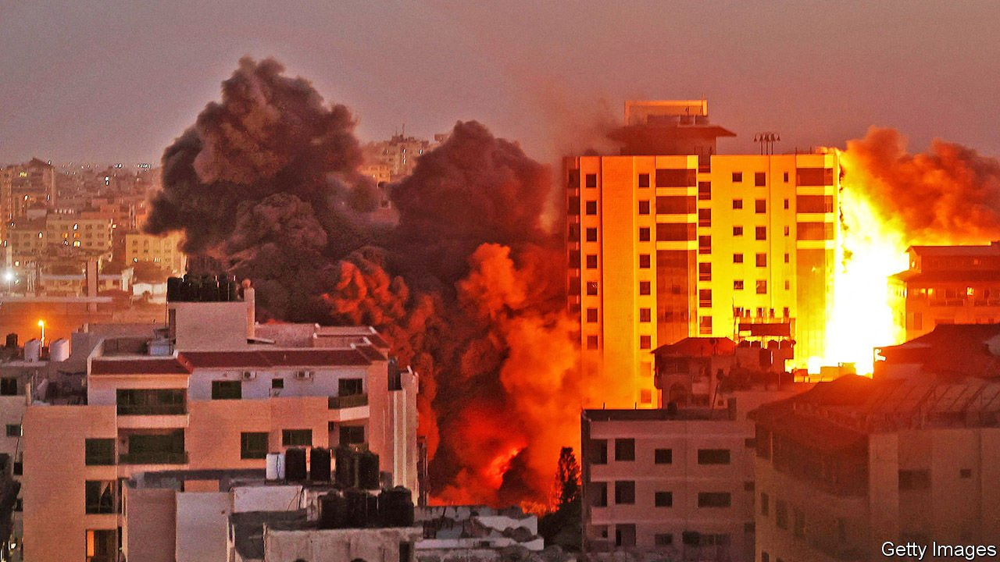

###### Stopping the cycle

# Only negotiations can bring lasting peace to Israel and Palestine 

##### Managing the conflict is no solution 

 

> May 13th 2021 

IT WAS A confrontation waiting to happen, in a conflict the world would rather ignore. Israelis and Palestinians have once again goaded each other to the brink of war in the Holy Land. , fired by Palestinian militants, have been aimed at Jerusalem, Tel Aviv and southern Israel. Gaza, the Palestinian territory run by Hamas, a violent Islamist movement, has been hit even harder by Israeli air strikes. Arabs and Jews have clashed in the streets of Israeli cities. Dozens of people, most of them Palestinian, have been killed.

The worst fighting between Israelis and Palestinians in years has Jerusalem at its heart, as so often (see Middle East &amp; Africa section). In April, at the start of the Muslim holy month of Ramadan, Israel’s police chief fenced off the plaza around the Damascus Gate, one of the entrances to Jerusalem’s old walled city and a gathering spot for Palestinians. The move, made for “security reasons”, led to clashes between Palestinians and Israeli police. Hundreds were injured. Then the rockets started flying.


The violence, as ever, is counterproductive. Turning Israeli cities “into hell”, as Hamas threatens, will not help the Palestinians who suffer grievously in Gaza—just the opposite, in fact. Every rocket that Hamas fires makes it easier for Israel to claim that it has “no partner for peace” and to intensify its siege of Gaza. But Israel, too, must reconsider its strategy. Its leaders view the broader conflict as something to be managed, not solved. Yet its unjust treatment of the Palestinians stores up trouble. Today’s crisis was predictable—even if the spark that ignited it was not.

Jerusalem epitomises the problem. Israel claims the city as its “eternal and undivided capital”. But its inhabitants are irrevocably split. The eastern part of the city, although captured by Israel in 1967, remains largely Palestinian. The Oslo accords of 1993 left the city’s status to be settled in a permanent peace deal between Israel and the Palestinians. But Israel has built a wall separating Jerusalem from the Palestinian hinterland. It seeks to strengthen its claim to the whole city by ringing it with new Jewish homes and squeezing Palestinians out. Though they make up 38% of Jerusalem’s population, most local Palestinians are not citizens but mere “residents”, granted access to health care and social security, but not the same rights as Jews.

This disparity in the law is at the heart of a case before Israel’s Supreme Court that is making the atmosphere more febrile. The court is reviewing a judgment to evict Palestinian families from the Sheikh Jarrah neighbourhood of East Jerusalem. Their homes sit on land that was owned by Jews before Jordan occupied the eastern part of Jerusalem in 1948. Israeli law allows the heirs of the original owners to reclaim property in East Jerusalem. Yet Palestinians cannot claim their former homes in West Jerusalem (or anywhere else in Israel). No wonder Palestinian residents of the city are always ready to protest.

The injustices elsewhere are worse. Palestinians in the wider West Bank, like those in Jerusalem, have watched Israel confiscate land and build settlements on occupied territory, which is illegal under international law. They must also deal with Israeli checkpoints and an onerous permit regime. In Gaza more than 2m Palestinians have been cut off from the world by Israeli and Egyptian blockades since 2007, when Hamas grabbed control. The territory struggles to keep the lights on; the tap water is filthy. Despair at such conditions led to violence in 2018 and 2019, and is feeding the current spasm.

Yet Israeli politicians ignore the conflict. The Palestinian issue did not feature in any of the four elections Israel has recently held. Most Israelis are comfortable with the “anti-solutionism” of Binyamin Netanyahu, the prime minister, who shows little interest in pursuing a permanent settlement with the Palestinians. His domestic rivals are edging closer to a deal that would push him out of power. But, before the recent violence, they said little about how they would handle the conflict.

Palestinian leaders have made it easy for Israel to give up on peace. Hamas is more interested in firing rockets than improving the lives of Gazans. Its rival, Fatah, has not done much better in the West Bank. The party’s leader, Mahmoud Abbas, is in the 17th year of a four-year term as Palestine’s president. He seems concerned mainly with preserving his own power. On April 29th, blaming Israel for restricting voting in East Jerusalem, he indefinitely postponed elections that Fatah was likely to lose.

With little hope of a better future, a good number of young Palestinians favour confronting Israel. That makes repeated fits of deadly violence inevitable. Only negotiations will bring lasting peace. Western and regional powers should press for them to resume; Israeli and Palestinian leaders should come to the table. Solving the conflict will be even harder than managing it. But talking is the one permanent way out. ■

A version of this article was published online on May 12th, 2021

