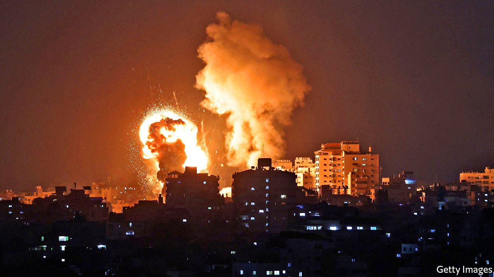
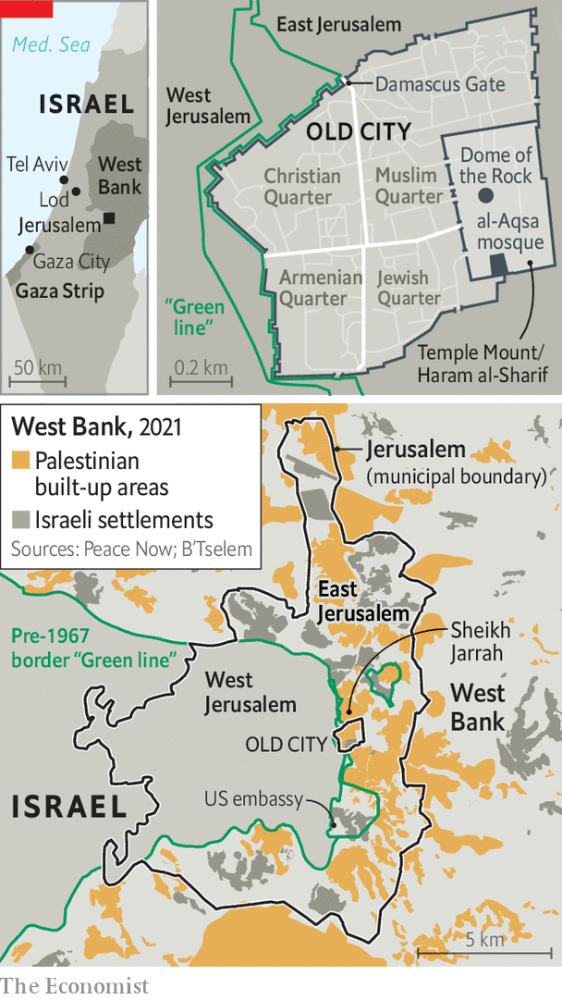

###### The fire this time

# Israel and Hamas move closer to war 

##### Where does this cycle of violence end? 

 

> May 13th 2021 

WHAT BEGAN last month as a dispute over metal barricades in Jerusalem has now, in the surreal logic of the Holy Land, brought Israel and Gaza to the brink of war. Since May 10th Palestinian militants in the territory have fired more than 1,600 rockets at Israel, which in turn has carried out hundreds of air strikes. It is by far the most intense round of warfare since 2014. Israeli bombs have destroyed three tower blocks in Gaza, in operations reportedly aimed at offices of Hamas, the militant Islamist group that controls the territory. Hamas and its allies have fired huge barrages of rockets at Tel Aviv and southern Israel. Scores of people, mostly Palestinians, have been killed.

Both sides have threatened more violence, despite calls for the opposite from America, the European Union and Arab countries. Israel moved troops to the border with Gaza and told residents to stay in bomb shelters. Clashes between Arabs and Jews spread across Israel, which imposed a state of emergency in the city of Lod following riots by Israeli Arabs and the killing of an Arab man by a Jewish resident. The United Nations envoy to the Middle East, Tor Wennesland, warned that fighting was “escalating towards a full-scale war”.


The trouble started, as it so often does, with clashes over a small bit of land, intensified by the religious power of Jerusalem. In this case it was the sunken plaza around the Damascus Gate, one of the ancient entrances to the old walled city (see map). In April, at the start of the Muslim holy month of Ramadan, Israel’s police chief decided “for security reasons” to fence off the area, a gathering spot for Palestinians. That led to clashes. The move was later reversed, but street battles between young Palestinians and Israeli police culminated in two big incidents in which police entered the area around the al-Aqsa mosque, Islam’s third-holiest site, firing stun-grenades and rubber bullets. Hundreds of people were injured.

 


On May 10th thousands of Jewish nationalists added to the febrile atmosphere by marching, as they do every year, on “Jerusalem Day”—a holiday marking Israel’s capture of East Jerusalem, the West Bank and Gaza in the six-day war in 1967. This year, at least, Binyamin Netanyahu, Israel’s prime minister, ordered a last-minute change to the route, away from the Damascus Gate. That angered the marchers, but just as they were gathering at the roadblock preventing their progress to the gate, Hamas launched its rockets, setting off air-raid sirens and forcing them to disperse.

Israel’s Iron Dome missile-defence system has shot down most of the rockets; only a handful have got through to hit built-up areas. Israeli deaths remain in single digits. Avoiding further escalation depends partly on the system’s success. “What you’re seeing in the sky is the algorithm,” explains an engineer involved in tweaking the system the better to identify and intercept the most threatening rockets. “We’ve been constantly improving the algorithm so it can face a barrage like this.” Israel is also trying to stop the attacks at source. It has bombed about 200 launching sites, but there are still many more. Separately, it is trying to inflict pain on the militant groups by killing their leaders.


“The main strategic advantage of Iron Dome is that by significantly reducing Israeli civilian casualties, it allows the political leadership to pause before committing to all-out war,” says an Israeli general. “There’s no perfect weapon to prevent all casualties,” he adds. “For that you need peace.” But for now, peace does not seem either side’s favoured option. Israeli leaders have rejected a ceasefire and vowed to strike Hamas hard. The government remains anxious about an invasion of Gaza, though. Close-quarters fighting would favour the militants, and would involve many more casualties on all sides.

Whether Israel can defeat Hamas without shedding much blood may affect how Israelis think about Mr Netanyahu’s long-running policy of managing, rather than trying to solve, the conflict with the Palestinians. He has not seriously pursued a settlement, wagering that Palestinians have become resigned to the occupation or, if not, that he can suppress their anger. In Jerusalem 38% of the population are Palestinians, most of whom have “residency” rights, which gives them access to Israeli social security and health care. They are not treated as equals to Israelis, though, and face a variety of pressures to move out.

A case before Israel’s Supreme Court—now postponed, in light of the violence—is indicative. It concerns the eviction of some Palestinian families from the Sheikh Jarrah neighbourhood of East Jerusalem, which is largely Palestinian. The land on which their homes sit was owned by Jews before Jordan occupied the eastern part of Jerusalem in 1948. Under Israeli law the heirs of the original owners can reclaim the property because it is in East Jerusalem. Palestinian families have no such rights over their former homes in West Jerusalem. In fact, all property once owned by “absentee” Palestinians was expropriated by Israel.

The frustration this causes is fodder for Hamas. It expected to make big gains in Palestinian legislative elections on May 22nd (the first such ballot in 15 years). Mahmoud Abbas, the Palestinian president and leader of Fatah, a rival party, decided last month to postpone the elections. Ostensibly he did so because Israel would not let some Palestinians vote at post offices in East Jerusalem. In fact, his main concern was that he might lose. By latching onto the protests in Jerusalem, Hamas hopes to boost its political standing, never mind the consequences for Gaza. Mr Abbas, meanwhile, has prevented Palestinians in the West Bank from organising protests in solidarity with their kin in Jerusalem.

On the Israeli side, Mr Netanyahu is tired and distracted. He has fought four elections in two years; none produced a conclusive result. His rivals have been edging closer to a deal that will remove him from power. Were he in a stronger position, he might have done more to rein in the police and his far-right supporters. But now that fighting has started, he has a chance to portray himself as a trusted wartime leader. He insists that Hamas should "pay a very heavy price".

Foreign powers have been little help. Four months after President Joe Biden was inaugurated, there is still no American ambassador in Jerusalem. His administration seems torn about how to respond. The State Department blamed both sides for stoking tensions, but America later stalled a similar statement by the UN Security Council. The previous UN envoy, Nickolay Mladenov, was adept at dampening occasional spasms of violence before they escalated to war. Mr Wennesland, his successor and a veteran diplomat in the region, has inherited that challenge.

Mr Netanyahu has spent much of his career insisting that Israel need not make peace with the Palestinians. On his watch the occupied territories have been relatively quiet, at least compared to the violence of past Palestinian intifadas, or uprisings. Yet the events of the past month, the unrest that has spread from Jerusalem to every corner of the land, are a reminder that Palestinian grievances will not disappear. If Mr Netanyahu does leave office in the coming weeks, it is perhaps a fitting coda to his long rule. ■

A version of this article was published online on May 10th, 2021

