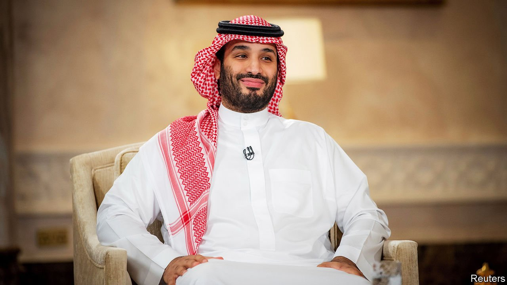

###### Prince Charming

# Muhammad bin Salman of Saudi Arabia plays the diplomat 

##### How long will it last? 

 

> May 15th 2021 

AS A YOUNG buck, Muhammad bin Salman, the Saudi crown prince, thought he could take on the world. He charged into Yemen, detained Lebanon’s prime minister and had his people chop up a mild-mannered dissident, Jamal Khashoggi, in the Turkish city of Istanbul. When Western countries, such as Canada and Germany, criticised his human-rights record, he recalled his ambassadors. When President Barack Obama made overtures to Iran, a Saudi rival, Prince Muhammad threatened to sell the kingdom’s American assets. To the prince, Iran’s supreme leader, Ayatollah Ali Khamenei, was akin to Hitler. He even tried to marshal an array of Arab and Sunni countries against Iran.

Six years after his father, Salman bin Abdelaziz, became king, the prince, now in his mid-30s, may be changing, switching tactics from maximum pressure to maximum diplomacy, cutting his losses and trying to defuse conflicts. Facing resistance in the region and disapproval from President Joe Biden, he may have decided that the cost of his foreign ventures is unsustainable. Saudi foreign policy has begun to look much less aggressive.


So far this year he has held two rounds of talks with Iran in Baghdad, the Iraqi capital, and spoken of his hope for “a good and special relationship”. His officials have met his Yemeni foes, the Iranian-backed Houthi rebels, in the Omani capital, Muscat. The Saudis offered to lift the kingdom’s siege of Yemen and to help rebuild the country his jets have bombed. He has also stopped funding the rebellion against Syria’s ruler, Bashar al-Assad; earlier this month he sent his intelligence chief to Damascus to discuss restoring ties.

Prince Muhammad is mending fences with Turkey and Qatar as well. Both had irritated him by backing Islamist groups that he dislikes, such as Egypt’s Muslim Brotherhood. But the prince has lifted a three-year blockade of Qatar and bought arms from Turkey. On May 10th he hosted Turkey’s foreign minister, Mevlut Cavusoglu, and Qatar’s emir, Tamim bin Hamad al-Thani. “He’s dispensed with polarisation,” says Oraib Rantawi, a Jordanian analyst. “A new wind is blowing.”

Friends say Prince Muhammad has matured. Others say he is a bully who has been chastened by those he knows to be more powerful. He promised to take Yemen’s capital, Sana’a, quickly. Instead, the Houthis have made incursions into Saudi Arabia. Iran and its regional proxies have flung missiles at Saudi airports, palaces and oil installations. Ships in the kingdom’s Red Sea ports have come under repeated attack. In 2019, after drones struck the kingdom’s oil-processing hub at Abqaiq, halving Saudi oil output, no one came to his rescue, not even President Donald Trump. The prince’s allies in the Gulf have abandoned his campaign in Yemen.

During his election campaign President Joe Biden called the kingdom a pariah, accusing it of murdering children in Yemen, and vowed to end American sales of arms. He has since toned down his disapproval but is still calling for an end to the war. Soon after Mr Biden took office, the prince dropped his refusal to talk to Iran and freed Loujain al-Hathloul, the kingdom’s most prominent rights activist.

The prince has also been held back by a stalling economy. The pandemic and low oil prices have hurt, while the conflict in Yemen has drained his war chest. And his unpredictability has deterred foreigners from investing in Vision 2030, his grandiose reform programme.

Tension with Iran in the Strait of Hormuz, the conduit for most Saudi oil exports, and the difficulty of building a post-oil economy have altered the prince’s plans. In search of alternative trade routes, he is expanding ports on the Red Sea and building a high-speed rail link from west to east. He is also forging a Red Sea council to spur development in all the littoral states and to open a gateway into Africa. His “smart” megacity, Neom, and a vast tourist complex in the kingdom’s north-west are meant to bolster economic links with Egypt, Jordan and, perhaps one day, Israel.

Meanwhile, he has trimmed the kingdom’s bankrolling of an array of Arab and Muslim causes, such as the Palestinians, whom he recently failed to mention in a three-hour interview. He has cut aid to Pakistan, failed to prop up Lebanon, and slashed mosque-building projects that used to spread the kingdom’s religious conservatism across the world. Defying puritanical clerics who consider Shias heretics, he has played host to some from Iraq.

Prince Muhammad can still, however, annoy his Arab neighbours. His demand that companies doing business with Saudi Arabia should move their regional headquarters to the kingdom has upset Muhammad bin Zayed of Abu Dhabi, the de facto ruler of the United Arab Emirates, the region’s trading hub. And he can still be impulsive. Though he lifted his blockade of Qatar, he recently slapped bans on imports from Jordan, Lebanon and Turkey after their governments displeased him. Prince Charming can still bare his teeth. ■

